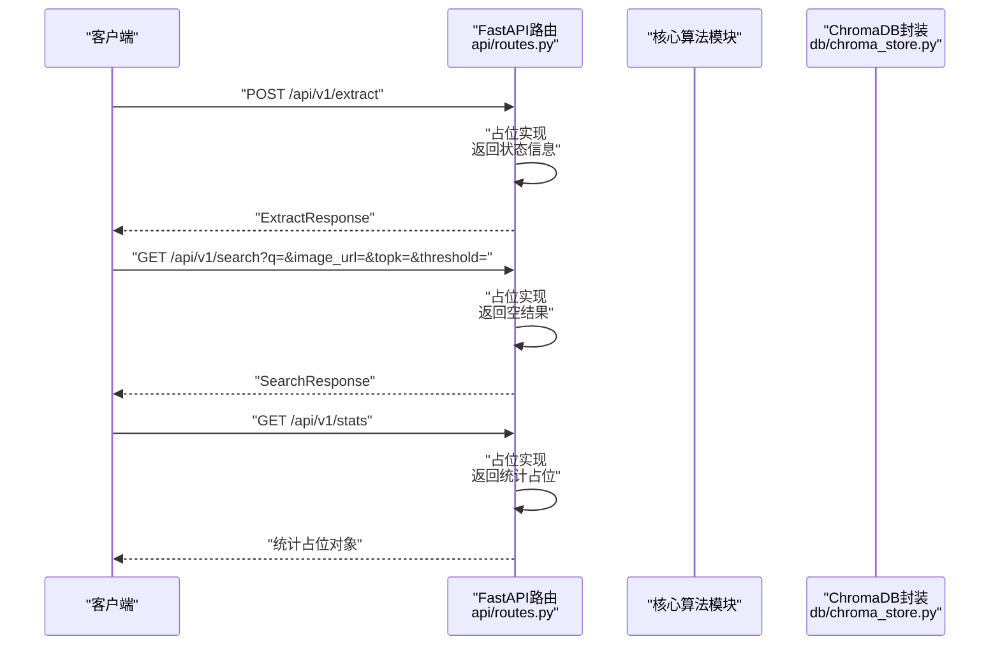
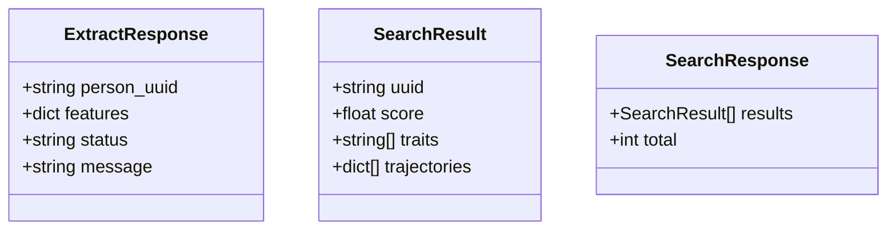
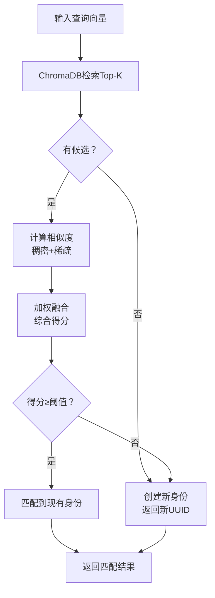
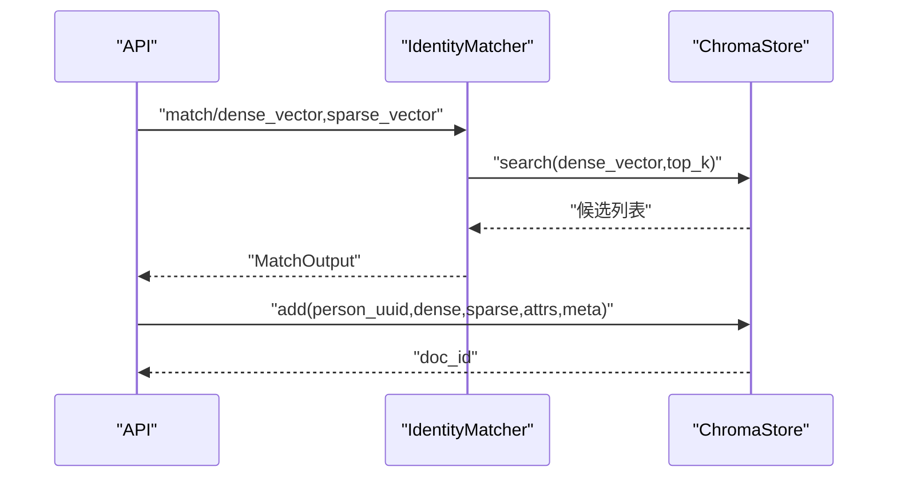
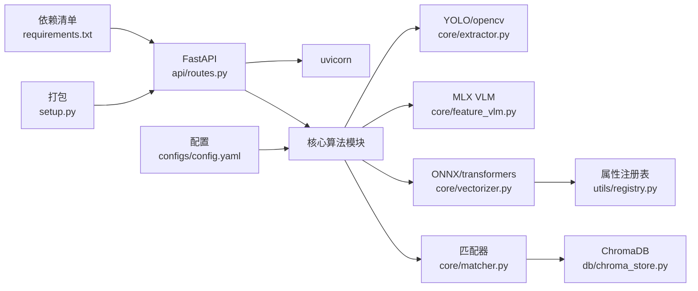

# Web API接口文档

<cite>
**本文档引用的文件**
- [main.py](file://crossmedia_pid/main.py)
- [routes.py](file://crossmedia_pid/api/routes.py)
- [config.yaml](file://crossmedia_pid/configs/config.yaml)
- [requirements.txt](file://crossmedia_pid/requirements.txt)
- [setup.py](file://crossmedia_pid/setup.py)
- [chroma_store.py](file://crossmedia_pid/db/chroma_store.py)
- [matcher.py](file://crossmedia_pid/core/matcher.py)
- [vectorizer.py](file://crossmedia_pid/core/vectorizer.py)
- [feature_vlm.py](file://crossmedia_pid/core/feature_vlm.py)
- [extractor.py](file://crossmedia_pid/core/extractor.py)
- [registry.py](file://crossmedia_pid/utils/registry.py)
</cite>

## 目录
1. [简介](#简介)
2. [项目结构](#项目结构)
3. [核心组件](#核心组件)
4. [架构总览](#架构总览)
5. [详细组件分析](#详细组件分析)
6. [依赖关系分析](#依赖关系分析)
7. [性能考量](#性能考量)
8. [故障排除指南](#故障排除指南)
9. [结论](#结论)
10. [附录](#附录)

## 简介
本文件为CrossMedia-PID系统的Web API接口文档。当前仓库处于阶段1（CLI），API路由已按阶段2规划完成基础框架，但具体实现仍为占位状态。本文档面向开发者与集成者，提供RESTful API规范、认证与访问控制策略、版本控制与兼容性、速率限制与错误处理、客户端集成指南、性能特征与扩展性建议，以及测试与调试工具使用说明。

## 项目结构
项目采用模块化分层设计，核心模块包括：
- API层：基于FastAPI的路由定义（阶段2预留）
- 核心算法层：视觉提取、特征抽取、向量化、匹配与检索
- 数据层：ChromaDB向量数据库封装
- 工具层：属性注册表与稀疏向量映射
- 配置层：YAML配置文件
- 依赖层：requirements.txt与setup.py

```mermaid
graph TB
subgraph "API层"
R["路由定义<br/>api/routes.py"]
end
subgraph "核心算法层"
E["视觉提取<br/>core/extractor.py"]
F["特征抽取(VLM)<br/>core/feature_vlm.py"]
V["向量化<br/>core/vectorizer.py"]
M["匹配与检索<br/>core/matcher.py"]
end
subgraph "数据层"
C["ChromaDB封装<br/>db/chroma_store.py"]
end
subgraph "工具层"
RG["属性注册表<br/>utils/registry.py"]
end
subgraph "配置与入口"
CFG["配置文件<br/>configs/config.yaml"]
REQ["依赖清单<br/>requirements.txt"]
ST["打包与入口<br/>setup.py"]
MAIN["CLI入口<br/>main.py"]
end
R --> E
R --> F
R --> V
R --> M
V --> RG
M --> C
E --> F
F --> V
V --> M
CFG --> E
CFG --> F
CFG --> V
CFG --> M
REQ --> R
ST --> R
MAIN --> E
MAIN --> F
MAIN --> V
MAIN --> M
```



**图表来源**
- [routes.py:1-91](file://crossmedia_pid/api/routes.py#L1-L91)
- [extractor.py:1-351](file://crossmedia_pid/core/extractor.py#L1-L351)
- [feature_vlm.py:1-325](file://crossmedia_pid/core/feature_vlm.py#L1-L325)
- [vectorizer.py:1-277](file://crossmedia_pid/core/vectorizer.py#L1-L277)
- [matcher.py:1-351](file://crossmedia_pid/core/matcher.py#L1-L351)
- [chroma_store.py:1-254](file://crossmedia_pid/db/chroma_store.py#L1-L254)
- [registry.py:1-269](file://crossmedia_pid/utils/registry.py#L1-L269)
- [config.yaml:1-58](file://crossmedia_pid/configs/config.yaml#L1-L58)
- [requirements.txt:1-38](file://crossmedia_pid/requirements.txt#L1-L38)
- [setup.py:1-35](file://crossmedia_pid/setup.py#L1-L35)
- [main.py:1-384](file://crossmedia_pid/main.py#L1-L384)

**章节来源**
- [routes.py:1-91](file://crossmedia_pid/api/routes.py#L1-L91)
- [config.yaml:1-58](file://crossmedia_pid/configs/config.yaml#L1-L58)
- [requirements.txt:1-38](file://crossmedia_pid/requirements.txt#L1-L38)
- [setup.py:1-35](file://crossmedia_pid/setup.py#L1-L35)
- [main.py:1-384](file://crossmedia_pid/main.py#L1-L384)

## 核心组件
- API路由与数据模型：定义了版本前缀、端点、请求参数与响应模型（占位实现）
- 视觉提取器：YOLO人体检测、质量评分与ROI裁剪
- 特征抽取器：基于VLM的结构化特征提取与JSON解析
- 向量化器：稠密向量与稀疏向量生成，属性注册表映射
- 匹配器：ChromaDB检索、混合相似度计算与身份决策
- 向量数据库：ChromaDB持久化封装
- 属性注册表：动态属性ID映射与统计

**章节来源**
- [routes.py:14-91](file://crossmedia_pid/api/routes.py#L14-L91)
- [extractor.py:65-351](file://crossmedia_pid/core/extractor.py#L65-L351)
- [feature_vlm.py:52-325](file://crossmedia_pid/core/feature_vlm.py#L52-L325)
- [vectorizer.py:28-277](file://crossmedia_pid/core/vectorizer.py#L28-L277)
- [matcher.py:30-351](file://crossmedia_pid/core/matcher.py#L30-L351)
- [chroma_store.py:18-254](file://crossmedia_pid/db/chroma_store.py#L18-L254)
- [registry.py:16-269](file://crossmedia_pid/utils/registry.py#L16-L269)

## 架构总览
API层通过FastAPI提供REST接口，调用核心算法模块完成图像处理、特征抽取、向量化与匹配检索，并将结果返回给客户端。当前阶段1的API端点为占位实现，阶段2将在此基础上接入真实业务逻辑。



**图表来源**
- [routes.py:36-91](file://crossmedia_pid/api/routes.py#L36-L91)

**章节来源**
- [routes.py:11-91](file://crossmedia_pid/api/routes.py#L11-L91)

## 详细组件分析

### API端点规范（阶段2预留）
- 版本前缀：/api/v1
- 当前状态：占位实现，阶段2将接入真实业务逻辑

端点概览
- POST /api/v1/extract
  - 请求：multipart/form-data，字段file（图片文件）、add_to_db（布尔）
  - 响应：ExtractResponse（person_uuid、features、status、message）
  - 当前行为：返回占位状态与提示信息
- GET /api/v1/search
  - 查询参数：q（文本描述）、image_url（图片URL）、topk（整数）、threshold（浮点）
  - 响应：SearchResponse（results列表、total）
  - 当前行为：返回空结果集
- GET /api/v1/person/{person_uuid}
  - 路径参数：person_uuid（字符串）
  - 当前行为：返回404未实现
- GET /api/v1/stats
  - 响应：统计占位对象
  - 当前行为：返回占位统计

```mermaid
flowchart TD
Start(["请求进入"]) --> Route["路由匹配<br/>/api/v1/*"]
Route --> EP1{"端点类型？"}
EP1 --> |/extract| Extract["POST /extract"]
EP1 --> |/search| Search["GET /search"]
EP1 --> |/person/{uuid}| Person["GET /person/{uuid}"]
EP1 --> |/stats| Stats["GET /stats"]
Extract --> Placeholder1["占位实现<br/>返回状态信息"]
Search --> Placeholder2["占位实现<br/>返回空结果"]
Person --> Placeholder3["404未实现"]
Stats --> Placeholder4["占位统计"]
Placeholder1 --> End(["响应返回"])
Placeholder2 --> End
Placeholder3 --> End
Placeholder4 --> End
```

**图表来源**
- [routes.py:36-91](file://crossmedia_pid/api/routes.py#L36-L91)

**章节来源**
- [routes.py:11-91](file://crossmedia_pid/api/routes.py#L11-L91)

### 数据模型
- ExtractResponse：person_uuid、features、status、message
- SearchResult：uuid、score、traits、trajectories
- SearchResponse：results、total



**图表来源**
- [routes.py:14-34](file://crossmedia_pid/api/routes.py#L14-L34)

**章节来源**
- [routes.py:14-34](file://crossmedia_pid/api/routes.py#L14-L34)

### 身份匹配与检索流程
- 检索候选：ChromaDB基于稠密向量查询
- 相似度计算：稠密向量余弦相似度、稀疏向量Jaccard相似度
- 权重融合：综合得分=wd·dense + ws·sparse + wf·face（Phase 1禁用人脸）
- 决策：综合得分≥阈值则匹配，否则新建身份



**图表来源**
- [matcher.py:140-253](file://crossmedia_pid/core/matcher.py#L140-L253)
- [chroma_store.py:125-178](file://crossmedia_pid/db/chroma_store.py#L125-L178)

**章节来源**
- [matcher.py:30-351](file://crossmedia_pid/core/matcher.py#L30-L351)
- [chroma_store.py:18-254](file://crossmedia_pid/db/chroma_store.py#L18-L254)

### 向量数据库交互
- 添加：person_uuid、稠密向量、稀疏向量、属性、源元信息
- 查询：基于稠密向量的Top-K检索，支持阈值过滤
- 统计：记录总数、唯一身份数、注册表统计



**图表来源**
- [matcher.py:254-286](file://crossmedia_pid/core/matcher.py#L254-L286)
- [chroma_store.py:73-123](file://crossmedia_pid/db/chroma_store.py#L73-L123)
- [chroma_store.py:125-178](file://crossmedia_pid/db/chroma_store.py#L125-L178)

**章节来源**
- [chroma_store.py:73-254](file://crossmedia_pid/db/chroma_store.py#L73-L254)

### 客户端集成指南
- SDK与客户端：当前阶段1未提供专用SDK，建议直接使用HTTP客户端调用API端点
- 认证与访问控制：当前未实现认证，建议在阶段2引入JWT或API Key机制
- 错误处理：端点返回标准HTTP状态码与错误信息，客户端需处理4xx/5xx
- 版本控制：使用URL前缀/api/v1，确保向后兼容

**章节来源**
- [routes.py:36-91](file://crossmedia_pid/api/routes.py#L36-L91)

## 依赖关系分析
- FastAPI与uvicorn：API服务框架与ASGI服务器
- 核心算法依赖：YOLO、MLX VLM、ONNX Runtime、ChromaDB、NumPy、Pillow
- 配置驱动：通过config.yaml控制模型、阈值、数据库与匹配参数



**图表来源**
- [requirements.txt:26-29](file://crossmedia_pid/requirements.txt#L26-L29)
- [setup.py:22-24](file://crossmedia_pid/setup.py#L22-L24)
- [config.yaml:4-57](file://crossmedia_pid/configs/config.yaml#L4-L57)

**章节来源**
- [requirements.txt:1-38](file://crossmedia_pid/requirements.txt#L1-L38)
- [setup.py:1-35](file://crossmedia_pid/setup.py#L1-L35)
- [config.yaml:1-58](file://crossmedia_pid/configs/config.yaml#L1-L58)

## 性能考量
- 模型优化：M1 Mac优先使用MPS；ONNX提供加速；transformers作为回退
- 向量检索：ChromaDB集合元数据配置距离空间；支持阈值过滤减少无效匹配
- 批处理：CLI支持批量处理，API可借鉴批处理策略提升吞吐
- 资源限制：M1优化配置（队列大小、内存上限、GC间隔）

**章节来源**
- [extractor.py:95-104](file://crossmedia_pid/core/extractor.py#L95-L104)
- [vectorizer.py:53-94](file://crossmedia_pid/core/vectorizer.py#L53-L94)
- [chroma_store.py:62-65](file://crossmedia_pid/db/chroma_store.py#L62-L65)
- [config.yaml:48-52](file://crossmedia_pid/configs/config.yaml#L48-L52)

## 故障排除指南
- API端点未实现：/api/v1/person/{person_uuid}返回404，/api/v1/extract与/search为占位实现
- 模型加载失败：检查MLX VLM与ONNX Runtime安装，确认模型可用性
- 向量数据库初始化失败：检查ChromaDB持久化目录权限与磁盘空间
- 配置错误：核对config.yaml中模型路径、阈值与数据库参数

**章节来源**
- [routes.py:75-91](file://crossmedia_pid/api/routes.py#L75-L91)
- [feature_vlm.py:80-100](file://crossmedia_pid/core/feature_vlm.py#L80-L100)
- [chroma_store.py:43-71](file://crossmedia_pid/db/chroma_store.py#L43-L71)
- [config.yaml:4-57](file://crossmedia_pid/configs/config.yaml#L4-L57)

## 结论
本项目在阶段1提供了Web API的基础框架与核心算法能力，API端点处于占位状态，等待阶段2接入真实业务逻辑。建议在阶段2完善认证、速率限制、错误处理与版本控制策略，并提供SDK与客户端示例，以满足生产环境需求。

## 附录

### 版本控制与兼容性
- 版本前缀：/api/v1
- 兼容性：保持URL不变，新增字段时向后兼容

**章节来源**
- [routes.py:11](file://crossmedia_pid/api/routes.py#L11)

### 速率限制与错误处理
- 速率限制：当前未实现，建议在阶段2引入限流策略
- 错误处理：端点返回标准HTTP状态码与错误信息，客户端需妥善处理

**章节来源**
- [routes.py:36-91](file://crossmedia_pid/api/routes.py#L36-L91)

### 测试与调试
- 单元测试：pytest与pytest-asyncio
- 调试技巧：启用详细日志，检查模型加载与数据库连接状态

**章节来源**
- [requirements.txt:35-38](file://crossmedia_pid/requirements.txt#L35-L38)
- [main.py:37-45](file://crossmedia_pid/main.py#L37-L45)