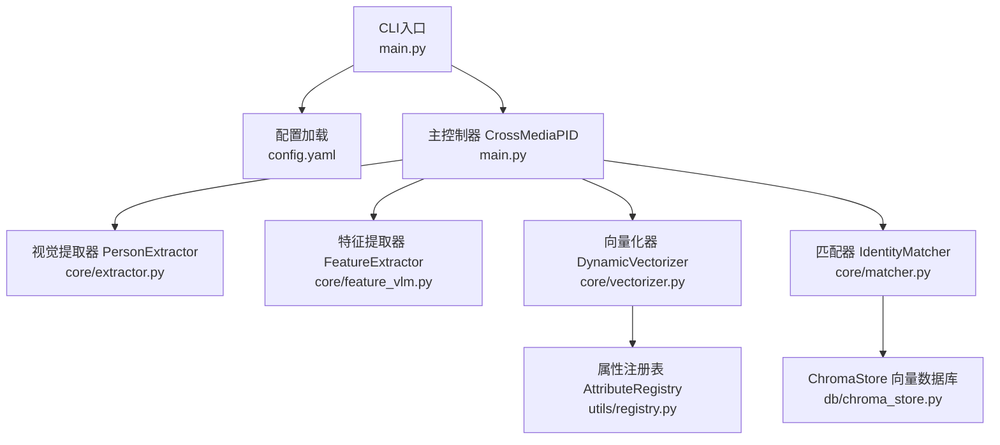
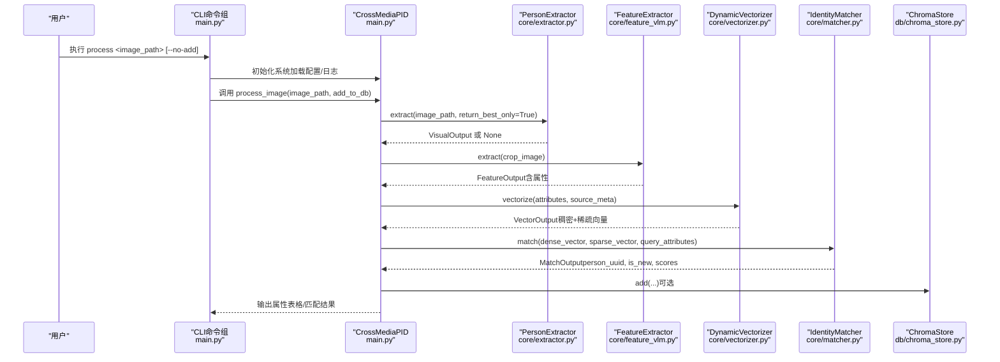
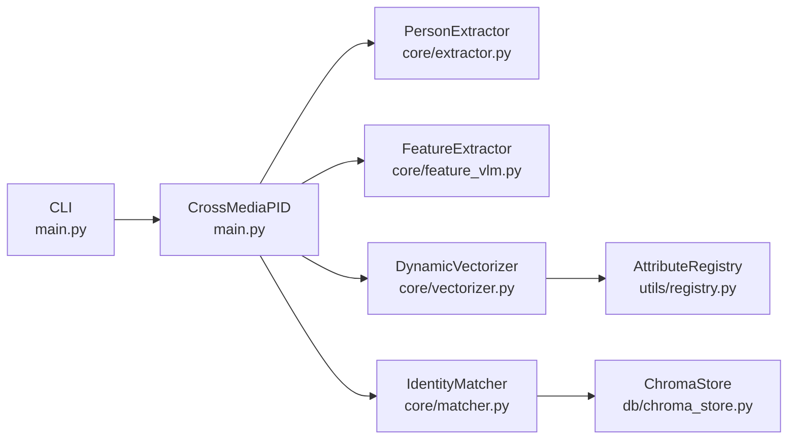

# 命令行接口参考

<cite>
**本文引用的文件**
- [main.py](file://crossmedia_pid/main.py)
- [config.yaml](file://crossmedia_pid/configs/config.yaml)
- [requirements.txt](file://crossmedia_pid/requirements.txt)
- [setup.py](file://crossmedia_pid/setup.py)
- [extractor.py](file://crossmedia_pid/core/extractor.py)
- [matcher.py](file://crossmedia_pid/core/matcher.py)
- [chroma_store.py](file://crossmedia_pid/db/chroma_store.py)
- [vectorizer.py](file://crossmedia_pid/core/vectorizer.py)
- [registry.py](file://crossmedia_pid/utils/registry.py)
</cite>

## 目录
1. [简介](#简介)
2. [项目结构](#项目结构)
3. [核心组件](#核心组件)
4. [架构总览](#架构总览)
5. [详细组件分析](#详细组件分析)
6. [依赖分析](#依赖分析)
7. [性能考虑](#性能考虑)
8. [故障排查指南](#故障排查指南)
9. [结论](#结论)
10. [附录](#附录)

## 简介
本文件为 CrossMedia-PID 的命令行接口（CLI）权威参考，覆盖以下命令与功能：
- process：处理单张图片，完成检测、特征抽取、向量化与身份匹配，并可选择是否入库
- batch：批量处理目录中的图片，支持通配符与数量限制
- search：以图搜图，检索相似人物
- stats：查看系统统计信息（记录总数、唯一人物数、属性注册表统计）

同时提供：
- 完整语法、参数与选项说明
- 输入输出格式与典型输出表格
- 实际使用示例与最佳实践
- 配置文件使用方法与自定义选项
- 错误处理与调试技巧
- 性能优化建议

## 项目结构
CLI 位于入口脚本中，通过 Click 构建命令组与子命令；核心业务逻辑分布在 core、db、utils 等模块中，配置由 YAML 文件提供。

图表来源
- [main.py:237-384](file://crossmedia_pid/main.py#L237-L384)
- [config.yaml:1-58](file://crossmedia_pid/configs/config.yaml#L1-L58)
- [extractor.py:65-351](file://crossmedia_pid/core/extractor.py#L65-L351)
- [vectorizer.py:174-277](file://crossmedia_pid/core/vectorizer.py#L174-L277)
- [matcher.py:30-351](file://crossmedia_pid/core/matcher.py#L30-L351)
- [chroma_store.py:18-254](file://crossmedia_pid/db/chroma_store.py#L18-L254)
- [registry.py:16-269](file://crossmedia_pid/utils/registry.py#L16-L269)

章节来源
- [main.py:1-384](file://crossmedia_pid/main.py#L1-L384)
- [config.yaml:1-58](file://crossmedia_pid/configs/config.yaml#L1-L58)

## 核心组件
- CLI 命令组与通用选项
  - 通用选项：--config/-c 指定配置文件路径；--verbose/-v 开启详细日志
  - 子命令：process、batch、search、stats
- 主控制器 CrossMediaPID
  - 负责初始化各模块（视觉提取、特征抽取、向量化、匹配、数据库），并协调流程
- 数据库与注册表
  - ChromaStore：持久化稠密向量与稀疏向量元数据
  - AttributeRegistry：属性键到ID的映射与统计

章节来源
- [main.py:237-384](file://crossmedia_pid/main.py#L237-L384)
- [chroma_store.py:18-254](file://crossmedia_pid/db/chroma_store.py#L18-L254)
- [registry.py:16-269](file://crossmedia_pid/utils/registry.py#L16-L269)

## 架构总览
CLI 调用流程（以 process 为例）：

图表来源
- [main.py:112-201](file://crossmedia_pid/main.py#L112-L201)
- [extractor.py:206-264](file://crossmedia_pid/core/extractor.py#L206-L264)
- [vectorizer.py:227-258](file://crossmedia_pid/core/vectorizer.py#L227-L258)
- [matcher.py:140-253](file://crossmedia_pid/core/matcher.py#L140-L253)
- [chroma_store.py:73-123](file://crossmedia_pid/db/chroma_store.py#L73-L123)

## 详细组件分析

### CLI 命令总览
- process
  - 作用：处理单张图片，输出提取的属性与匹配结果
  - 语法：python main.py process <image_path> [--no-add]
  - 参数：
    - image_path：图片路径（必须存在）
  - 选项：
    - --no-add：不将结果添加到数据库
  - 输出：Rich 表格显示属性键值对；若匹配到已有身份则显示 UUID 与分数；若为新身份则生成 UUID
- batch
  - 作用：批量处理目录中的图片
  - 语法：python main.py batch <image_dir> [--pattern PATTERN] [--limit LIMIT]
  - 参数：
    - image_dir：目录路径（必须存在且非文件）
  - 选项：
    - --pattern/-p：文件匹配模式，默认 *.jpg（会自动扩展为 jpg/jpeg/png）
    - --limit/-l：最大处理数量
  - 输出：进度条与统计（总数、成功、失败、平均耗时）
- search
  - 作用：以图搜图，返回相似人物列表
  - 语法：python main.py search <image_path> [--top-k K]
  - 参数：
    - image_path：图片路径（必须存在）
  - 选项：
    - --top-k/-k：返回结果数量，默认 5
  - 输出：Rich 表格显示排名、Person UUID、总分、稠密/稀疏分数
- stats
  - 作用：显示系统统计
  - 语法：python main.py stats
  - 输出：Rich 表格显示记录总数、唯一人物数、属性注册表统计

章节来源
- [main.py:256-384](file://crossmedia_pid/main.py#L256-L384)

### process 命令详解
- 功能流程
  - 步骤 1：视觉提取（检测人体、质量评分、裁剪 ROI）
  - 步骤 2：特征提取（从裁剪图像抽取属性）
  - 步骤 3：向量化（生成稠密向量与稀疏向量）
  - 步骤 4：身份匹配（检索候选、计算混合分数、决定新/旧身份）
  - 可选步骤：将结果写入数据库
- 输入参数
  - image_path：图片路径（支持常见格式）
- 可选参数
  - --no-add：跳过入库
- 输出格式
  - Rich 表格：属性键 -> 值
  - 控制台消息：匹配状态（新身份/已匹配）、耗时
- 使用示例
  - 处理单张图片并入库：process <image_path>
  - 处理单张图片但不入库：process <image_path> --no-add
- 最佳实践
  - 确保图片中有人体且质量评分达标（默认阈值见配置）
  - 若目标人物首次出现，将生成新 UUID 并入库
- 性能优化
  - 在 M1 上优先使用 MPS 设备（YOLO 自动检测）
  - 合理设置最小边界框尺寸，减少无效检测
  - 适当降低 --top-k 以减少匹配开销

章节来源
- [main.py:112-201](file://crossmedia_pid/main.py#L112-L201)
- [extractor.py:106-264](file://crossmedia_pid/core/extractor.py#L106-L264)
- [matcher.py:140-253](file://crossmedia_pid/core/matcher.py#L140-L253)
- [chroma_store.py:73-123](file://crossmedia_pid/db/chroma_store.py#L73-L123)

### batch 命令详解
- 功能流程
  - 递归查找匹配模式的图片（jpg/jpeg/png）
  - 逐个调用 process_image，收集统计信息
  - 输出进度条与汇总统计
- 输入参数
  - image_dir：目录路径
- 可选参数
  - --pattern/-p：文件匹配模式（默认 *.jpg）
  - --limit/-l：最大处理数量
- 输出格式
  - Rich 表格：匹配结果（排名、UUID、分数）
  - 控制台统计：总数、成功、失败、平均耗时
- 使用示例
  - 批量处理某目录下所有 JPG/PNG：batch <dir>
  - 限制处理数量：batch <dir> --limit 100
  - 指定模式：batch <dir> --pattern "*.png"
- 最佳实践
  - 合理设置 --limit，避免一次性处理过多文件
  - 使用更严格的文件模式减少无关文件干扰
- 性能优化
  - 合理设置 --pattern，减少 IO 扫描范围
  - 批量处理时注意内存占用，必要时分批执行

章节来源
- [main.py:277-328](file://crossmedia_pid/main.py#L277-L328)

### search 命令详解
- 功能流程
  - 与 process 类似，但不入库
  - 直接检索相似人物并返回前 K 名
- 输入参数
  - image_path：图片路径
- 可选参数
  - --top-k/-k：返回数量（默认 5）
- 输出格式
  - Rich 表格：排名、Person UUID、总分、稠密/稀疏分数
- 使用示例
  - 以图搜图并返回前 5：search <image_path>
  - 返回前 10：search <image_path> --top-k 10
- 最佳实践
  - 保证查询图片质量良好，提高检索命中率
  - 结合 process 的属性表格核验检索结果的合理性
- 性能优化
  - 适当降低 --top-k，减少数据库检索与相似度计算
  - 确保数据库集合已建立索引（默认已启用）

章节来源
- [main.py:330-361](file://crossmedia_pid/main.py#L330-L361)
- [matcher.py:288-333](file://crossmedia_pid/core/matcher.py#L288-L333)

### stats 命令详解
- 功能流程
  - 获取数据库记录总数、唯一人物数
  - 获取属性注册表统计（总属性数、已验证属性数）
- 输入参数
  - 无
- 输出格式
  - Rich 表格：指标名称 -> 数值
- 使用示例
  - 查看系统统计：stats
- 最佳实践
  - 定期运行以监控数据增长趋势
  - 结合注册表统计评估属性覆盖度

章节来源
- [main.py:363-379](file://crossmedia_pid/main.py#L363-L379)
- [chroma_store.py:211-226](file://crossmedia_pid/db/chroma_store.py#L211-L226)
- [registry.py:181-190](file://crossmedia_pid/utils/registry.py#L181-L190)

## 依赖分析
- CLI 与核心模块
  - CLI 依赖 CrossMediaPID，后者依赖 extractor、feature_vlm、vectorizer、matcher、chroma_store
  - vectorizer 依赖 utils/registry
- 外部依赖
  - Click：命令行框架
  - Rich：富文本输出
  - Ultralytics/YOLO：人体检测
  - ChromaDB：向量数据库
  - Transformers/ONNXRuntime：稠密向量编码
  - MLX/MLX-VLM：多模态特征抽取（在 feature_vlm 中使用）

图表来源
- [main.py:28-32](file://crossmedia_pid/main.py#L28-L32)
- [requirements.txt:1-38](file://crossmedia_pid/requirements.txt#L1-L38)

章节来源
- [requirements.txt:1-38](file://crossmedia_pid/requirements.txt#L1-L38)
- [setup.py:29-33](file://crossmedia_pid/setup.py#L29-L33)

## 性能考虑
- 设备选择
  - YOLO 在 M1 上优先使用 MPS；如不可用则回退 CPU
- 模型与向量化
  - ONNXRuntime 优先使用 CoreML/CPU 提供程序；若无 ONNX 则回退 transformers
  - 建议在 M1 上准备 ONNX 模型以提升稠密向量编码速度
- 检索策略
  - 合理设置 --top-k，避免过多候选导致相似度计算开销增大
  - 阈值过高会导致频繁创建新身份，过低则可能误匹配
- 批处理
  - 通过 --limit 控制并发与内存占用
  - 仅扫描必要文件类型，减少 IO

[本节为通用指导，无需特定文件来源]

## 故障排查指南
- 常见问题与解决
  - 无法加载模型/依赖缺失：确认 requirements 安装完整
  - 图片无法读取：检查路径是否存在、格式是否受支持
  - 未检测到人体：调整最小边界框尺寸或置信度阈值
  - 匹配分数异常：检查阈值与权重配置
  - 数据库连接失败：确认 ChromaDB 持久化目录权限
- 调试技巧
  - 使用 --verbose 输出详细日志
  - 使用 --config 指定自定义配置文件路径
  - 逐步缩小问题范围：先用 search 验证检索，再用 process 验证入库
- 日志级别
  - 默认 INFO；开启 --verbose 后为 DEBUG

章节来源
- [main.py:37-45](file://crossmedia_pid/main.py#L37-L45)
- [config.yaml:54-58](file://crossmedia_pid/configs/config.yaml#L54-L58)

## 结论
CrossMedia-PID 的 CLI 提供了从单图处理到批量处理、检索与统计的完整能力。通过合理的配置与参数选择，可在保证准确性的前提下获得良好的性能表现。建议结合本参考文档与实际场景，按需调整阈值、权重与批处理策略。

[本节为总结，无需特定文件来源]

## 附录

### 配置文件使用方法与自定义选项
- 配置文件路径
  - 默认：configs/config.yaml
  - 可通过 --config/-c 指定
- 关键配置项
  - models.yolo：YOLO 模型路径、置信度、IoU、类别过滤
  - models.vlm：多模态模型名称、最大 token、温度
  - models.embedding：稠密嵌入模型、ONNX 路径、最大长度
  - database.chroma：持久化目录、集合名、距离函数
  - features：最小质量分数、最小边界框尺寸
  - matching：匹配阈值、top_k、权重（稠密/稀疏/人脸）
  - registry：注册表持久化路径、最小频率
  - m1_optimization：队列大小、Metal 启用、内存限制、GC 间隔
  - logging：日志级别与格式
- 自定义建议
  - 根据硬件条件选择合适的模型与 ONNX 提供程序
  - 根据业务需求调整阈值与权重
  - 定期清理数据库与注册表，保持系统健康

章节来源
- [config.yaml:1-58](file://crossmedia_pid/configs/config.yaml#L1-L58)
- [main.py:48-54](file://crossmedia_pid/main.py#L48-L54)

### CLI 语法速查
- process
  - 语法：process <image_path> [--no-add]
  - 示例：process ./test.jpg
- batch
  - 语法：batch <image_dir> [--pattern PATTERN] [--limit LIMIT]
  - 示例：batch ./images --pattern "*.png" --limit 100
- search
  - 语法：search <image_path> [--top-k K]
  - 示例：search ./query.jpg --top-k 10
- stats
  - 语法：stats
  - 示例：stats

章节来源
- [main.py:256-384](file://crossmedia_pid/main.py#L256-L384)