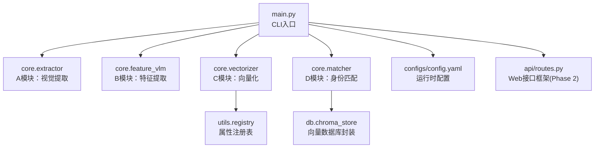
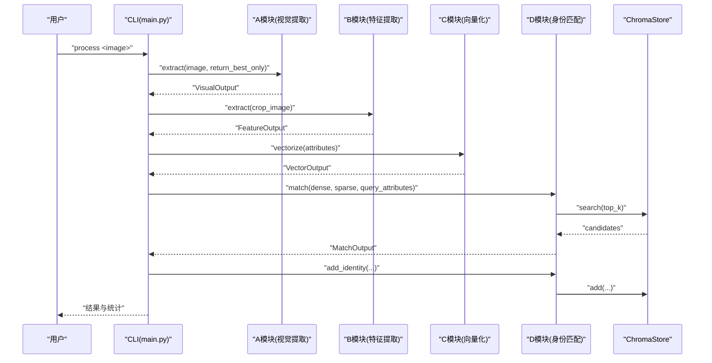
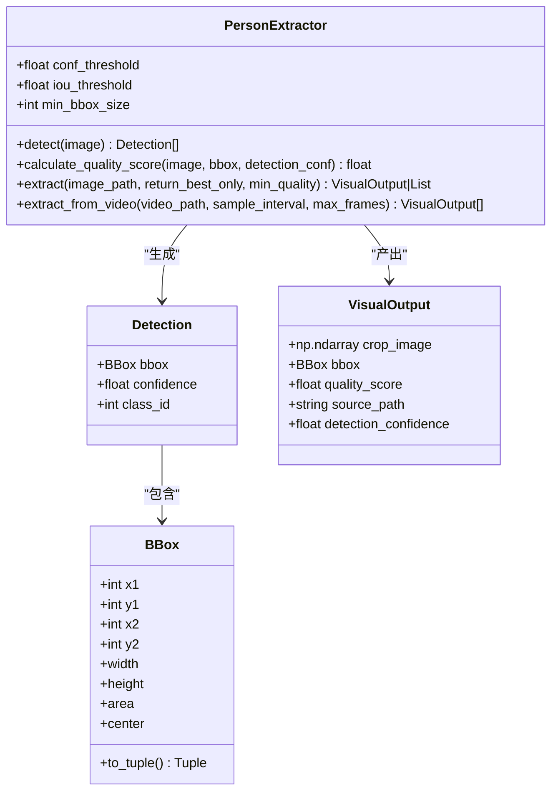
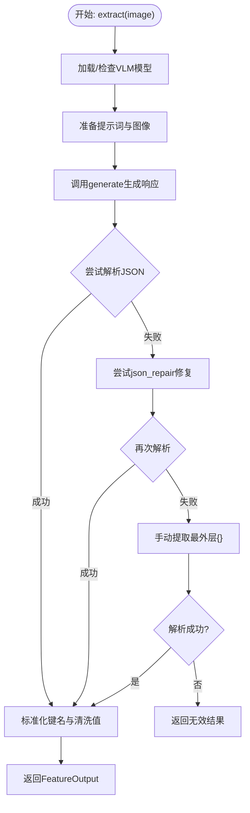
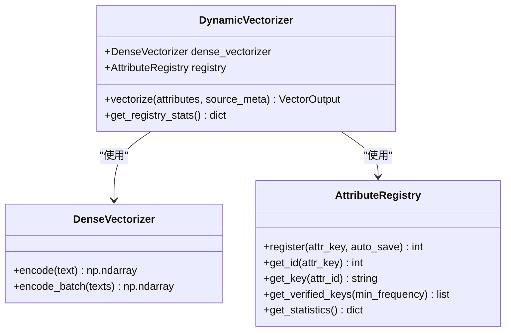
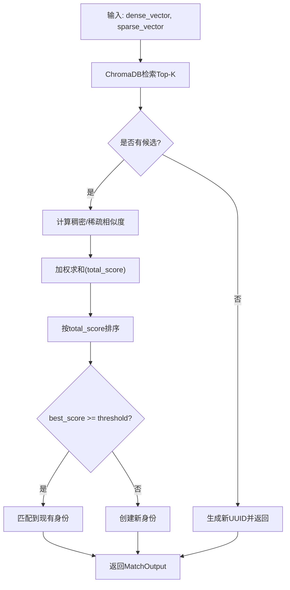
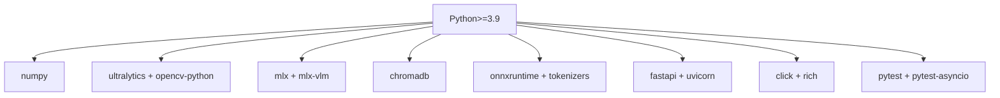

# 开发者贡献指南

<cite>
**本文档引用的文件**
- [main.py](file://main.py)
- [requirements.txt](file://requirements.txt)
- [setup.py](file://setup.py)
- [config.yaml](file://configs/config.yaml)
- [registry.py](file://utils/registry.py)
- [extractor.py](file://core/extractor.py)
- [feature_vlm.py](file://core/feature_vlm.py)
- [matcher.py](file://core/matcher.py)
- [vectorizer.py](file://core/vectorizer.py)
- [chroma_store.py](file://db/chroma_store.py)
- [routes.py](file://api/routes.py)
</cite>

## 目录
1. [简介](#简介)
2. [项目结构](#项目结构)
3. [核心组件](#核心组件)
4. [架构总览](#架构总览)
5. [详细组件分析](#详细组件分析)
6. [依赖分析](#依赖分析)
7. [性能考虑](#性能考虑)
8. [故障排除指南](#故障排除指南)
9. [结论](#结论)
10. [附录](#附录)

## 简介
CrossMedia-PID 是一个跨媒体人物识别系统，采用模块化设计，分为四个核心阶段：视觉提取（A模块）、开放域特征提取（B模块）、动态向量化（C模块）与身份匹配（D模块）。系统通过CLI提供命令行入口，并预留了基于FastAPI的Web接口（Phase 2）。项目强调可扩展性与可维护性，支持M1 Mac优化、多模型融合与向量数据库持久化。

## 项目结构
项目采用按功能分层的模块化组织方式，核心模块位于 `core/`，数据库封装位于 `db/`，通用工具位于 `utils/`，配置位于 `configs/`，API路由位于 `api/`，入口脚本位于根目录。

**图表来源**
- [main.py:1-384](file://main.py#L1-L384)
- [extractor.py:1-351](file://core/extractor.py#L1-L351)
- [feature_vlm.py:1-325](file://core/feature_vlm.py#L1-L325)
- [vectorizer.py:1-277](file://core/vectorizer.py#L1-L277)
- [matcher.py:1-351](file://core/matcher.py#L1-L351)
- [registry.py:1-269](file://utils/registry.py#L1-L269)
- [chroma_store.py:1-254](file://db/chroma_store.py#L1-L254)
- [config.yaml:1-58](file://configs/config.yaml#L1-L58)
- [routes.py:1-91](file://api/routes.py#L1-L91)

**章节来源**
- [main.py:1-384](file://main.py#L1-L384)
- [config.yaml:1-58](file://configs/config.yaml#L1-L58)

## 核心组件
- 主控制器与CLI：负责系统初始化、流程编排与用户交互。
- 视觉提取器：基于YOLO进行人体检测、质量评分与最佳帧筛选。
- 特征提取器：基于MLX VLM抽取结构化人物特征并清洗解析。
- 向量化器：将属性转为稠密向量与稀疏向量，维护属性注册表。
- 匹配器：基于ChromaDB检索与混合相似度计算，决定新旧身份。
- 数据存储：ChromaDB持久化，支持元数据与向量检索。
- 配置管理：YAML配置驱动，支持模型参数、阈值与优化选项。
- Web接口：FastAPI路由框架（Phase 2），预留扩展点。

**章节来源**
- [main.py:57-234](file://main.py#L57-L234)
- [extractor.py:65-351](file://core/extractor.py#L65-L351)
- [feature_vlm.py:52-325](file://core/feature_vlm.py#L52-L325)
- [vectorizer.py:28-277](file://core/vectorizer.py#L28-L277)
- [matcher.py:30-351](file://core/matcher.py#L30-L351)
- [chroma_store.py:18-254](file://db/chroma_store.py#L18-L254)
- [config.yaml:1-58](file://configs/config.yaml#L1-L58)
- [routes.py:1-91](file://api/routes.py#L1-L91)

## 架构总览
系统采用“模块化流水线”架构，每个模块职责单一且可替换。数据流自上而下贯穿四步：检测与裁剪 → 特征抽取 → 向量化 → 匹配与入库。模块间通过明确的数据类与接口解耦，便于独立测试与演进。

**图表来源**
- [main.py:112-200](file://main.py#L112-L200)
- [extractor.py:206-264](file://core/extractor.py#L206-L264)
- [feature_vlm.py:210-290](file://core/feature_vlm.py#L210-L290)
- [vectorizer.py:227-258](file://core/vectorizer.py#L227-L258)
- [matcher.py:140-252](file://core/matcher.py#L140-L252)
- [chroma_store.py:125-178](file://db/chroma_store.py#L125-L178)

## 详细组件分析

### 视觉提取模块（A模块）
- 职责：人体检测、边界框质量评分、ROI裁剪与最佳帧筛选。
- 关键能力：MPS/CPU设备选择、最小框尺寸过滤、质量评分融合检测置信度、面积、清晰度与中心位置。
- 输出：VisualOutput（裁剪图像、边界框、质量评分、检测置信度）。

**图表来源**
- [extractor.py:65-351](file://core/extractor.py#L65-L351)

**章节来源**
- [extractor.py:65-351](file://core/extractor.py#L65-L351)

### 特征提取模块（B模块）
- 职责：使用MLX VLM抽取结构化特征，标准化键名与清洗值，解析JSON响应。
- 关键能力：延迟加载模型、提示词工程、多种JSON解析策略（直接解析、代码块、修复、手动提取）。
- 输出：FeatureOutput（属性字典、原始响应、是否有效）。

**图表来源**
- [feature_vlm.py:80-290](file://core/feature_vlm.py#L80-L290)

**章节来源**
- [feature_vlm.py:52-325](file://core/feature_vlm.py#L52-L325)

### 向量化模块（C模块）
- 职责：将属性字典转为稠密向量与稀疏向量；维护属性注册表；提供注册表统计。
- 关键能力：ONNX/Transformers双路径稠密向量编码；稀疏向量基于注册表ID映射；文本构造策略。
- 输出：VectorOutput（稠密向量、稀疏向量、原始文本）。

**图表来源**
- [vectorizer.py:28-277](file://core/vectorizer.py#L28-L277)
- [registry.py:16-269](file://utils/registry.py#L16-L269)

**章节来源**
- [vectorizer.py:174-277](file://core/vectorizer.py#L174-L277)
- [registry.py:16-269](file://utils/registry.py#L16-L269)

### 匹配模块（D模块）
- 职责：基于ChromaDB检索候选，计算稠密余弦相似度与稀疏Jaccard相似度，加权综合得分，决定新旧身份。
- 关键能力：权重归一化、阈值决策、Top-K候选、相似度排序与日志记录。
- 输出：MatchOutput（UUID、综合分数、是否新身份、候选列表）。

**图表来源**
- [matcher.py:140-252](file://core/matcher.py#L140-L252)
- [chroma_store.py:125-178](file://db/chroma_store.py#L125-L178)

**章节来源**
- [matcher.py:30-351](file://core/matcher.py#L30-L351)
- [chroma_store.py:18-254](file://db/chroma_store.py#L18-L254)

### 数据存储（ChromaStore）
- 职责：封装ChromaDB客户端、集合管理、向量与元数据的增删查。
- 关键能力：延迟初始化、Cosine距离转换为相似度、JSON序列化元数据、按PersonUUID聚合。
- 输出：搜索候选列表、统计信息、删除操作。

**章节来源**
- [chroma_store.py:18-254](file://db/chroma_store.py#L18-L254)

### 配置与CLI
- 配置：YAML集中管理模型路径、阈值、权重、数据库参数与日志级别。
- CLI：Click命令组，支持process、batch、search、stats，进度条与表格输出，日志级别动态控制。

**章节来源**
- [config.yaml:1-58](file://configs/config.yaml#L1-L58)
- [main.py:237-380](file://main.py#L237-L380)

### Web接口（API）
- 路由：基于FastAPI的路由框架，预留提取、搜索、详情与统计接口，当前为占位实现，为Phase 2做准备。

**章节来源**
- [routes.py:1-91](file://api/routes.py#L1-L91)

## 依赖分析
- Python版本：>=3.9
- 核心依赖：numpy、Pillow、pyyaml、pydantic、python-dotenv
- 计算机视觉：ultralytics（YOLO）、opencv-python
- MLX生态：mlx、mlx-vlm（VLM推理）
- 向量数据库：chromadb
- 密集嵌入：onnxruntime、tokenizers（transformers回退）
- Web框架：fastapi、uvicorn、python-multipart（Phase 2）
- CLI与UI：click、rich
- 测试与开发：pytest、pytest-asyncio

**图表来源**
- [requirements.txt:1-38](file://requirements.txt#L1-L38)
- [setup.py:8-27](file://setup.py#L8-L27)

**章节来源**
- [requirements.txt:1-38](file://requirements.txt#L1-L38)
- [setup.py:1-35](file://setup.py#L1-L35)

## 性能考虑
- 设备选择：M1 Mac优先使用MPS加速YOLO推理，减少CPU/GPU切换开销。
- 模型加载：VLM与嵌入模型采用延迟加载，避免启动时阻塞。
- 向量编码：ONNX提供CoreML/CPU执行路径，Transformer作为回退方案。
- 检索优化：ChromaDB使用余弦距离，返回相似度而非距离，减少额外转换。
- 批处理：CLI提供进度条与平均耗时统计，便于评估吞吐。
- 内存与并发：M1优化配置提供队列大小、内存限制与GC间隔建议。

**章节来源**
- [extractor.py:94-104](file://core/extractor.py#L94-L104)
- [feature_vlm.py:80-101](file://core/feature_vlm.py#L80-L101)
- [vectorizer.py:53-94](file://core/vectorizer.py#L53-L94)
- [chroma_store.py:144-178](file://db/chroma_store.py#L144-L178)
- [config.yaml:47-52](file://configs/config.yaml#L47-L52)

## 故障排除指南
- 模型加载失败
  - 症状：VLM或嵌入模型初始化报错。
  - 处理：检查模型名称与ONNX路径；确认mlx/mlx-vlm与transformers安装；查看回退逻辑是否生效。
  - 参考：[feature_vlm.py:80-101](file://core/feature_vlm.py#L80-L101)、[vectorizer.py:53-94](file://core/vectorizer.py#L53-L94)
- JSON解析异常
  - 症状：特征提取返回无效。
  - 处理：启用json_repair；检查提示词与模型输出格式；查看原始响应日志。
  - 参考：[feature_vlm.py:131-184](file://core/feature_vlm.py#L131-L184)
- 检测不到人像
  - 症状：视觉提取返回空。
  - 处理：降低最小框尺寸或质量阈值；检查图像清晰度与光照条件。
  - 参考：[extractor.py:140-149](file://core/extractor.py#L140-L149)
- 匹配阈值过低/过高
  - 症状：频繁新建身份或无法匹配。
  - 处理：调整config中的阈值与权重；观察相似度分布。
  - 参考：[config.yaml:34-41](file://configs/config.yaml#L34-L41)、[matcher.py:121-138](file://core/matcher.py#L121-L138)
- 数据库不可用
  - 症状：ChromaDB初始化失败或查询为空。
  - 处理：检查持久化目录权限；确认集合已创建；查看日志错误。
  - 参考：[chroma_store.py:43-71](file://db/chroma_store.py#L43-L71)

**章节来源**
- [feature_vlm.py:80-101](file://core/feature_vlm.py#L80-L101)
- [feature_vlm.py:131-184](file://core/feature_vlm.py#L131-L184)
- [extractor.py:140-149](file://core/extractor.py#L140-L149)
- [config.yaml:34-41](file://configs/config.yaml#L34-L41)
- [matcher.py:121-138](file://core/matcher.py#L121-L138)
- [chroma_store.py:43-71](file://db/chroma_store.py#L43-L71)

## 结论
CrossMedia-PID通过清晰的模块划分与稳健的实现，构建了一个可扩展、可维护的跨媒体人物识别系统。开发者可在保持模块边界的前提下，针对任一模块进行迭代与扩展，同时利用配置与CLI快速验证新特性。后续Phase 2将引入Web接口与更丰富的匹配策略，进一步完善系统能力。

## 附录

### 开发环境搭建
- 安装Python 3.9+
- 克隆仓库后安装依赖：[requirements.txt:1-38](file://requirements.txt#L1-L38)
- 可选：使用pip安装项目自身以获得CLI入口：[setup.py:1-35](file://setup.py#L1-L35)
- 运行CLI：参考入口文件注释与帮助输出

**章节来源**
- [requirements.txt:1-38](file://requirements.txt#L1-L38)
- [setup.py:1-35](file://setup.py#L1-L35)
- [main.py:5-10](file://main.py#L5-L10)

### 代码结构与编码规范
- 文件命名：模块化文件采用小写与下划线，如 `core/extractor.py`。
- 类命名：采用PascalCase，如 `PersonExtractor`、`FeatureExtractor`。
- 函数命名：采用snake_case，如 `extract()`、`vectorize()`。
- 数据类：使用 `@dataclass`，字段显式标注类型。
- 日志：模块内使用 `logger = logging.getLogger(__name__)`。
- 配置：统一从YAML加载，避免硬编码。

**章节来源**
- [extractor.py:65-351](file://core/extractor.py#L65-L351)
- [feature_vlm.py:52-325](file://core/feature_vlm.py#L52-L325)
- [vectorizer.py:28-277](file://core/vectorizer.py#L28-L277)
- [matcher.py:30-351](file://core/matcher.py#L30-L351)
- [chroma_store.py:18-254](file://db/chroma_store.py#L18-L254)
- [registry.py:16-269](file://utils/registry.py#L16-L269)
- [config.yaml:1-58](file://configs/config.yaml#L1-58)

### 模块化设计原则与扩展机制
- 单一职责：A/B/C/D模块职责清晰，输入输出明确。
- 松耦合：通过数据类与接口传递，避免直接依赖具体实现。
- 配置驱动：模型参数、阈值、权重均来自配置文件，便于热插拔。
- 延迟加载：模型与数据库在首次使用时初始化，提升启动速度。
- 插件化：新增模块可通过CLI与主控制器接入，无需修改既有流程。

**章节来源**
- [main.py:57-111](file://main.py#L57-L111)
- [config.yaml:1-58](file://configs/config.yaml#L1-L58)

### 新功能开发流程与最佳实践
- 需求分析：明确模块边界与输入输出。
- 设计接口：定义数据类与方法签名，确保类型安全。
- 实现与测试：先单元测试，再集成测试。
- 配置化：将参数暴露到配置文件，支持运行时调整。
- 文档与日志：补充README说明与关键日志信息。
- 性能评估：对比不同模型与参数组合，记录耗时与准确率。

### 单元测试编写与覆盖率要求
- 测试范围：建议覆盖核心算法（特征解析、相似度计算、向量化）与边界条件（空输入、异常响应）。
- 测试框架：使用pytest与pytest-asyncio。
- 覆盖率目标：建议达到关键路径80%以上，核心模块接近100%。
- 示例策略：mock外部依赖（模型、数据库），隔离单元逻辑。

**章节来源**
- [requirements.txt:36-38](file://requirements.txt#L36-L38)

### 代码审查标准
- 代码风格：遵循PEP 8，类型注解完整，变量命名清晰。
- 错误处理：异常捕获与日志记录充分，避免静默失败。
- 性能与资源：避免重复初始化，及时释放资源，注意内存占用。
- 可测试性：尽量减少全局状态，便于mock与注入依赖。
- 文档与注释：关键函数与复杂逻辑提供注释，公共接口补充说明。

### 发布流程
- 版本管理：遵循语义化版本，更新 [setup.py:4-6](file://setup.py#L4-L6) 中的版本号。
- 依赖锁定：在CI中固定关键依赖版本，确保可复现性。
- 构建与打包：使用标准打包流程，验证CLI入口与依赖完整性。
- 发布渠道：PyPI或内部镜像仓库，附带变更日志。

**章节来源**
- [setup.py:4-6](file://setup.py#L4-L6)

### 依赖管理、版本控制与CI配置
- 依赖管理：使用 [requirements.txt:1-38](file://requirements.txt#L1-L38) 与 [setup.py:8-27](file://setup.py#L8-L27) 统一声明。
- 版本控制：遵循Git工作流，分支策略建议采用功能分支与PR合并。
- CI配置：建议包含Python版本矩阵、依赖安装、单元测试与覆盖率检查。

**章节来源**
- [requirements.txt:1-38](file://requirements.txt#L1-L38)
- [setup.py:1-35](file://setup.py#L1-L35)

### 调试技巧与开发工具
- 日志：CLI支持 --verbose 输出详细日志，定位问题。
- 进度可视化：CLI批处理使用rich进度条，直观展示处理状态。
- 模拟与Mock：对模型与数据库进行Mock，快速验证算法逻辑。
- 性能剖析：记录每步耗时，结合配置调整参数。

**章节来源**
- [main.py:37-46](file://main.py#L37-L46)
- [main.py:302-328](file://main.py#L302-L328)

### 贡献代码、报告问题与社区参与
- 提交规范：使用清晰的提交信息，关联问题编号。
- 问题报告：提供最小可复现示例、日志片段与环境信息。
- 社区讨论：通过Issue与PR参与讨论，遵循社区行为准则。

### 许可证与法律要求
- 许可证：项目未包含许可证文件，建议在仓库根目录添加LICENSE文件，明确开源许可证类型（如MIT、Apache 2.0等）。
- 法律合规：确保第三方模型与依赖的使用符合其许可条款；在分发前完成合规审查。