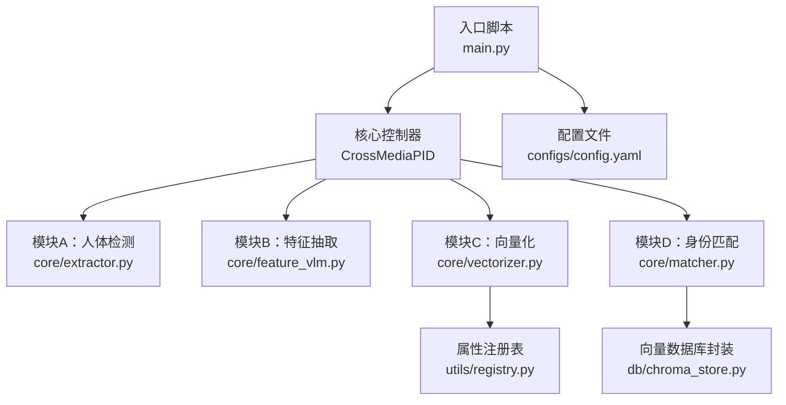
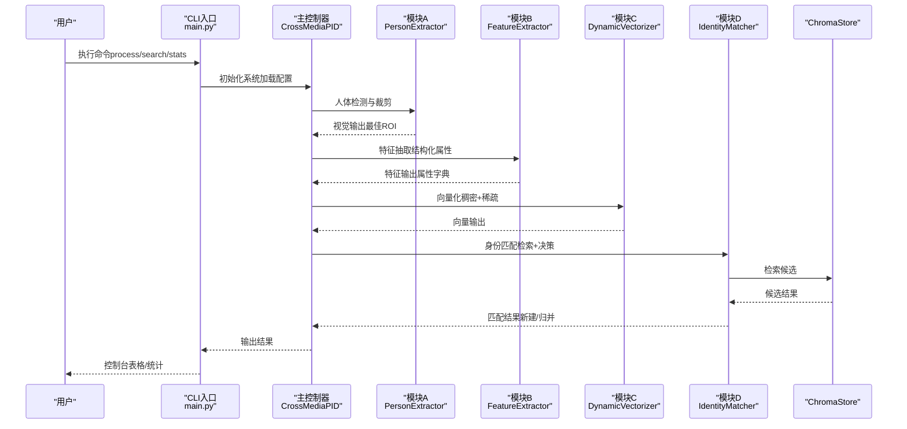
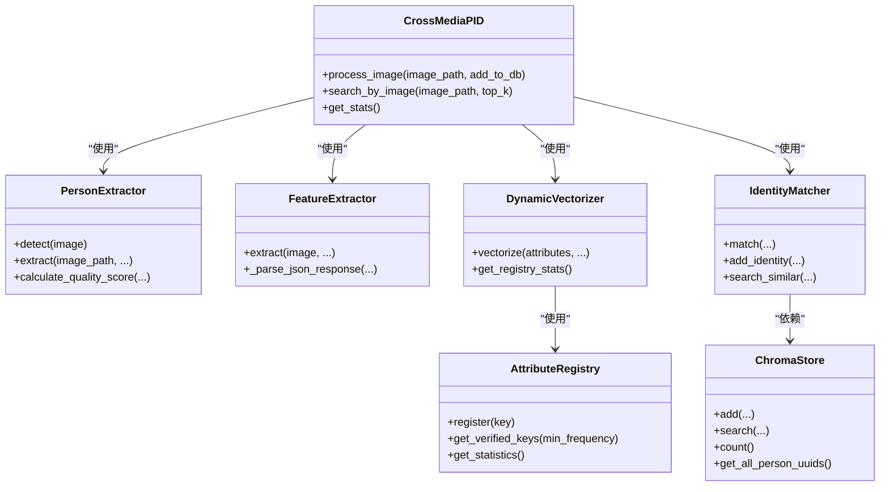
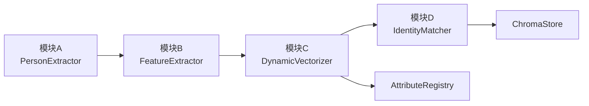

# 快速开始

<cite>
**本文引用的文件**
- [main.py](file://main.py)
- [requirements.txt](file://requirements.txt)
- [setup.py](file://setup.py)
- [config.yaml](file://configs/config.yaml)
- [extractor.py](file://core/extractor.py)
- [feature_vlm.py](file://core/feature_vlm.py)
- [matcher.py](file://core/matcher.py)
- [vectorizer.py](file://core/vectorizer.py)
- [chroma_store.py](file://db/chroma_store.py)
- [registry.py](file://utils/registry.py)
</cite>

## 目录
1. [简介](#简介)
2. [项目结构](#项目结构)
3. [核心组件](#核心组件)
4. [架构总览](#架构总览)
5. [详细组件分析](#详细组件分析)
6. [依赖分析](#依赖分析)
7. [性能考虑](#性能考虑)
8. [故障排除指南](#故障排除指南)
9. [结论](#结论)
10. [附录](#附录)

## 简介
CrossMedia-PID 是一个跨媒体人物识别系统，采用“人体检测-特征抽取-向量化-身份匹配”的流水线设计，支持单张图片处理、批量处理与以图搜图。系统通过 YOLOv8 进行人体检测，使用 Qwen3-VL 多模态模型抽取人物特征，借助 BGE 中文嵌入模型生成稠密语义向量，并结合动态属性注册表构建稀疏向量，最终在 ChromaDB 向量库中进行检索与匹配。

本“快速开始”面向初学者，提供从环境准备、依赖安装、模型准备到基本使用的完整步骤，帮助你在最短时间内跑通系统。

## 项目结构
项目采用按功能分层的组织方式，核心模块位于 crossmedia_pid 目录下，主要文件如下：
- 入口脚本：main.py
- 配置文件：configs/config.yaml
- 核心模块：core/extractor.py、core/feature_vlm.py、core/vectorizer.py、core/matcher.py
- 数据库封装：db/chroma_store.py
- 工具与注册表：utils/registry.py
- 依赖声明：requirements.txt、setup.py

图表来源
- [main.py:1-384](file://main.py#L1-L384)
- [extractor.py:1-351](file://core/extractor.py#L1-L351)
- [feature_vlm.py:1-325](file://core/feature_vlm.py#L1-L325)
- [vectorizer.py:1-277](file://core/vectorizer.py#L1-L277)
- [matcher.py:1-351](file://core/matcher.py#L1-L351)
- [chroma_store.py:1-254](file://db/chroma_store.py#L1-L254)
- [registry.py:1-269](file://utils/registry.py#L1-L269)
- [config.yaml:1-58](file://configs/config.yaml#L1-L58)

章节来源
- [main.py:1-384](file://main.py#L1-L384)
- [config.yaml:1-58](file://configs/config.yaml#L1-L58)

## 核心组件
- 人体检测与裁剪（模块A）：基于 YOLOv8 检测人体，计算质量评分并裁剪最佳 ROI。
- 特征抽取（模块B）：使用 Qwen3-VL 多模态模型从裁剪图像中抽取结构化人物特征，清洗并标准化为字典。
- 向量化（模块C）：将特征字典转为自然语言文本，生成稠密语义向量；同时基于属性注册表生成稀疏向量。
- 身份匹配（模块D）：在 ChromaDB 中检索候选，计算稠密/稀疏混合相似度，决定新建身份或归并到现有身份。
- 向量数据库封装：ChromaStore 提供持久化、查询、统计等能力。
- 属性注册表：动态维护属性键到ID的映射，支持最小频次验证与统计。

章节来源
- [extractor.py:65-264](file://core/extractor.py#L65-L264)
- [feature_vlm.py:52-291](file://core/feature_vlm.py#L52-L291)
- [vectorizer.py:174-258](file://core/vectorizer.py#L174-L258)
- [matcher.py:30-252](file://core/matcher.py#L30-L252)
- [chroma_store.py:18-242](file://db/chroma_store.py#L18-L242)
- [registry.py:16-208](file://utils/registry.py#L16-L208)

## 架构总览
系统通过 Click CLI 提供命令行接口，统一加载配置并初始化四大模块，形成端到端的处理流程。

图表来源
- [main.py:112-226](file://main.py#L112-L226)
- [extractor.py:206-264](file://core/extractor.py#L206-L264)
- [feature_vlm.py:210-291](file://core/feature_vlm.py#L210-L291)
- [vectorizer.py:227-258](file://core/vectorizer.py#L227-L258)
- [matcher.py:140-252](file://core/matcher.py#L140-L252)
- [chroma_store.py:125-178](file://db/chroma_store.py#L125-L178)

## 详细组件分析

### 安装与环境准备
- Python 版本要求：>=3.9（由安装脚本声明）
- 推荐使用虚拟环境隔离依赖
- 在 macOS M1/M2 上，系统会优先使用 MPS 设备进行 YOLO 推理

章节来源
- [setup.py:28](file://setup.py#L28)

### 依赖安装
- 使用 pip 安装项目所需依赖
- 关键依赖说明：
  - 计算机视觉：ultralytics（YOLOv8）、opencv-python
  - 多模态模型：mlx、mlx-vlm（用于 Qwen3-VL）
  - 向量数据库：chromadb
  - 嵌入模型：onnxruntime、tokenizers（BGE 中文嵌入）
  - CLI 与 UI：click、rich
  - 配置与开发：pyyaml、pytest、python-dotenv 等

章节来源
- [requirements.txt:1-38](file://requirements.txt#L1-L38)

### 模型文件准备
- YOLOv8 人体检测模型：默认使用 yolov8n.pt（可在配置中指定路径）
- Qwen3-VL 多模态模型：默认使用 mlx-community/Qwen3-VL-235B-4bit（MLX VLM）
- BGE 中文嵌入模型：默认使用 BAAI/bge-small-zh-v1.5（ONNX 或 Transformers）

注意：首次运行时，系统会在需要时加载上述模型。建议提前准备好本地模型缓存以减少首次启动时间。

章节来源
- [config.yaml:4-20](file://configs/config.yaml#L4-L20)
- [extractor.py:90-104](file://core/extractor.py#L90-L104)
- [feature_vlm.py:80-101](file://core/feature_vlm.py#L80-L101)
- [vectorizer.py:53-94](file://core/vectorizer.py#L53-L94)

### 基本使用示例

- 单张图片处理
  - 命令：python main.py process <image_path>
  - 行为：检测人体→抽取特征→向量化→匹配→可选入库
  - 输出：控制台表格展示提取的属性，以及匹配结果（新建身份/归并）

- 批量处理
  - 命令：python main.py batch <image_dir> [--pattern PATTERN] [--limit N]
  - 行为：扫描目录→按模式匹配→逐张处理→进度条显示
  - 输出：统计处理总数、成功数、失败数与平均耗时

- 以图搜图
  - 命令：python main.py search <image_path> [--top-k K]
  - 行为：与单张处理相同，但不入库，仅检索相似人物
  - 输出：按综合得分排序的候选列表

- 统计信息
  - 命令：python main.py stats
  - 行为：查询向量库与注册表统计
  - 输出：总记录数、唯一人物数、注册表统计

章节来源
- [main.py:256-380](file://main.py#L256-L380)

### 配置选项说明
- 模型配置（models）
  - yolov8 检测模型路径、置信度阈值、NMS IoU 阈值、类别过滤（仅人像）
  - VLM 模型名称、最大生成 token 数、采样温度
  - 嵌入模型名称、ONNX 路径、最大序列长度
- 向量数据库（database.chroma）
  - 持久化目录、集合名称、距离函数
- 特征提取（features）
  - 最小质量评分、最小边界框尺寸
- 匹配策略（matching）
  - 阈值、Top-K、稠密/稀疏/人脸权重（Phase 1禁用人脸）
- 属性注册表（registry）
  - 注册表持久化路径、最小频率阈值
- M1 优化（m1_optimization）
  - 队列大小、启用 Metal、内存限制、GC 间隔
- 日志（logging）
  - 日志级别与格式

章节来源
- [config.yaml:1-58](file://configs/config.yaml#L1-L58)

### 代码级组件关系

图表来源
- [main.py:57-234](file://main.py#L57-L234)
- [extractor.py:65-351](file://core/extractor.py#L65-L351)
- [feature_vlm.py:52-325](file://core/feature_vlm.py#L52-L325)
- [vectorizer.py:174-277](file://core/vectorizer.py#L174-L277)
- [matcher.py:30-351](file://core/matcher.py#L30-L351)
- [chroma_store.py:18-254](file://db/chroma_store.py#L18-L254)
- [registry.py:16-269](file://utils/registry.py#L16-L269)

## 依赖分析
- 模块内聚与耦合
  - 主控制器 CrossMediaPID 将四大模块组合，职责清晰，耦合点集中在向量输出与数据库交互
  - 向量化器与注册表解耦，便于独立演进
  - 匹配器与数据库封装分离，利于替换存储后端
- 外部依赖
  - YOLOv8、MLX VLM、ONNX Runtime、ChromaDB、Transformers 等
- 潜在循环依赖
  - 当前模块间无显式循环导入

图表来源
- [extractor.py:65-351](file://core/extractor.py#L65-L351)
- [feature_vlm.py:52-325](file://core/feature_vlm.py#L52-L325)
- [vectorizer.py:174-277](file://core/vectorizer.py#L174-L277)
- [matcher.py:30-351](file://core/matcher.py#L30-L351)
- [chroma_store.py:18-254](file://db/chroma_store.py#L18-L254)
- [registry.py:16-269](file://utils/registry.py#L16-L269)

章节来源
- [requirements.txt:1-38](file://requirements.txt#L1-L38)

## 性能考虑
- 设备选择：M1/M2 上优先使用 MPS 推理（YOLO），MLX VLM 与 ONNX Runtime 适配 M1 生态
- 模型加载：首次运行会加载模型，建议预热或提前下载缓存
- 向量检索：合理设置 Top-K 与阈值，避免过多候选导致检索变慢
- 批处理：利用进度条与并发策略提升吞吐，注意磁盘与内存占用
- 注册表：高频更新会触发持久化，建议在大批量入库后统一提交

## 故障排除指南
- Python 版本过低
  - 症状：安装失败或运行时报错
  - 处理：升级至 Python 3.9+
- 依赖安装失败
  - 症状：pip 安装报错或缺失编译工具
  - 处理：确保系统具备编译环境；优先使用虚拟环境；必要时更换镜像源
- YOLO 推理失败（MPS/CPU）
  - 症状：GPU 不可用或推理异常
  - 处理：确认 torch.mps 可用；若不可用，系统会回退到 CPU；检查模型路径与权限
- VLM 推理失败（MLX）
  - 症状：模型加载失败或生成异常
  - 处理：确认 mlx、mlx-vlm 安装；检查模型名称与可用性；查看日志定位错误
- 嵌入模型加载失败（ONNX/Transformers）
  - 症状：BGE 模型加载缓慢或失败
  - 处理：确保 onnxruntime、tokenizers 正常；如无 ONNX 文件，系统会回退到 Transformers；检查网络与缓存
- ChromaDB 初始化失败
  - 症状：无法创建/打开持久化目录
  - 处理：检查路径权限与磁盘空间；确认 chromadb 安装；清理损坏的持久化文件
- 检测不到人像
  - 症状：无输出或提示未检测到人
  - 处理：降低置信度或最小框尺寸；检查图像质量与光照条件
- 匹配阈值过高
  - 症状：总是新建身份
  - 处理：调低 matching.threshold 或调整权重；或增加训练样本以提高稀疏向量区分度

章节来源
- [extractor.py:90-104](file://core/extractor.py#L90-L104)
- [feature_vlm.py:80-101](file://core/feature_vlm.py#L80-L101)
- [vectorizer.py:53-94](file://core/vectorizer.py#L53-L94)
- [chroma_store.py:43-71](file://db/chroma_store.py#L43-L71)
- [config.yaml:34-40](file://configs/config.yaml#L34-L40)

## 结论
通过本快速开始指南，你已经完成了 CrossMedia-PID 的环境准备、依赖安装与模型准备，并掌握了单张处理、批量处理与以图搜图的基本用法。建议在实际部署中结合业务场景调整配置参数（如阈值、Top-K、权重），并关注性能与稳定性优化。

## 附录

### 常用命令速查
- 单张处理：python main.py process <image_path> [--no-add]
- 批量处理：python main.py batch <image_dir> [--pattern PATTERN] [--limit N]
- 以图搜图：python main.py search <image_path> [--top-k K]
- 统计信息：python main.py stats

### 预期输出要点
- 单张处理：控制台表格显示提取的属性键值；输出匹配结果（新建/归并）与质量评分
- 批量处理：统计总数、成功/失败数与平均耗时
- 以图搜图：按综合得分排序的候选列表（含稠密/稀疏得分）
- 统计信息：总记录数、唯一人物数、注册表统计