# 性能优化

<cite>
**本文引用的文件**
- [main.py](file://crossmedia_pid/main.py)
- [extractor.py](file://crossmedia_pid/core/extractor.py)
- [feature_vlm.py](file://crossmedia_pid/core/feature_vlm.py)
- [vectorizer.py](file://crossmedia_pid/core/vectorizer.py)
- [matcher.py](file://crossmedia_pid/core/matcher.py)
- [chroma_store.py](file://crossmedia_pid/db/chroma_store.py)
- [registry.py](file://crossmedia_pid/utils/registry.py)
- [config.yaml](file://crossmedia_pid/configs/config.yaml)
- [requirements.txt](file://crossmedia_pid/requirements.txt)
</cite>

## 目录
1. [简介](#简介)
2. [项目结构](#项目结构)
3. [核心组件](#核心组件)
4. [架构概览](#架构概览)
5. [详细组件分析](#详细组件分析)
6. [依赖分析](#依赖分析)
7. [性能考虑](#性能考虑)
8. [故障排查指南](#故障排查指南)
9. [结论](#结论)

## 简介

CrossMedia-PID是一个跨媒体人物识别系统，采用模块化架构设计，包含四个主要处理阶段：视觉提取、特征提取、向量化和身份匹配。该系统针对M1 Mac进行了专门优化，使用ONNX Runtime进行深度学习模型推理，并通过ChromaDB实现高效的向量检索。

系统的核心优势在于其灵活的配置管理和渐进式功能实现，当前版本专注于稠密向量匹配，为后续的人脸特征集成预留了接口。

## 项目结构

项目采用清晰的模块化组织结构，每个核心功能都独立封装在相应的模块中：

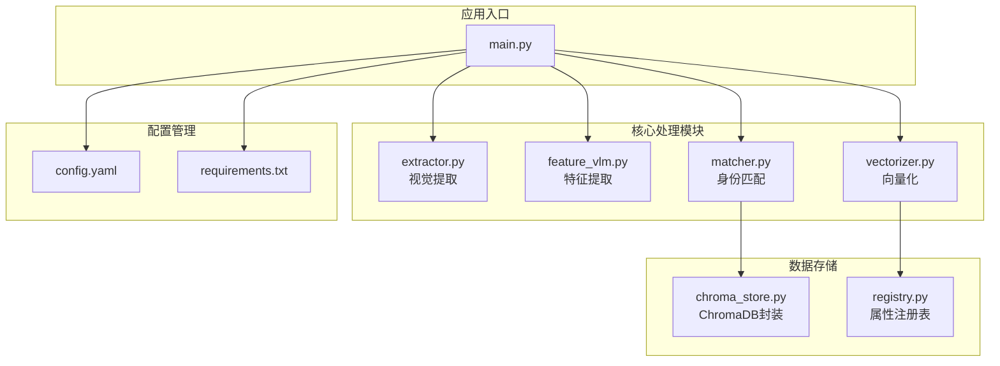

**图表来源**
- [main.py:1-50](file://crossmedia_pid/main.py#L1-L50)
- [extractor.py:1-50](file://crossmedia_pid/core/extractor.py#L1-L50)
- [feature_vlm.py:1-50](file://crossmedia_pid/core/feature_vlm.py#L1-L50)
- [vectorizer.py:1-50](file://crossmedia_pid/core/vectorizer.py#L1-L50)
- [matcher.py:1-50](file://crossmedia_pid/core/matcher.py#L1-L50)
- [chroma_store.py:1-50](file://crossmedia_pid/db/chroma_store.py#L1-L50)
- [registry.py:1-50](file://crossmedia_pid/utils/registry.py#L1-L50)

**章节来源**
- [main.py:1-110](file://crossmedia_pid/main.py#L1-L110)
- [config.yaml:1-58](file://crossmedia_pid/configs/config.yaml#L1-L58)

## 核心组件

系统由四个核心模块组成，每个模块都有明确的职责分工：

### 视觉提取模块 (A模块)
负责人体检测、质量评估和ROI裁剪，使用YOLOv8模型进行实时目标检测。

### 特征提取模块 (B模块)
基于MLX VLM模型的开放域特征提取，支持动态属性识别和结构化JSON输出。

### 向量化模块 (C模块)
结合稠密向量和稀疏向量的混合表示，使用BGE模型生成语义嵌入。

### 身份匹配模块 (D模块)
实现多模态相似度计算和身份决策，支持阈值控制和权重调节。

**章节来源**
- [extractor.py:65-265](file://crossmedia_pid/core/extractor.py#L65-L265)
- [feature_vlm.py:52-291](file://crossmedia_pid/core/feature_vlm.py#L52-L291)
- [vectorizer.py:174-258](file://crossmedia_pid/core/vectorizer.py#L174-L258)
- [matcher.py:30-253](file://crossmedia_pid/core/matcher.py#L30-L253)

## 架构概览

系统采用流水线式处理架构，支持单张图片处理和批量处理两种模式：

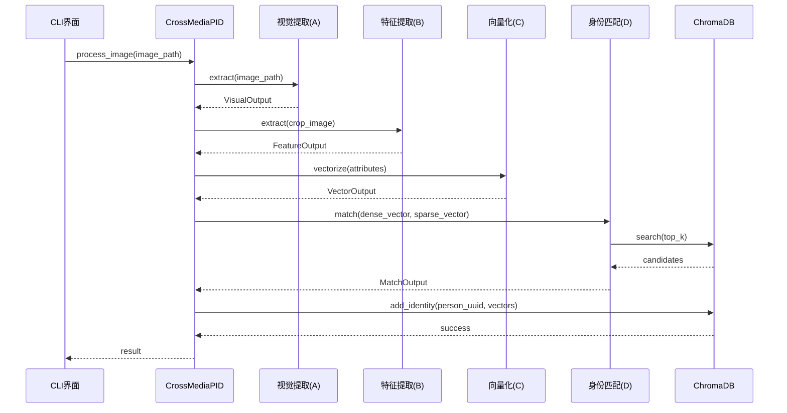

**图表来源**
- [main.py:112-201](file://crossmedia_pid/main.py#L112-L201)
- [extractor.py:206-264](file://crossmedia_pid/core/extractor.py#L206-L264)
- [feature_vlm.py:210-291](file://crossmedia_pid/core/feature_vlm.py#L210-L291)
- [vectorizer.py:227-258](file://crossmedia_pid/core/vectorizer.py#L227-L258)
- [matcher.py:140-253](file://crossmedia_pid/core/matcher.py#L140-L253)

## 详细组件分析

### 视觉提取器性能分析

视觉提取器是系统中最耗时的模块之一，主要性能瓶颈在于YOLO模型推理和图像处理操作。

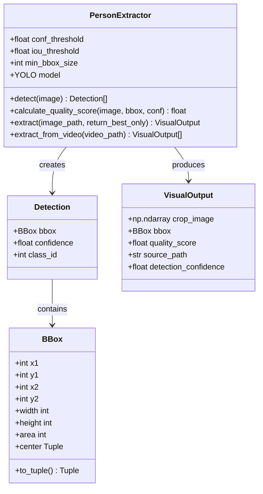

**图表来源**
- [extractor.py:65-265](file://crossmedia_pid/core/extractor.py#L65-L265)
- [extractor.py:19-63](file://crossmedia_pid/core/extractor.py#L19-L63)

**性能优化建议**：
1. **模型推理优化**：利用MPS后端进行GPU加速，避免CPU回退
2. **图像预处理**：减少不必要的图像转换操作
3. **质量评分优化**：缓存拉普拉斯方差计算结果
4. **批处理支持**：实现视频帧的并行处理

**章节来源**
- [extractor.py:68-104](file://crossmedia_pid/core/extractor.py#L68-L104)
- [extractor.py:151-204](file://crossmedia_pid/core/extractor.py#L151-L204)

### 特征提取器性能分析

特征提取器使用MLX VLM模型，具有强大的开放域特征提取能力，但推理成本较高。

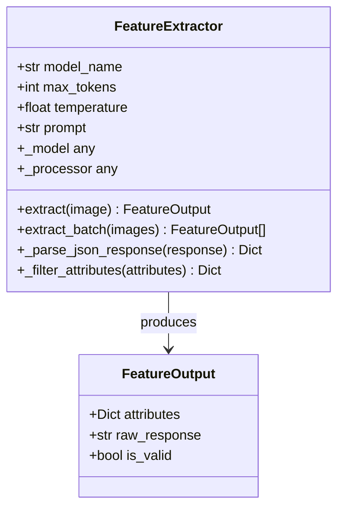

**图表来源**
- [feature_vlm.py:52-291](file://crossmedia_pid/core/feature_vlm.py#L52-L291)
- [feature_vlm.py:44-50](file://crossmedia_pid/core/feature_vlm.py#L44-L50)

**性能优化建议**：
1. **模型加载优化**：实现延迟加载和模型复用
2. **JSON解析优化**：使用更高效的解析策略
3. **批处理支持**：添加批量特征提取功能
4. **内存管理**：及时释放中间变量

**章节来源**
- [feature_vlm.py:55-80](file://crossmedia_pid/core/feature_vlm.py#L55-L80)
- [feature_vlm.py:131-185](file://crossmedia_pid/core/feature_vlm.py#L131-L185)

### 向量化器性能分析

向量化器结合稠密向量和稀疏向量，使用ONNX Runtime进行加速推理。

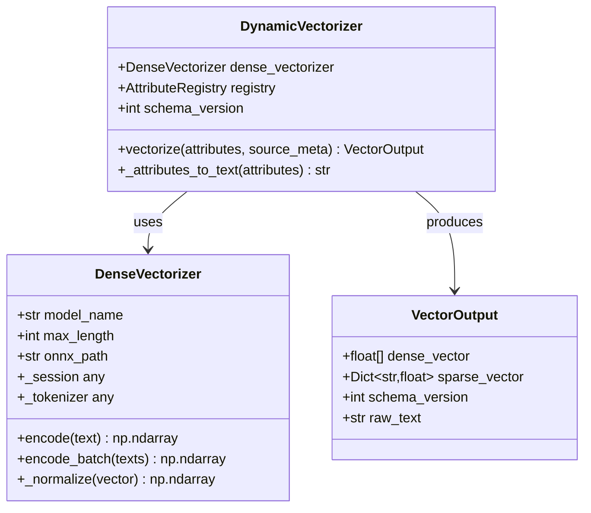

**图表来源**
- [vectorizer.py:28-172](file://crossmedia_pid/core/vectorizer.py#L28-L172)
- [vectorizer.py:174-258](file://crossmedia_pid/core/vectorizer.py#L174-L258)

**性能优化建议**：
1. **ONNX优化**：确保使用CoreML执行提供程序
2. **批处理优化**：实现文本的批量编码
3. **内存池**：复用tokenizer和session对象
4. **权重缓存**：缓存稀疏向量权重计算

**章节来源**
- [vectorizer.py:31-94](file://crossmedia_pid/core/vectorizer.py#L31-L94)
- [vectorizer.py:227-258](file://crossmedia_pid/core/vectorizer.py#L227-L258)

### 身份匹配器性能分析

身份匹配器实现多模态相似度计算和身份决策逻辑。

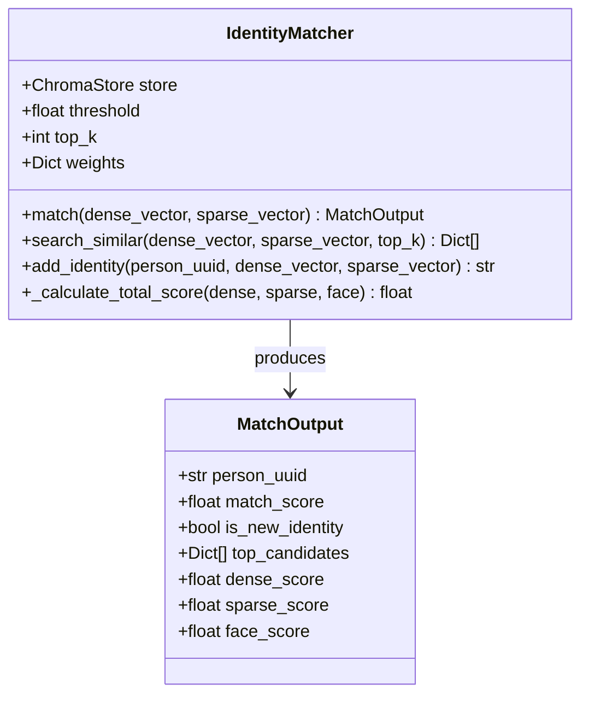

**图表来源**
- [matcher.py:30-253](file://crossmedia_pid/core/matcher.py#L30-L253)
- [matcher.py:18-28](file://crossmedia_pid/core/matcher.py#L18-L28)

**性能优化建议**：
1. **权重归一化**：确保权重总和为1
2. **相似度计算优化**：缓存常用计算结果
3. **阈值过滤**：在ChromaDB层面应用距离阈值
4. **候选排序优化**：使用更高效的排序算法

**章节来源**
- [matcher.py:33-70](file://crossmedia_pid/core/matcher.py#L33-L70)
- [matcher.py:140-253](file://crossmedia_pid/core/matcher.py#L140-L253)

### ChromaDB存储性能分析

ChromaDB作为向量数据库，提供了高效的相似度搜索功能。

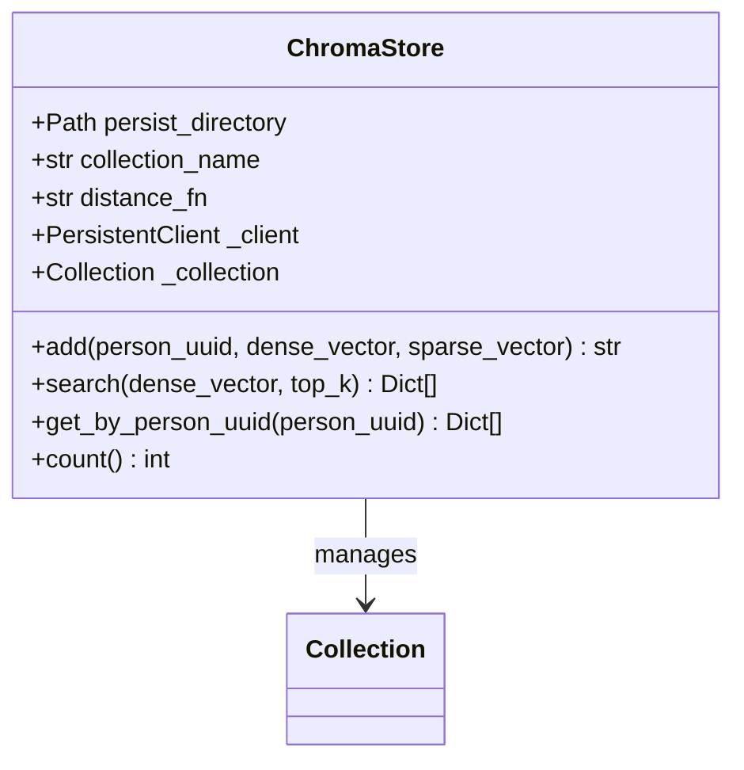

**图表来源**
- [chroma_store.py:18-179](file://crossmedia_pid/db/chroma_store.py#L18-L179)

**性能优化建议**：
1. **集合配置**：合理设置hnsw参数
2. **持久化策略**：优化磁盘I/O操作
3. **查询优化**：使用合适的距离函数
4. **内存管理**：控制集合大小和索引维护

**章节来源**
- [chroma_store.py:21-72](file://crossmedia_pid/db/chroma_store.py#L21-L72)
- [chroma_store.py:125-179](file://crossmedia_pid/db/chroma_store.py#L125-L179)

## 依赖分析

系统依赖关系清晰，主要依赖包括计算机视觉、机器学习和数据库相关的库。

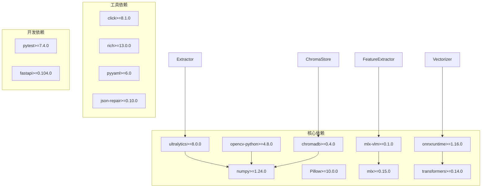

**图表来源**
- [requirements.txt:1-38](file://crossmedia_pid/requirements.txt#L1-L38)

**章节来源**
- [requirements.txt:1-38](file://crossmedia_pid/requirements.txt#L1-L38)

## 性能考虑

### 并行处理策略

系统目前主要通过CLI界面支持批量处理，但可以进一步优化：

1. **多进程并行**：使用multiprocessing处理多个图片
2. **异步处理**：实现异步特征提取和向量化
3. **GPU并行**：利用MPS后端进行并行推理

### 缓存机制最佳实践

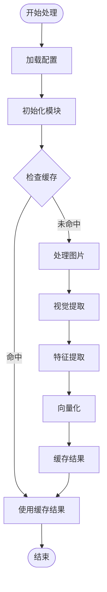

**缓存策略建议**：
1. **模型权重缓存**：ONNX会话和tokenizer对象复用
2. **中间结果缓存**：特征提取和向量化结果缓存
3. **注册表缓存**：属性注册表的内存映射
4. **数据库查询缓存**：ChromaDB查询结果缓存

### 内存管理优化

1. **对象池**：复用YOLO模型、ONNX会话和tokenizer对象
2. **及时释放**：处理完图片后及时释放内存
3. **批处理大小**：根据可用内存调整批处理大小
4. **垃圾回收**：定期触发垃圾回收机制

### 批量处理性能调优

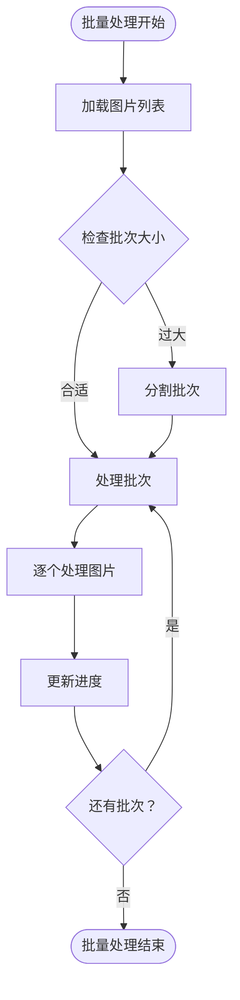

**批量处理优化建议**：
1. **动态批次调整**：根据内存使用情况调整批次大小
2. **进度监控**：实时监控处理进度和性能指标
3. **错误恢复**：实现部分失败时的错误恢复机制
4. **并发控制**：限制同时运行的进程数量

### 模型推理加速技术

1. **ONNX Runtime优化**：
   - 使用CoreML执行提供程序
   - 启用TensorRT或Metal Performance Shaders
   - 配置适当的线程数

2. **量化模型**：
   - 使用4-bit量化模型
   - 实现动态量化策略

3. **模型蒸馏**：
   - 使用轻量级替代模型
   - 实现模型压缩

### 大数据集处理策略

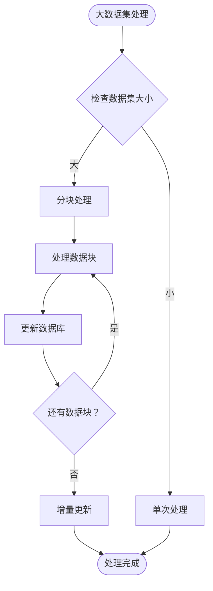

**大数据集优化策略**：
1. **分批策略**：按内存限制分批处理
2. **增量更新**：支持增量数据库更新
3. **索引优化**：优化ChromaDB索引配置
4. **并行处理**：多进程并行处理不同数据块

### 性能基准测试方法

1. **基准测试指标**：
   - 处理速度：每秒处理图片数量
   - 内存使用：峰值内存占用
   - 延迟分布：P50/P95/P99延迟
   - 准确率：匹配准确率和召回率

2. **测试环境**：
   - 不同硬件配置对比
   - 不同批次大小测试
   - 不同模型配置测试

3. **监控工具**：
   - 系统资源监控
   - 应用性能监控
   - 数据库性能监控

### 配置选项对性能的影响

| 配置项 | 性能影响 | 权衡考虑 |
|--------|----------|----------|
| `conf_threshold` | 检测精度 vs 处理时间 | 提高阈值减少误检但可能漏检 |
| `min_bbox_size` | 检测质量 vs 性能 | 增大尺寸提高质量但过滤更多候选 |
| `max_length` | 模型性能 vs 文本长度 | 更长文本需要更多计算资源 |
| `top_k` | 检索精度 vs 性能 | 更大的k值提高召回但增加计算 |
| `threshold` | 匹配精度 vs 覆盖率 | 更严格的阈值提高精度但可能错过匹配 |

**章节来源**
- [config.yaml:34-52](file://crossmedia_pid/configs/config.yaml#L34-L52)
- [extractor.py:86-88](file://crossmedia_pid/core/extractor.py#L86-L88)
- [vectorizer.py:45-47](file://crossmedia_pid/core/vectorizer.py#L45-L47)
- [matcher.py:52-54](file://crossmedia_pid/core/matcher.py#L52-L54)

## 故障排查指南

### 常见性能问题诊断

1. **处理速度慢**：
   - 检查模型是否使用GPU加速
   - 验证批处理大小是否合适
   - 监控内存使用情况

2. **内存泄漏**：
   - 检查对象是否正确释放
   - 验证缓存策略是否有效
   - 监控长时间运行的内存增长

3. **模型加载失败**：
   - 检查ONNX模型文件完整性
   - 验证依赖库版本兼容性
   - 确认硬件支持情况

### 诊断工具和方法

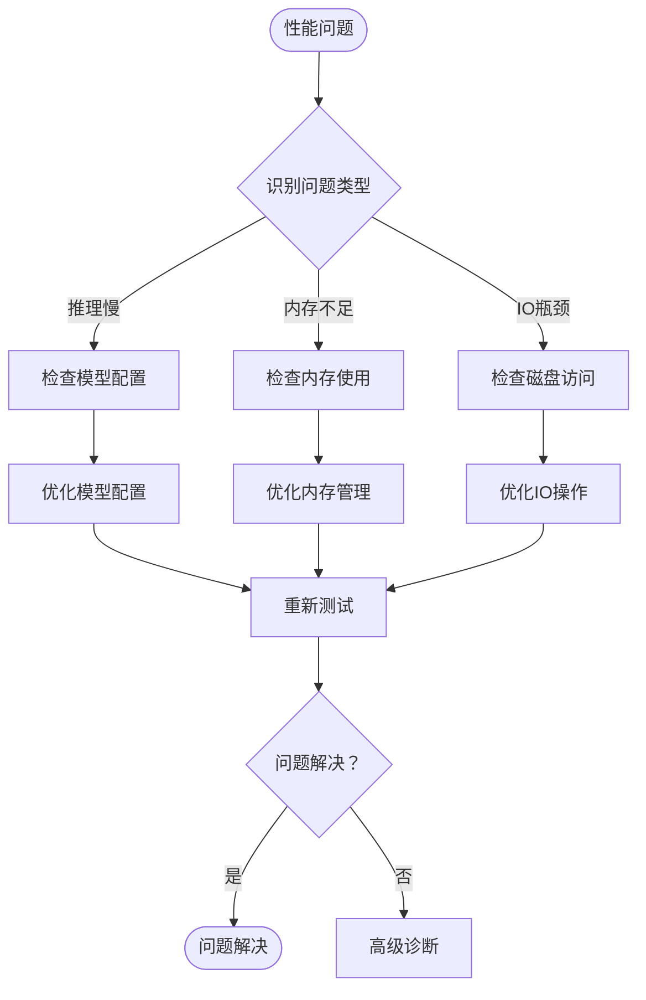

**诊断步骤**：
1. **日志分析**：查看详细的处理日志
2. **性能分析**：使用性能分析工具定位瓶颈
3. **资源监控**：监控CPU、内存、磁盘使用情况
4. **网络诊断**：检查模型下载和网络连接

### 错误处理和恢复

1. **模型加载错误**：自动降级到CPU模式
2. **内存不足**：自动调整批处理大小
3. **数据库连接失败**：重试机制和错误报告
4. **文件读取失败**：跳过损坏文件并记录错误

**章节来源**
- [main.py:37-46](file://crossmedia_pid/main.py#L37-L46)
- [extractor.py:95-103](file://crossmedia_pid/core/extractor.py#L95-L103)
- [vectorizer.py:86-94](file://crossmedia_pid/core/vectorizer.py#L86-L94)
- [chroma_store.py:69-71](file://crossmedia_pid/db/chroma_store.py#L69-L71)

## 结论

CrossMedia-PID系统展现了良好的模块化设计和性能优化潜力。通过合理的配置管理和硬件加速，系统能够在M1 Mac环境下实现高效的跨媒体人物识别。

关键的性能优化方向包括：
- 利用ONNX Runtime和MPS后端进行GPU加速
- 实现多进程并行处理和缓存机制
- 优化ChromaDB索引和查询策略
- 建立完善的性能监控和基准测试体系

未来的发展可以在保持现有架构稳定性的基础上，逐步引入更多硬件加速技术和更精细的性能调优策略，以满足更大规模的应用需求。