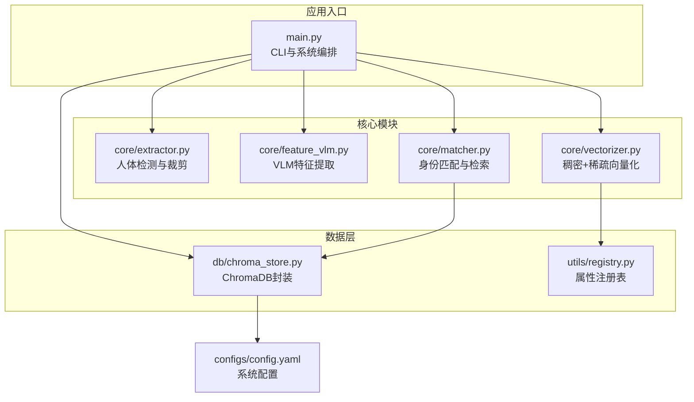
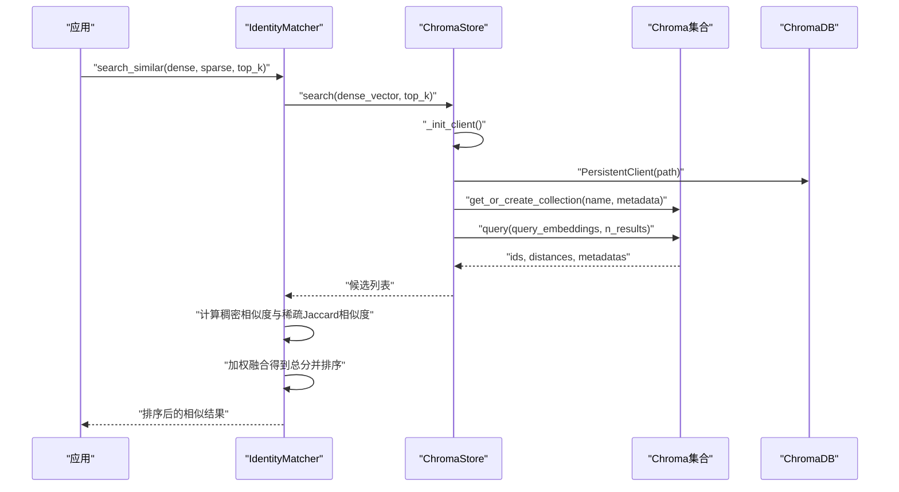
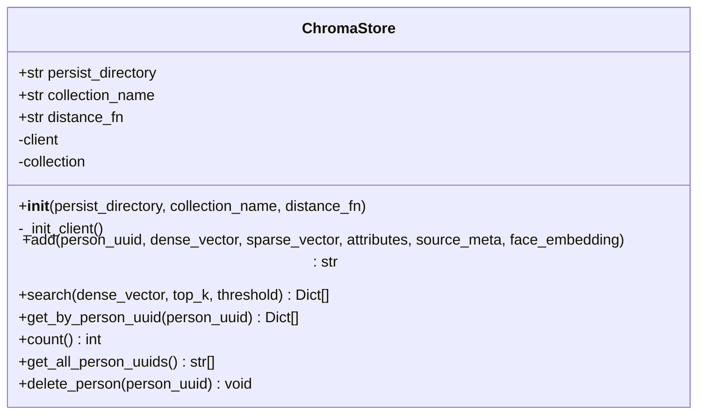
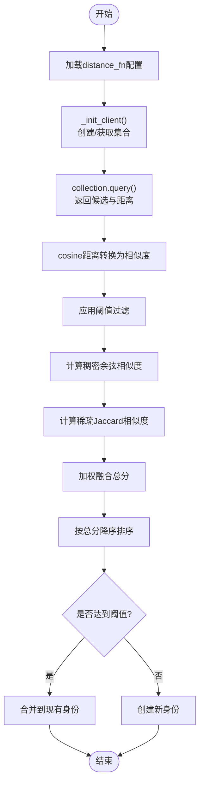
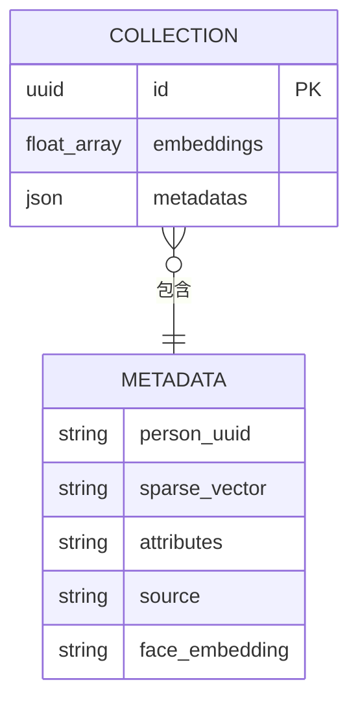
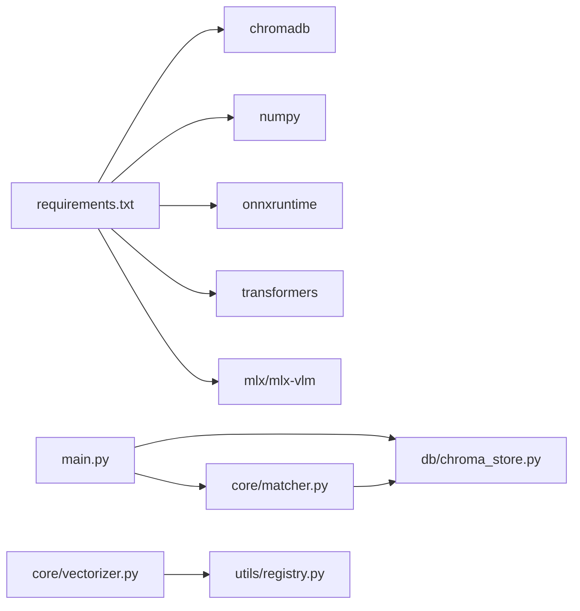

# ChromaDB向量存储

<cite>
**本文引用的文件**
- [chroma_store.py](file://crossmedia_pid/db/chroma_store.py)
- [main.py](file://crossmedia_pid/main.py)
- [config.yaml](file://crossmedia_pid/configs/config.yaml)
- [vectorizer.py](file://crossmedia_pid/core/vectorizer.py)
- [matcher.py](file://crossmedia_pid/core/matcher.py)
- [registry.py](file://crossmedia_pid/utils/registry.py)
- [extractor.py](file://crossmedia_pid/core/extractor.py)
- [feature_vlm.py](file://crossmedia_pid/core/feature_vlm.py)
- [requirements.txt](file://crossmedia_pid/requirements.txt)
</cite>

## 目录
1. [简介](#简介)
2. [项目结构](#项目结构)
3. [核心组件](#核心组件)
4. [架构总览](#架构总览)
5. [详细组件分析](#详细组件分析)
6. [依赖分析](#依赖分析)
7. [性能考虑](#性能考虑)
8. [故障排查指南](#故障排查指南)
9. [结论](#结论)
10. [附录](#附录)

## 简介
本技术文档聚焦CrossMedia-PID项目中的ChromaDB向量存储系统，围绕ChromaStore类展开，深入解析其设计与实现，包括延迟初始化、客户端连接管理、集合操作；阐述向量数据的存储格式（稠密向量、稀疏向量与元数据JSON序列化策略）；解释距离函数配置（余弦、欧几里得、内积）对相似度计算的影响；说明文档ID生成机制、元数据字段结构与查询优化策略；并提供添加向量、相似度搜索、按UUID查询与批量操作的API使用示例，最后给出性能调优、内存管理与故障处理的最佳实践。

## 项目结构
本项目采用模块化分层设计，ChromaDB向量存储位于db层，与核心处理模块（特征提取、向量化、匹配）协同工作。ChromaStore封装了ChromaDB客户端与集合的生命周期管理，提供统一的增删改查接口。

图表来源
- [main.py:57-111](file://crossmedia_pid/main.py#L57-L111)
- [chroma_store.py:18-42](file://crossmedia_pid/db/chroma_store.py#L18-L42)
- [vectorizer.py:174-204](file://crossmedia_pid/core/vectorizer.py#L174-L204)
- [registry.py:16-40](file://crossmedia_pid/utils/registry.py#L16-L40)
- [config.yaml:21-27](file://crossmedia_pid/configs/config.yaml#L21-L27)

章节来源
- [main.py:57-111](file://crossmedia_pid/main.py#L57-L111)
- [config.yaml:21-27](file://crossmedia_pid/configs/config.yaml#L21-L27)

## 核心组件
- ChromaStore：ChromaDB持久化客户端与集合的封装，负责延迟初始化、集合创建、增删改查与统计。
- IdentityMatcher：基于ChromaStore的检索与融合打分，结合稠密向量余弦相似度、稀疏向量Jaccard相似度与权重进行身份决策。
- DynamicVectorizer：将属性字典转为稠密向量与稀疏向量，稀疏向量通过AttributeRegistry维护维度映射。
- AttributeRegistry：属性键到ID的注册表，支持动态扩展与持久化，为稀疏向量提供稳定维度空间。
- 配置系统：通过config.yaml集中管理ChromaDB集合参数、匹配阈值、权重与日志级别等。

章节来源
- [chroma_store.py:18-42](file://crossmedia_pid/db/chroma_store.py#L18-L42)
- [matcher.py:30-70](file://crossmedia_pid/core/matcher.py#L30-L70)
- [vectorizer.py:174-204](file://crossmedia_pid/core/vectorizer.py#L174-L204)
- [registry.py:16-40](file://crossmedia_pid/utils/registry.py#L16-L40)
- [config.yaml:21-41](file://crossmedia_pid/configs/config.yaml#L21-L41)

## 架构总览
ChromaStore在首次使用时才初始化ChromaDB PersistentClient，并根据配置创建或获取集合。集合元数据中设置hnsw:space为distance_fn，从而影响底层索引与相似度计算方式。向量数据以稠密向量嵌入与元数据形式存储，元数据中包含person_uuid、稀疏向量（JSON序列化）、原始属性（JSON序列化）以及可选的source与face_embedding。检索时先通过query接口获取候选，再在应用层计算稠密相似度与稀疏相似度，最终融合得到综合分数。

图表来源
- [matcher.py:288-333](file://crossmedia_pid/core/matcher.py#L288-L333)
- [chroma_store.py:125-178](file://crossmedia_pid/db/chroma_store.py#L125-L178)

章节来源
- [matcher.py:288-333](file://crossmedia_pid/core/matcher.py#L288-L333)
- [chroma_store.py:125-178](file://crossmedia_pid/db/chroma_store.py#L125-L178)

## 详细组件分析

### ChromaStore类设计与实现
- 延迟初始化机制
  - 在构造函数中仅保存配置，不立即建立连接。
  - 首次调用add/search/get/delete等方法时触发_init_client，创建PersistentClient并获取/创建集合。
  - 该策略降低启动开销，避免不必要的磁盘IO与网络请求。
- 客户端连接管理
  - 使用PersistentClient(path, anonymized_telemetry=False)持久化到本地目录。
  - 集合元数据metadata中设置hnsw:space为distance_fn，影响底层索引空间与相似度计算。
- 集合操作
  - add：生成UUID作为文档ID，准备元数据（person_uuid、稀疏向量JSON、属性JSON、可选source、可选face_embedding），调用collection.add(ids, embeddings, metadatas)。
  - search：调用collection.query(query_embeddings, n_results)，解析返回的ids/dists/metadatas，将ChromaDB的cosine距离转换为相似度（1 - distance），并应用阈值过滤。
  - get_by_person_uuid：通过where条件按person_uuid过滤，返回记录列表。
  - count/get_all_person_uuids/delete_person：提供统计与管理能力。
- 距离函数配置
  - distance_fn在构造函数中接收，存储于集合元数据中，影响索引构建与相似度计算。
  - 当distance_fn为cosine时，ChromaDB返回的距离为1 - cosθ，因此在search中转换为相似度。
- 文档ID生成机制
  - 使用uuid.uuid4()生成全局唯一文档ID，确保多进程或多实例下的冲突避免。
- 元数据字段结构
  - person_uuid：人物标识。
  - sparse_vector：稀疏向量，以JSON字符串存储，键为注册表分配的整型ID，值为权重。
  - attributes：原始属性字典，以JSON字符串存储，便于后续检索与展示。
  - source：源数据元信息（如source_path、quality_score等），以JSON字符串存储。
  - face_embedding：人脸特征向量（Phase 1暂不使用），以JSON字符串存储。
- 查询优化策略
  - top_k限制候选数量，减少后续打分与排序开销。
  - threshold过滤低相似度候选，进一步缩小范围。
  - 仅在需要时加载客户端，避免重复初始化。

图表来源
- [chroma_store.py:18-242](file://crossmedia_pid/db/chroma_store.py#L18-L242)

章节来源
- [chroma_store.py:18-242](file://crossmedia_pid/db/chroma_store.py#L18-L242)

### 距离函数与相似度计算
- 距离函数配置
  - distance_fn可选值：cosine、l2、ip（内积）。通过集合元数据hnsw:space传递给底层索引。
  - cosine：ChromaDB返回1 - cosθ，需转换为相似度1 - distance。
  - l2：欧几里得距离越小越相似。
  - ip：内积越大越相似，通常配合向量归一化使用。
- 相似度计算流程
  - 检索阶段：ChromaStore.search返回候选及其距离/相似度。
  - 应用阶段：IdentityMatcher对每个候选计算稠密相似度（余弦）与稀疏相似度（Jaccard），再按权重融合得到总分。
  - 阈值与排序：超过阈值的候选参与排序，最高分者决定是否新建身份或合并到现有身份。

图表来源
- [chroma_store.py:125-178](file://crossmedia_pid/db/chroma_store.py#L125-L178)
- [matcher.py:180-252](file://crossmedia_pid/core/matcher.py#L180-L252)

章节来源
- [chroma_store.py:125-178](file://crossmedia_pid/db/chroma_store.py#L125-L178)
- [matcher.py:180-252](file://crossmedia_pid/core/matcher.py#L180-L252)

### 向量数据存储格式与序列化策略
- 稠密向量
  - 存储为浮点数列表，直接作为embeddings字段写入集合。
- 稀疏向量
  - 由DynamicVectorizer生成，键为注册表分配的整型ID，值为权重。
  - 以JSON字符串形式存储在元数据的sparse_vector字段中，便于跨版本兼容与查询。
- 元数据JSON序列化
  - attributes/source/face_embedding均以JSON字符串存储，确保类型安全与跨语言兼容。
  - 使用ensure_ascii=False保证中文等非ASCII字符正确序列化。
- 注册表与稀疏维度映射
  - AttributeRegistry维护属性键到ID的映射，支持动态扩展与持久化。
  - 稀疏向量维度随注册表增长而扩展，保证不同批次数据的维度一致性。

图表来源
- [chroma_store.py:73-123](file://crossmedia_pid/db/chroma_store.py#L73-L123)
- [registry.py:233-268](file://crossmedia_pid/utils/registry.py#L233-L268)

章节来源
- [chroma_store.py:73-123](file://crossmedia_pid/db/chroma_store.py#L73-L123)
- [registry.py:233-268](file://crossmedia_pid/utils/registry.py#L233-L268)

### API使用示例（基于源码路径）
- 添加向量
  - 调用链：IdentityMatcher.add_identity → ChromaStore.add
  - 示例路径：[matcher.py:254-286](file://crossmedia_pid/core/matcher.py#L254-L286)、[chroma_store.py:73-123](file://crossmedia_pid/db/chroma_store.py#L73-L123)
- 相似度搜索
  - 调用链：IdentityMatcher.search_similar → ChromaStore.search
  - 示例路径：[matcher.py:288-333](file://crossmedia_pid/core/matcher.py#L288-L333)、[chroma_store.py:125-178](file://crossmedia_pid/db/chroma_store.py#L125-L178)
- 按UUID查询
  - 调用链：ChromaStore.get_by_person_uuid
  - 示例路径：[chroma_store.py:180-209](file://crossmedia_pid/db/chroma_store.py#L180-L209)
- 批量操作
  - 批量处理由CLI驱动，逐条调用process_image → matcher.add_identity → store.add
  - 示例路径：[main.py:282-328](file://crossmedia_pid/main.py#L282-L328)

章节来源
- [matcher.py:254-286](file://crossmedia_pid/core/matcher.py#L254-L286)
- [chroma_store.py:73-123](file://crossmedia_pid/db/chroma_store.py#L73-L123)
- [matcher.py:288-333](file://crossmedia_pid/core/matcher.py#L288-L333)
- [chroma_store.py:125-178](file://crossmedia_pid/db/chroma_store.py#L125-L178)
- [chroma_store.py:180-209](file://crossmedia_pid/db/chroma_store.py#L180-L209)
- [main.py:282-328](file://crossmedia_pid/main.py#L282-L328)

## 依赖分析
- 外部依赖
  - chromadb：ChromaDB客户端与持久化集合。
  - numpy：向量运算与归一化。
  - onnxruntime/transformers：稠密向量编码（可选ONNX加速）。
  - mlx/mlx-vlm：VLM特征提取（M1优化）。
- 内部耦合
  - ChromaStore与IdentityMatcher强耦合：Matcher依赖Store进行检索与写入。
  - DynamicVectorizer与AttributeRegistry：向量化过程依赖注册表生成稀疏向量。
  - 主程序main.py装配各模块并注入配置。

图表来源
- [requirements.txt:16-38](file://crossmedia_pid/requirements.txt#L16-L38)
- [main.py:28-32](file://crossmedia_pid/main.py#L28-L32)
- [chroma_store.py:49-61](file://crossmedia_pid/db/chroma_store.py#L49-L61)
- [vectorizer.py:14](file://crossmedia_pid/core/vectorizer.py#L14)
- [registry.py:215-231](file://crossmedia_pid/utils/registry.py#L215-L231)

章节来源
- [requirements.txt:16-38](file://crossmedia_pid/requirements.txt#L16-L38)
- [main.py:28-32](file://crossmedia_pid/main.py#L28-L32)
- [chroma_store.py:49-61](file://crossmedia_pid/db/chroma_store.py#L49-L61)
- [vectorizer.py:14](file://crossmedia_pid/core/vectorizer.py#L14)
- [registry.py:215-231](file://crossmedia_pid/utils/registry.py#L215-L231)

## 性能考虑
- 延迟初始化与懒加载
  - ChromaStore在首次使用时才创建客户端与集合，避免启动时的IO与网络开销。
- 稀疏向量维度控制
  - 通过AttributeRegistry的最小频率阈值（配置中min_frequency）筛选稳定维度，减少稀疏向量维度爆炸。
- 查询参数优化
  - 合理设置top_k与threshold，平衡召回与性能。
  - 使用JSON序列化存储稀疏向量，避免复杂类型导致的序列化开销。
- 向量归一化
  - DenseVectorizer对稠密向量进行L2归一化，提升余弦相似度稳定性。
- M1/Metal优化
  - MLX与ONNX Provider优先选择Metal执行，加速推理。
- 内存管理
  - 定期清理无用对象，避免长生命周期持有大量中间向量。
  - 批处理时及时释放临时变量，避免峰值内存过高。
- 索引与距离函数
  - 根据业务场景选择合适的distance_fn（cosine/l2/ip），并在集合元数据中固定，避免频繁重建索引。

[本节为通用性能建议，无需特定文件引用]

## 故障排查指南
- 初始化失败
  - 症状：日志报错“Failed to initialize ChromaDB”。
  - 排查：确认persist_directory可写、磁盘空间充足；检查chromadb版本与Python环境兼容性。
  - 参考路径：[chroma_store.py:69-71](file://crossmedia_pid/db/chroma_store.py#L69-L71)
- 模型加载失败
  - 症状：VLM/Dense向量模型加载异常。
  - 排查：确认模型名称可用、ONNX路径正确；回退到transformers路径；检查mlx/mlx-vlm安装。
  - 参考路径：[feature_vlm.py:85-100](file://crossmedia_pid/core/feature_vlm.py#L85-L100)、[vectorizer.py:53-94](file://crossmedia_pid/core/vectorizer.py#L53-L94)
- JSON解析错误
  - 症状：特征提取后JSON解析失败。
  - 排查：启用json_repair尝试修复；检查VLM输出格式；确认编码与换行符。
  - 参考路径：[feature_vlm.py:131-184](file://crossmedia_pid/core/feature_vlm.py#L131-L184)
- 相似度异常
  - 症状：cosine相似度为负或异常高。
  - 排查：确认向量已归一化；检查distance_fn配置与集合元数据一致；核对阈值设置。
  - 参考路径：[chroma_store.py:159-160](file://crossmedia_pid/db/chroma_store.py#L159-L160)、[matcher.py:71-82](file://crossmedia_pid/core/matcher.py#L71-L82)
- 权重与阈值不当
  - 症状：匹配过于宽松或严格。
  - 排查：调整matching.threshold与weights；确保权重和为1。
  - 参考路径：[config.yaml:34-41](file://crossmedia_pid/configs/config.yaml#L34-L41)、[matcher.py:65-70](file://crossmedia_pid/core/matcher.py#L65-L70)

章节来源
- [chroma_store.py:69-71](file://crossmedia_pid/db/chroma_store.py#L69-L71)
- [feature_vlm.py:85-100](file://crossmedia_pid/core/feature_vlm.py#L85-L100)
- [feature_vlm.py:131-184](file://crossmedia_pid/core/feature_vlm.py#L131-L184)
- [chroma_store.py:159-160](file://crossmedia_pid/db/chroma_store.py#L159-L160)
- [matcher.py:71-82](file://crossmedia_pid/core/matcher.py#L71-L82)
- [config.yaml:34-41](file://crossmedia_pid/configs/config.yaml#L34-L41)
- [matcher.py:65-70](file://crossmedia_pid/core/matcher.py#L65-L70)

## 结论
ChromaStore通过延迟初始化与集合元数据配置，实现了灵活且高效的向量存储方案。结合IdentityMatcher的混合相似度打分与AttributeRegistry的稀疏维度管理，系统在跨媒体人物识别任务中具备良好的可扩展性与稳定性。合理配置距离函数、阈值与权重，配合批处理与内存优化策略，可在保证精度的同时获得更佳的性能表现。

[本节为总结性内容，无需特定文件引用]

## 附录
- 配置要点
  - database.chroma：persist_directory、collection_name、distance_fn。
  - matching：threshold、top_k、weights。
  - registry：persist_path、min_frequency。
- 关键流程
  - 数据入库：extract → feature_vlm → vectorizer → matcher.add_identity → store.add。
  - 检索匹配：matcher.search_similar → store.search → matcher融合打分 → 决策。
- 依赖清单
  - chromadb、numpy、onnxruntime、transformers、mlx/mlx-vlm、json_repair、click/rich等。

章节来源
- [config.yaml:21-58](file://crossmedia_pid/configs/config.yaml#L21-L58)
- [main.py:112-201](file://crossmedia_pid/main.py#L112-L201)
- [matcher.py:288-333](file://crossmedia_pid/core/matcher.py#L288-L333)
- [chroma_store.py:73-123](file://crossmedia_pid/db/chroma_store.py#L73-L123)
- [requirements.txt:16-38](file://crossmedia_pid/requirements.txt#L16-L38)