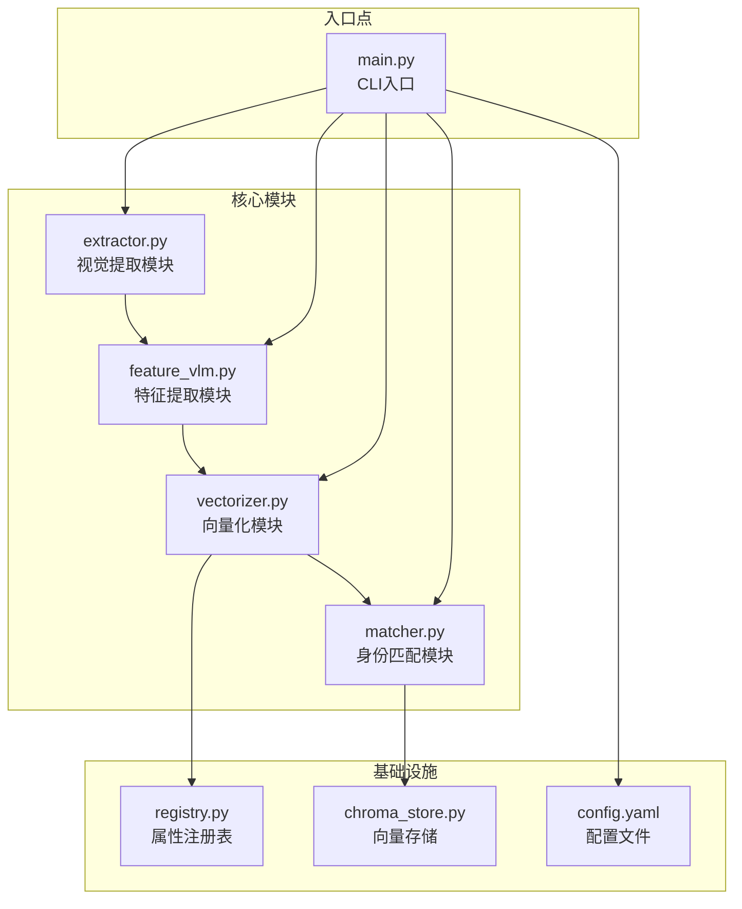
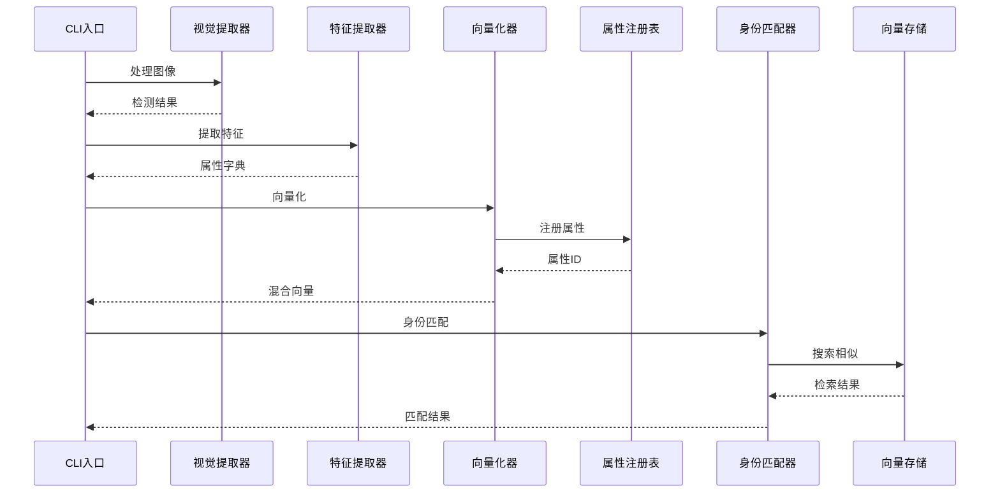
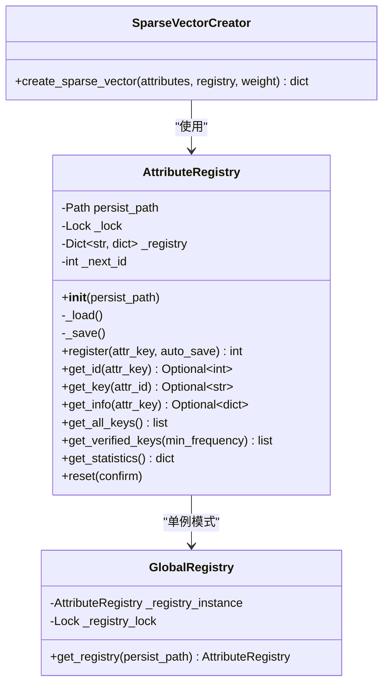
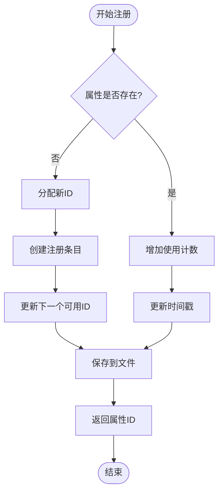
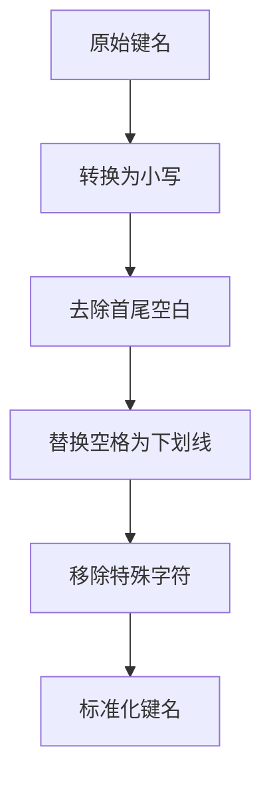
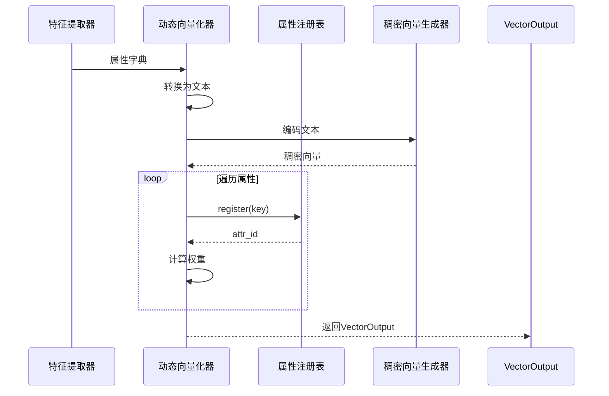
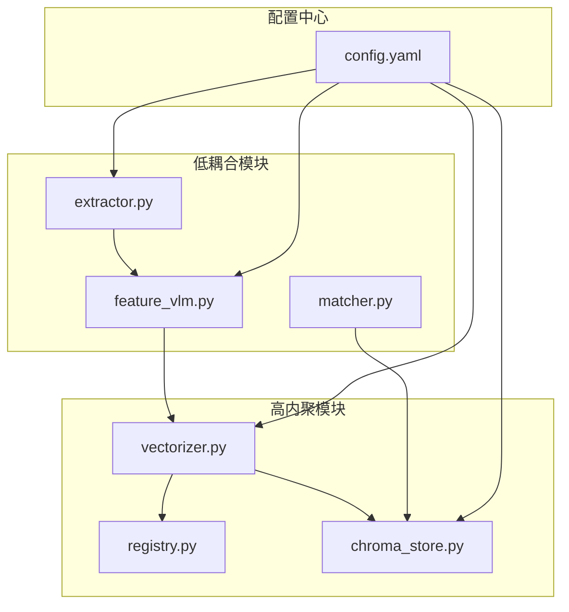

# 属性注册表管理

<cite>
**本文档引用的文件**
- [registry.py](file://crossmedia_pid/utils/registry.py)
- [vectorizer.py](file://crossmedia_pid/core/vectorizer.py)
- [chroma_store.py](file://crossmedia_pid/db/chroma_store.py)
- [main.py](file://crossmedia_pid/main.py)
- [matcher.py](file://crossmedia_pid/core/matcher.py)
- [extractor.py](file://crossmedia_pid/core/extractor.py)
- [feature_vlm.py](file://crossmedia_pid/core/feature_vlm.py)
- [config.yaml](file://crossmedia_pid/configs/config.yaml)
</cite>

## 目录
1. [简介](#简介)
2. [项目结构](#项目结构)
3. [核心组件](#核心组件)
4. [架构概览](#架构概览)
5. [详细组件分析](#详细组件分析)
6. [依赖关系分析](#依赖关系分析)
7. [性能考虑](#性能考虑)
8. [故障排除指南](#故障排除指南)
9. [结论](#结论)

## 简介

CrossMedia-PID属性注册表系统是一个动态管理的稀疏向量维度注册机制，负责维护属性字符串到ID的映射关系。该系统在混合向量生成过程中发挥关键作用，确保向量维度的一致性和完整性，同时提供属性值的标准化处理、唯一性约束和冲突解决策略。

系统采用单例模式设计，通过JSON文件持久化存储，支持多线程安全访问，并集成了完整的统计功能和管理接口。

## 项目结构

CrossMedia-PID项目采用模块化架构，属性注册表系统位于utils目录下，与核心向量化模块紧密集成：

**图表来源**
- [main.py:57-111](file://crossmedia_pid/main.py#L57-L111)
- [registry.py:16-40](file://crossmedia_pid/utils/registry.py#L16-L40)

**章节来源**
- [main.py:24-35](file://crossmedia_pid/main.py#L24-L35)
- [config.yaml:1-58](file://crossmedia_pid/configs/config.yaml#L1-L58)

## 核心组件

### AttributeRegistry类设计原理

AttributeRegistry是属性注册表系统的核心，采用以下设计原则：

- **动态注册机制**：支持运行时动态添加新的属性键名
- **唯一性保证**：每个属性键名对应唯一的ID标识
- **持久化存储**：通过JSON文件实现数据持久化
- **线程安全**：使用锁机制确保并发访问的安全性
- **统计功能**：提供完整的属性使用统计信息

### 稀疏向量维度管理

系统通过以下机制管理稀疏向量维度：

1. **自动注册**：首次遇到的属性键名自动分配ID
2. **计数跟踪**：记录属性的使用频率
3. **时间戳管理**：跟踪属性的首次和最近使用时间
4. **维度映射**：维护属性键名到ID的双向映射

**章节来源**
- [registry.py:16-269](file://crossmedia_pid/utils/registry.py#L16-L269)

## 架构概览

属性注册表系统在整个CrossMedia-PID架构中扮演着关键角色：

**图表来源**
- [main.py:112-200](file://crossmedia_pid/main.py#L112-L200)
- [vectorizer.py:227-258](file://crossmedia_pid/core/vectorizer.py#L227-L258)
- [registry.py:82-115](file://crossmedia_pid/utils/registry.py#L82-L115)

## 详细组件分析

### AttributeRegistry类深度分析

#### 类结构设计

**图表来源**
- [registry.py:16-269](file://crossmedia_pid/utils/registry.py#L16-L269)

#### 动态注册机制

属性注册的核心流程如下：

**图表来源**
- [registry.py:82-115](file://crossmedia_pid/utils/registry.py#L82-L115)

#### 数据持久化策略

系统采用JSON格式进行数据持久化，包含以下关键字段：

- `registry`: 主要的属性映射表
- `next_id`: 下一个可用的属性ID
- `updated_at`: 最后更新时间戳

**章节来源**
- [registry.py:41-81](file://crossmedia_pid/utils/registry.py#L41-L81)

### 属性值标准化处理

#### 键名标准化

特征提取器实现了完整的属性键名标准化流程：

**图表来源**
- [feature_vlm.py:102-112](file://crossmedia_pid/core/feature_vlm.py#L102-L112)

#### 值清洗机制

属性值清洗采用严格的过滤策略：

- `None`值：标记为过滤
- `"无"`字符串：标记为过滤
- 空字符串：标记为过滤
- `null`、`NULL`、`None`：标记为过滤
- `none`：标记为过滤

**章节来源**
- [feature_vlm.py:114-129](file://crossmedia_pid/core/feature_vlm.py#L114-L129)

### 稀疏向量生成集成

#### 向量化流程

DynamicVectorizer将属性注册表与向量化过程无缝集成：

**图表来源**
- [vectorizer.py:227-258](file://crossmedia_pid/core/vectorizer.py#L227-L258)
- [registry.py:233-268](file://crossmedia_pid/utils/registry.py#L233-L268)

#### 权重分配机制

当前实现采用简单的权重分配策略：

- 所有属性权重相同（默认为1.0）
- 支持自定义权重参数
- 为未来的复杂权重策略预留接口

**章节来源**
- [vectorizer.py:247-251](file://crossmedia_pid/core/vectorizer.py#L247-L251)
- [registry.py:262-266](file://crossmedia_pid/utils/registry.py#L262-L266)

### 属性分类体系

系统支持基于使用频率的属性分类：

#### 已验证属性

通过`get_verified_keys()`方法获取使用频率达到阈值的属性：

- 默认最小频率阈值：3次
- 基于`count`字段判断
- 用于统计和管理目的

#### 统计信息

提供完整的属性使用统计：

- `total_attributes`: 总属性数量
- `verified_attributes`: 已验证属性数量
- `next_id`: 下一个可用ID

**章节来源**
- [registry.py:165-190](file://crossmedia_pid/utils/registry.py#L165-L190)

## 依赖关系分析

### 组件耦合度

**图表来源**
- [main.py:67-108](file://crossmedia_pid/main.py#L67-L108)
- [config.yaml:4-57](file://crossmedia_pid/configs/config.yaml#L4-L57)

### 外部依赖

系统主要依赖以下外部库：

- **numpy**: 数值计算和向量操作
- **onnxruntime**: ONNX模型推理
- **chromadb**: 向量数据库存储
- **ultralytics**: YOLO目标检测
- **mlx_vlm**: 多模态语言模型

**章节来源**
- [vectorizer.py:53-94](file://crossmedia_pid/core/vectorizer.py#L53-L94)
- [chroma_store.py:48-71](file://crossmedia_pid/db/chroma_store.py#L48-L71)

## 性能考虑

### 线程安全优化

系统采用双重锁机制确保线程安全：

1. **全局锁**：保护单例实例的创建
2. **注册表锁**：保护注册表数据结构的并发访问

### 存储优化

- **增量保存**：支持自动保存选项，避免频繁磁盘IO
- **延迟加载**：模型和数据库连接采用延迟初始化
- **内存缓存**：注册表数据在内存中维护，减少文件访问

### 向量化性能

- **批处理支持**：向量化器支持批量处理
- **模型优化**：优先使用ONNX模型，回退到transformers
- **M1优化**：针对Apple Silicon进行性能优化

**章节来源**
- [registry.py:32-36](file://crossmedia_pid/utils/registry.py#L32-L36)
- [vectorizer.py:53-94](file://crossmedia_pid/core/vectorizer.py#L53-L94)

## 故障排除指南

### 常见问题诊断

#### 注册表加载失败

**症状**：系统启动时报错，无法加载属性注册表

**解决方案**：
1. 检查JSON文件格式是否正确
2. 验证文件权限是否足够
3. 确认磁盘空间充足
4. 检查文件编码是否为UTF-8

#### 并发访问冲突

**症状**：多线程环境下出现数据不一致

**解决方案**：
1. 确保使用全局注册表实例
2. 避免直接修改内部数据结构
3. 使用提供的API接口进行操作

#### 向量维度不一致

**症状**：不同批次的向量维度不匹配

**解决方案**：
1. 检查属性注册表是否正确持久化
2. 验证属性键名标准化是否一致
3. 确认权重分配策略统一

**章节来源**
- [registry.py:62-65](file://crossmedia_pid/utils/registry.py#L62-L65)
- [registry.py:203-207](file://crossmedia_pid/utils/registry.py#L203-L207)

## 结论

CrossMedia-PID属性注册表系统通过精心设计的架构实现了以下目标：

1. **动态管理**：支持运行时属性的自动注册和管理
2. **数据一致性**：通过唯一性约束和标准化处理确保数据质量
3. **性能优化**：采用多种优化策略提升系统整体性能
4. **扩展性设计**：模块化架构便于功能扩展和维护

该系统在混合向量生成中发挥关键作用，为跨媒体人物识别提供了坚实的数据基础。通过合理的错误处理和监控机制，系统能够在生产环境中稳定运行。

未来可以考虑的改进方向包括：
- 实现更复杂的权重分配策略
- 增加属性分类和层次结构支持
- 优化大规模数据的存储和查询性能
- 增强属性值的语义理解和推理能力