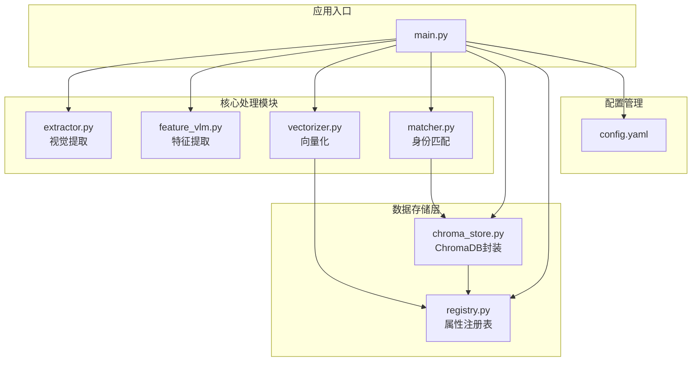
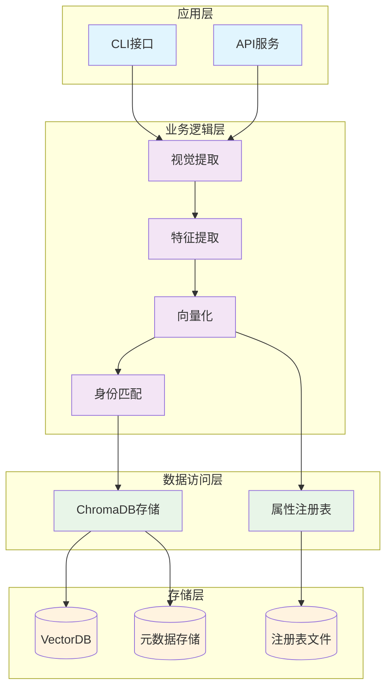
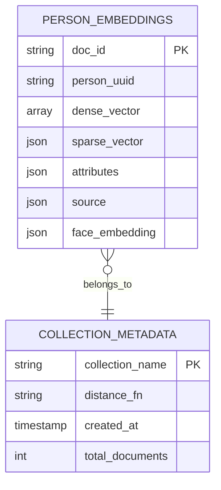
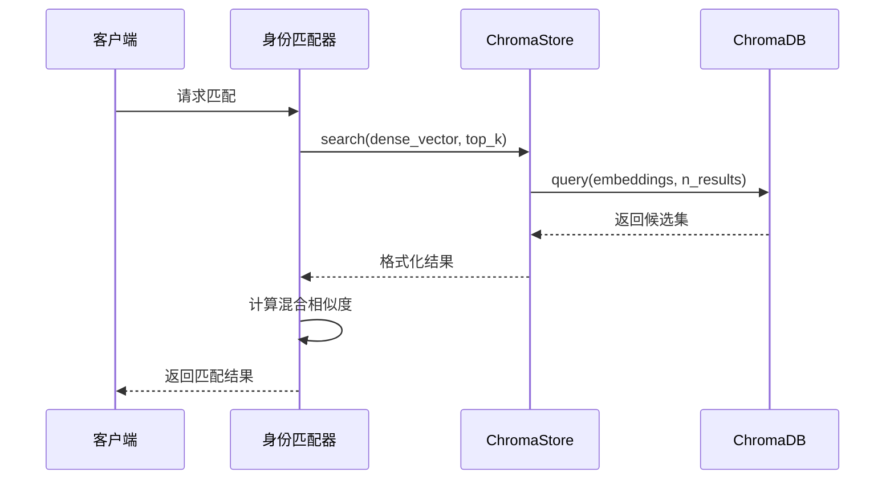
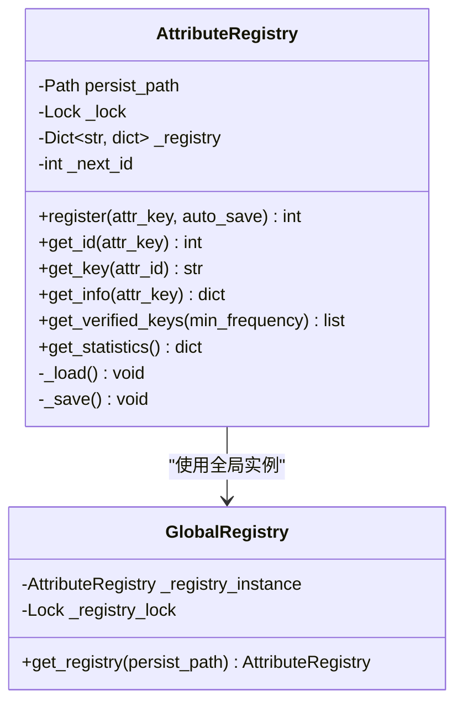
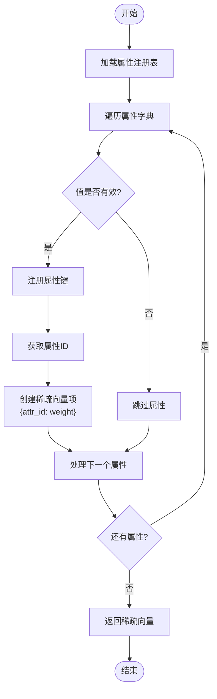
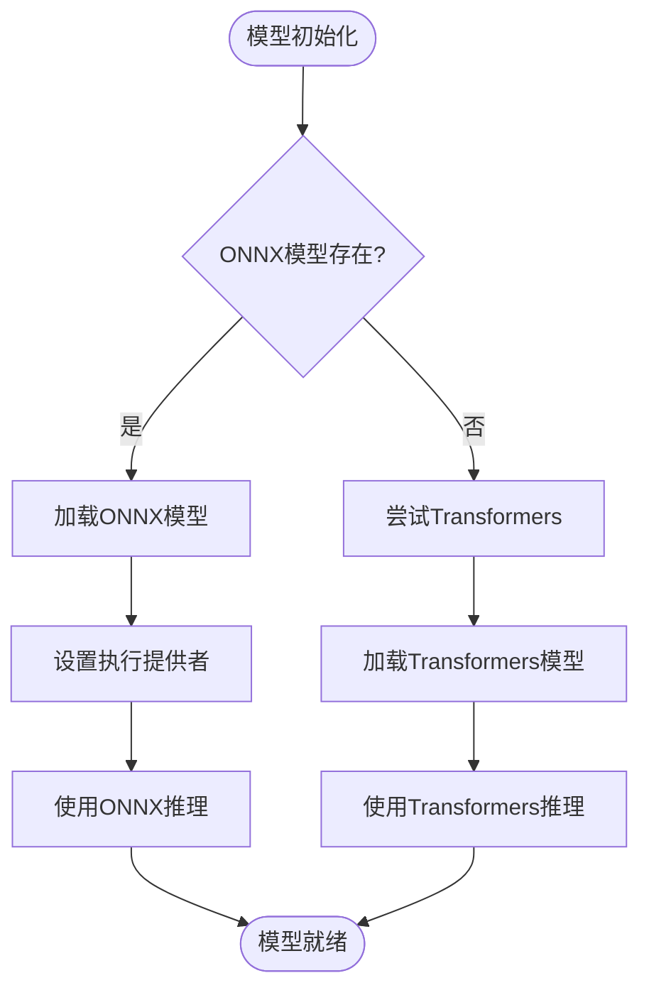
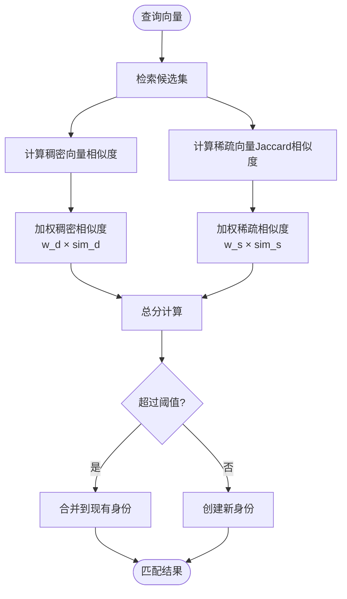
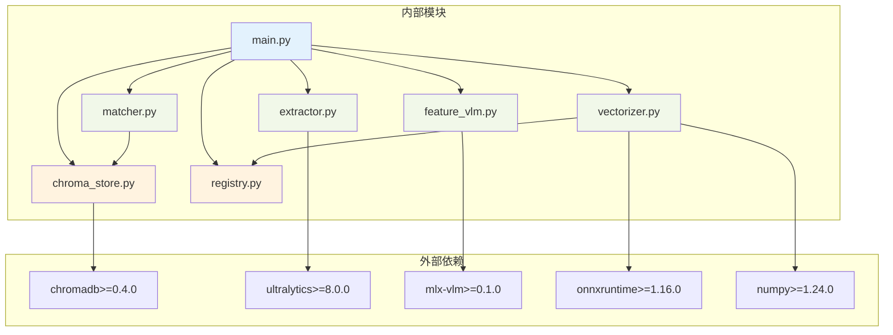
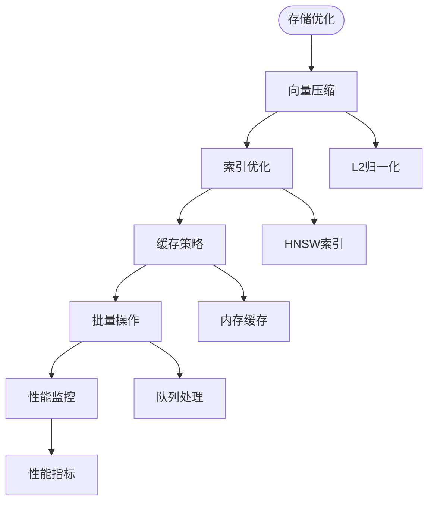

# 数据存储架构

<cite>
**本文档引用的文件**
- [chroma_store.py](file://crossmedia_pid/db/chroma_store.py)
- [registry.py](file://crossmedia_pid/utils/registry.py)
- [vectorizer.py](file://crossmedia_pid/core/vectorizer.py)
- [matcher.py](file://crossmedia_pid/core/matcher.py)
- [config.yaml](file://crossmedia_pid/configs/config.yaml)
- [main.py](file://crossmedia_pid/main.py)
- [extractor.py](file://crossmedia_pid/core/extractor.py)
- [feature_vlm.py](file://crossmedia_pid/core/feature_vlm.py)
- [requirements.txt](file://crossmedia_pid/requirements.txt)
</cite>

## 目录
1. [简介](#简介)
2. [项目结构](#项目结构)
3. [核心组件](#核心组件)
4. [架构概览](#架构概览)
5. [详细组件分析](#详细组件分析)
6. [依赖关系分析](#依赖关系分析)
7. [性能考量](#性能考量)
8. [故障排除指南](#故障排除指南)
9. [结论](#结论)
10. [附录](#附录)

## 简介

CrossMedia-PID是一个跨媒体人物识别系统，专注于在多模态数据环境中进行人物身份识别和管理。该系统采用混合向量存储策略，结合ChromaDB向量数据库和自定义属性注册表，实现了高效的人物特征存储、检索和匹配功能。

系统的核心创新在于将稠密语义向量与动态稀疏向量相结合，通过属性注册表实现维度的动态映射和管理。这种设计既保证了语义相似性的精确匹配，又保持了属性维度的灵活性和可扩展性。

## 项目结构

CrossMedia-PID项目采用模块化的架构设计，主要分为四个核心模块：

**图表来源**
- [main.py:57-111](file://crossmedia_pid/main.py#L57-L111)
- [chroma_store.py:18-42](file://crossmedia_pid/db/chroma_store.py#L18-L42)
- [registry.py:16-40](file://crossmedia_pid/utils/registry.py#L16-L40)

**章节来源**
- [main.py:57-111](file://crossmedia_pid/main.py#L57-L111)
- [config.yaml:1-58](file://crossmedia_pid/configs/config.yaml#L1-L58)

## 核心组件

### ChromaDB向量存储系统

ChromaStore类提供了完整的ChromaDB向量数据库封装，支持高效的向量检索和管理功能。

**主要特性：**
- **持久化存储**：基于本地文件系统的持久化存储
- **混合向量支持**：同时存储稠密向量和稀疏向量
- **元数据管理**：丰富的元数据存储能力
- **智能检索**：支持阈值过滤和Top-K检索

**数据存储格式：**
- 稠密向量：固定长度的浮点数数组
- 稀疏向量：JSON序列化的字典格式 `{维度ID: 权重}`
- 元数据：包含人物UUID、属性字典、源信息等

**章节来源**
- [chroma_store.py:18-254](file://crossmedia_pid/db/chroma_store.py#L18-L254)

### 属性注册表系统

AttributeRegistry实现了动态属性注册和管理机制，是系统灵活性的关键。

**核心功能：**
- **动态注册**：运行时自动注册新的属性键
- **ID映射**：维护属性键到ID的双向映射
- **统计监控**：跟踪属性使用频率和状态
- **持久化存储**：注册表状态的文件持久化

**设计原理：**
- 使用线程锁确保并发安全
- 采用JSON文件格式便于调试和维护
- 支持最小频率验证机制

**章节来源**
- [registry.py:16-269](file://crossmedia_pid/utils/registry.py#L16-L269)

### 向量化引擎

DynamicVectorizer结合了稠密向量生成和稀疏向量构建，实现了语义理解和属性表达的统一。

**技术特点：**
- **模型适配**：支持ONNX和Transformers两种推理方式
- **M1优化**：针对Apple Silicon的性能优化
- **动态稀疏**：基于注册表的稀疏向量生成
- **Schema版本控制**：向量化输出的版本管理

**章节来源**
- [vectorizer.py:174-277](file://crossmedia_pid/core/vectorizer.py#L174-L277)

### 身份匹配器

IdentityMatcher实现了混合距离计算和身份决策算法。

**匹配策略：**
- **多模态融合**：结合稠密、稀疏和人脸特征
- **加权评分**：可配置的权重分配机制
- **阈值决策**：灵活的匹配阈值设置
- **候选排序**：综合分数的排序和选择

**章节来源**
- [matcher.py:30-351](file://crossmedia_pid/core/matcher.py#L30-L351)

## 架构概览

CrossMedia-PID的数据存储架构采用了分层设计，从底层的向量存储到上层的应用逻辑形成了清晰的职责分离。

**图表来源**
- [main.py:57-111](file://crossmedia_pid/main.py#L57-L111)
- [chroma_store.py:18-42](file://crossmedia_pid/db/chroma_store.py#L18-L42)
- [registry.py:16-40](file://crossmedia_pid/utils/registry.py#L16-L40)

## 详细组件分析

### ChromaDB向量存储详细分析

ChromaStore类提供了完整的向量数据库操作接口，其设计体现了现代向量数据库的最佳实践。

#### 存储结构设计

**图表来源**
- [chroma_store.py:73-124](file://crossmedia_pid/db/chroma_store.py#L73-L124)
- [chroma_store.py:180-209](file://crossmedia_pid/db/chroma_store.py#L180-L209)

#### 向量存储格式

系统采用混合向量存储策略：

1. **稠密向量存储**：
   - 类型：固定长度浮点数数组
   - 存储：直接嵌入到向量数据库
   - 特点：支持快速相似性计算

2. **稀疏向量存储**：
   - 类型：JSON序列化的字典
   - 格式：`{维度ID: 权重}`
   - 存储：作为元数据字段
   - 特点：支持动态维度扩展

3. **元数据存储**：
   - 包含人物UUID、属性字典、源信息
   - 支持复杂查询和过滤
   - 提供完整的上下文信息

#### 检索优化机制

**图表来源**
- [matcher.py:140-253](file://crossmedia_pid/core/matcher.py#L140-L253)
- [chroma_store.py:125-178](file://crossmedia_pid/db/chroma_store.py#L125-L178)

**章节来源**
- [chroma_store.py:73-178](file://crossmedia_pid/db/chroma_store.py#L73-L178)

### 属性注册表设计原理

AttributeRegistry实现了动态属性管理系统，其设计充分考虑了并发性和持久化需求。

#### 注册表数据结构

**图表来源**
- [registry.py:16-231](file://crossmedia_pid/utils/registry.py#L16-L231)

#### 动态管理机制

注册表的核心优势在于其动态管理能力：

1. **自动注册**：新属性键自动分配ID并记录使用频率
2. **频率统计**：跟踪每个属性的使用次数和时间戳
3. **最小频率验证**：支持基于频率的属性验证机制
4. **线程安全**：使用锁机制确保并发访问的安全性

#### 稀疏向量生成流程

**图表来源**
- [registry.py:233-269](file://crossmedia_pid/utils/registry.py#L233-L269)

**章节来源**
- [registry.py:16-269](file://crossmedia_pid/utils/registry.py#L16-L269)

### 向量化系统实现

DynamicVectorizer结合了多种技术来实现高效的向量化处理。

#### 模型加载策略

**图表来源**
- [vectorizer.py:53-94](file://crossmedia_pid/core/vectorizer.py#L53-L94)

#### 向量化输出结构

VectorOutput数据类定义了标准化的输出格式：

| 字段名 | 类型 | 描述 | 用途 |
|--------|------|------|------|
| dense_vector | List[float] | 稠密语义向量 | 主要检索依据 |
| sparse_vector | Dict[str, float] | 稀疏属性向量 | 属性匹配辅助 |
| schema_version | int | 输出格式版本 | 兼容性管理 |
| raw_text | str | 生成向量的原始文本 | 调试和解释 |

**章节来源**
- [vectorizer.py:19-277](file://crossmedia_pid/core/vectorizer.py#L19-L277)

### 身份匹配算法

IdentityMatcher实现了复杂的多模态匹配算法，结合了多种相似度计算方法。

#### 混合相似度计算

**图表来源**
- [matcher.py:121-138](file://crossmedia_pid/core/matcher.py#L121-L138)

#### 权重配置机制

匹配器支持灵活的权重配置：

- **稠密向量权重 (w_d)**：语义相似性的重要性
- **稀疏向量权重 (w_s)**：属性匹配的贡献度  
- **人脸特征权重 (w_f)**：预留的人脸匹配能力

权重总和自动归一化，确保匹配结果的稳定性。

**章节来源**
- [matcher.py:30-351](file://crossmedia_pid/core/matcher.py#L30-L351)

## 依赖关系分析

CrossMedia-PID项目的依赖关系体现了清晰的分层架构和模块化设计。

**图表来源**
- [requirements.txt:1-38](file://crossmedia_pid/requirements.txt#L1-L38)
- [main.py:28-32](file://crossmedia_pid/main.py#L28-L32)

**章节来源**
- [requirements.txt:1-38](file://crossmedia_pid/requirements.txt#L1-L38)
- [main.py:28-32](file://crossmedia_pid/main.py#L28-L32)

## 性能考量

### 向量检索性能优化

系统在多个层面实现了性能优化：

1. **索引策略**：ChromaDB使用HNSW算法进行近似最近邻搜索
2. **距离函数**：支持余弦距离，适合高维向量相似性计算
3. **批量处理**：支持批量向量化和检索操作
4. **内存管理**：合理的内存使用和垃圾回收策略

### 存储优化策略

### 并发处理机制

系统采用多线程和异步处理来提高吞吐量：

- **注册表并发**：使用线程锁保护共享状态
- **模型加载**：延迟加载避免启动时的性能开销
- **批处理**：支持批量图像处理和向量化

## 故障排除指南

### 常见问题诊断

#### ChromaDB连接问题

**症状**：初始化失败或查询异常
**解决方案**：
1. 检查持久化目录权限
2. 验证ChromaDB版本兼容性
3. 确认磁盘空间充足

#### 模型加载失败

**症状**：向量化器初始化异常
**解决方案**：
1. 检查ONNX模型文件完整性
2. 验证Transformers模型可用性
3. 确认Python环境依赖安装

#### 属性注册异常

**症状**：注册表文件损坏或访问失败
**解决方案**：
1. 检查JSON文件格式
2. 验证文件权限设置
3. 考虑重建注册表文件

**章节来源**
- [chroma_store.py:43-72](file://crossmedia_pid/db/chroma_store.py#L43-L72)
- [registry.py:41-81](file://crossmedia_pid/utils/registry.py#L41-L81)

## 结论

CrossMedia-PID的数据存储系统展现了现代向量数据库应用的最佳实践。通过ChromaDB与自定义属性注册表的有机结合，系统实现了：

1. **高效存储**：混合向量存储策略平衡了语义相似性和维度灵活性
2. **智能检索**：多模态融合的匹配算法提供了准确的身份识别
3. **动态扩展**：属性注册表支持运行时的维度扩展和管理
4. **性能优化**：多层次的优化策略确保了系统的高效运行

该架构为跨媒体人物识别提供了坚实的技术基础，为后续的功能扩展和性能提升奠定了良好的基础。

## 附录

### 配置选项详解

系统支持丰富的配置选项，可通过config.yaml文件进行定制：

**数据库配置**：
- `persist_directory`: ChromaDB持久化目录
- `collection_name`: 向量集合名称
- `distance_fn`: 距离计算函数

**匹配参数**：
- `threshold`: 匹配阈值
- `top_k`: 候选数量
- `weights`: 多模态权重分配

**注册表设置**：
- `persist_path`: 注册表文件路径
- `min_frequency`: 属性验证最小频率

### 扩展性考虑

系统设计充分考虑了未来的扩展需求：

1. **分布式部署**：ChromaDB支持集群部署模式
2. **模型替换**：插件化的模型加载机制
3. **存储后端**：可扩展的存储抽象层
4. **监控告警**：完善的性能监控体系