# 核心模块架构

<cite>
**本文档引用的文件**
- [extractor.py](file://crossmedia_pid/core/extractor.py)
- [feature_vlm.py](file://crossmedia_pid/core/feature_vlm.py)
- [vectorizer.py](file://crossmedia_pid/core/vectorizer.py)
- [matcher.py](file://crossmedia_pid/core/matcher.py)
- [chroma_store.py](file://crossmedia_pid/db/chroma_store.py)
- [registry.py](file://crossmedia_pid/utils/registry.py)
- [config.yaml](file://crossmedia_pid/configs/config.yaml)
- [main.py](file://crossmedia_pid/main.py)
- [requirements.txt](file://crossmedia_pid/requirements.txt)
</cite>

## 目录
1. [简介](#简介)
2. [项目结构](#项目结构)
3. [核心组件](#核心组件)
4. [架构概览](#架构概览)
5. [详细组件分析](#详细组件分析)
6. [依赖关系分析](#依赖关系分析)
7. [性能考虑](#性能考虑)
8. [故障排除指南](#故障排除指南)
9. [结论](#结论)
10. [附录](#附录)

## 简介

CrossMedia-PID是一个跨媒体人物识别系统，专为处理多模态数据而设计。该系统采用模块化架构，将复杂的识别任务分解为四个核心模块：视觉提取器(A)、特征提取器(B)、向量化器(C)和匹配器(D)。每个模块都有明确的职责分工，通过精心设计的接口进行协作，实现了高效且可扩展的人物身份识别解决方案。

该系统特别适用于需要从图像和视频中识别人物并建立长期身份档案的应用场景，如安全监控、人员追踪和智能分析等。

## 项目结构

项目采用清晰的分层架构，按照功能模块进行组织：

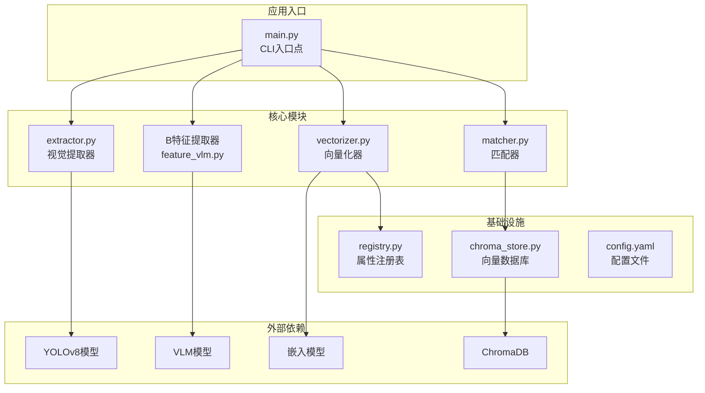

**图表来源**
- [main.py:57-111](file://crossmedia_pid/main.py#L57-L111)
- [extractor.py:65-104](file://crossmedia_pid/core/extractor.py#L65-L104)
- [feature_vlm.py:52-101](file://crossmedia_pid/core/feature_vlm.py#L52-L101)
- [vectorizer.py:28-53](file://crossmedia_pid/core/vectorizer.py#L28-L53)
- [matcher.py:30-70](file://crossmedia_pid/core/matcher.py#L30-L70)

**章节来源**
- [main.py:24-35](file://crossmedia_pid/main.py#L24-L35)
- [requirements.txt:1-38](file://crossmedia_pid/requirements.txt#L1-L38)

## 核心组件

CrossMedia-PID系统由四个核心模块组成，每个模块都承担着特定的功能职责：

### 模块A：视觉提取器 (PersonExtractor)
负责从图像和视频中检测和提取人体区域，提供质量评分和边界框信息。

### 模块B：特征提取器 (FeatureExtractor)  
使用视觉语言模型(VLM)从裁剪的人体图像中提取结构化特征，包括外观、行为和显著特征等。

### 模块C：向量化器 (DynamicVectorizer)
将提取的特征转换为混合向量表示，结合稠密语义向量和动态稀疏向量，支持高效的相似性搜索。

### 模块D：匹配器 (IdentityMatcher)
执行身份匹配决策，结合多种相似性度量计算综合分数，决定新身份创建或现有身份合并。

**章节来源**
- [extractor.py:65-66](file://crossmedia_pid/core/extractor.py#L65-L66)
- [feature_vlm.py:52-53](file://crossmedia_pid/core/feature_vlm.py#L52-L53)
- [vectorizer.py:174-175](file://crossmedia_pid/core/vectorizer.py#L174-L175)
- [matcher.py:30-31](file://crossmedia_pid/core/matcher.py#L30-L31)

## 架构概览

系统采用流水线式处理架构，四个模块按顺序协作完成完整的身份识别流程：

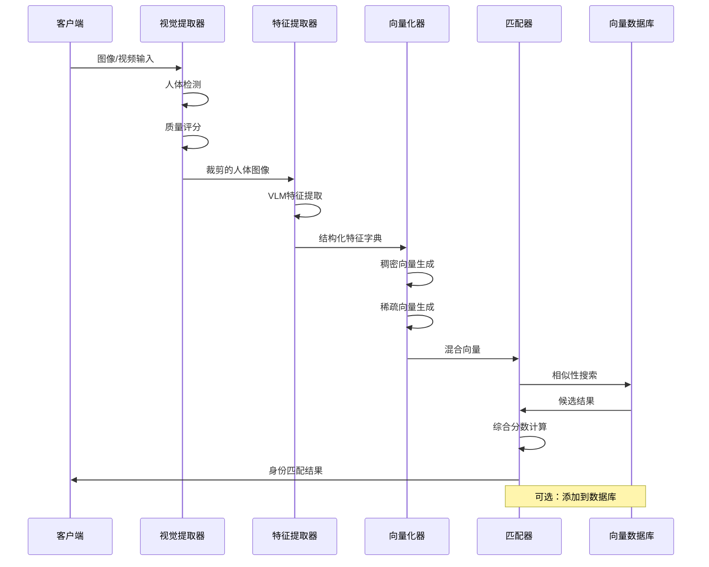

**图表来源**
- [main.py:112-201](file://crossmedia_pid/main.py#L112-L201)
- [extractor.py:206-264](file://crossmedia_pid/core/extractor.py#L206-L264)
- [feature_vlm.py:210-291](file://crossmedia_pid/core/feature_vlm.py#L210-L291)
- [vectorizer.py:227-258](file://crossmedia_pid/core/vectorizer.py#L227-L258)
- [matcher.py:140-253](file://crossmedia_pid/core/matcher.py#L140-L253)

## 详细组件分析

### 模块A：视觉提取器 (PersonExtractor)

#### 设计理念
视觉提取器专注于高质量的人体检测和区域提取，通过多因素质量评分确保后续处理的有效性。

#### 核心功能
- **人体检测**：使用YOLOv8模型进行精确的人体定位
- **质量评分**：综合检测置信度、边界框大小、图像清晰度和位置偏移
- **最佳帧筛选**：针对视频输入的智能帧采样策略
- **ROI裁剪**：生成高质量的人体区域图像

#### 数据结构设计

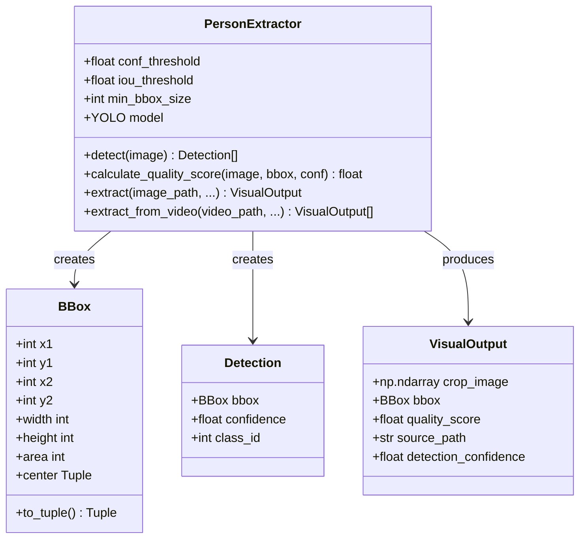

**图表来源**
- [extractor.py:19-63](file://crossmedia_pid/core/extractor.py#L19-L63)
- [extractor.py:65-351](file://crossmedia_pid/core/extractor.py#L65-L351)

#### 质量评分算法
质量评分综合考虑四个关键因素：

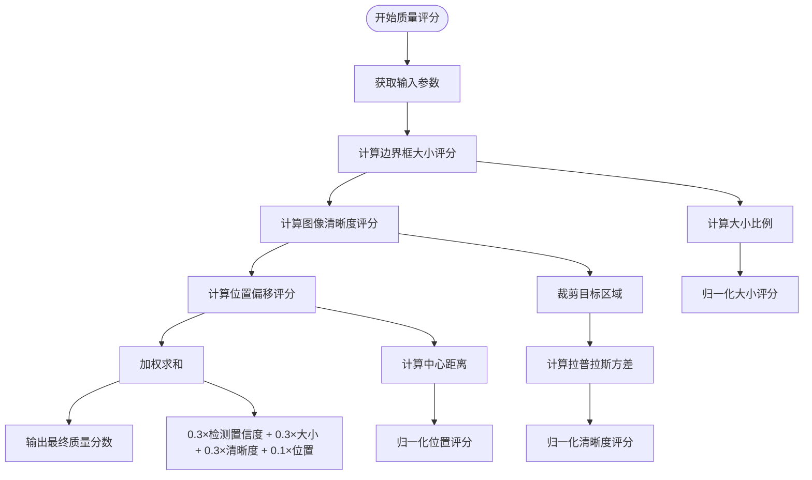

**图表来源**
- [extractor.py:151-204](file://crossmedia_pid/core/extractor.py#L151-L204)

#### 性能特性
- **设备优化**：自动检测MPS/Metal加速，优先使用GPU推理
- **批处理支持**：支持视频帧的批量处理和智能采样
- **内存管理**：合理的帧缓存和资源释放策略

**章节来源**
- [extractor.py:68-104](file://crossmedia_pid/core/extractor.py#L68-L104)
- [extractor.py:151-204](file://crossmedia_pid/core/extractor.py#L151-L204)
- [extractor.py:266-336](file://crossmedia_pid/core/extractor.py#L266-L336)

### 模块B：特征提取器 (FeatureExtractor)

#### 设计理念
特征提取器采用开放域方法，使用视觉语言模型(VLM)从图像中提取丰富的结构化特征，支持动态扩展和领域适应。

#### 核心功能
- **VLM集成**：使用MLX框架的Qwen3-VL模型进行多模态理解
- **JSON解析**：强大的JSON响应解析和错误恢复机制
- **特征标准化**：统一的键名标准化和值清洗策略
- **批量处理**：支持批量特征提取以提高效率

#### VLM提示工程
系统使用精心设计的提示模板，引导模型提取结构化的人员特征：

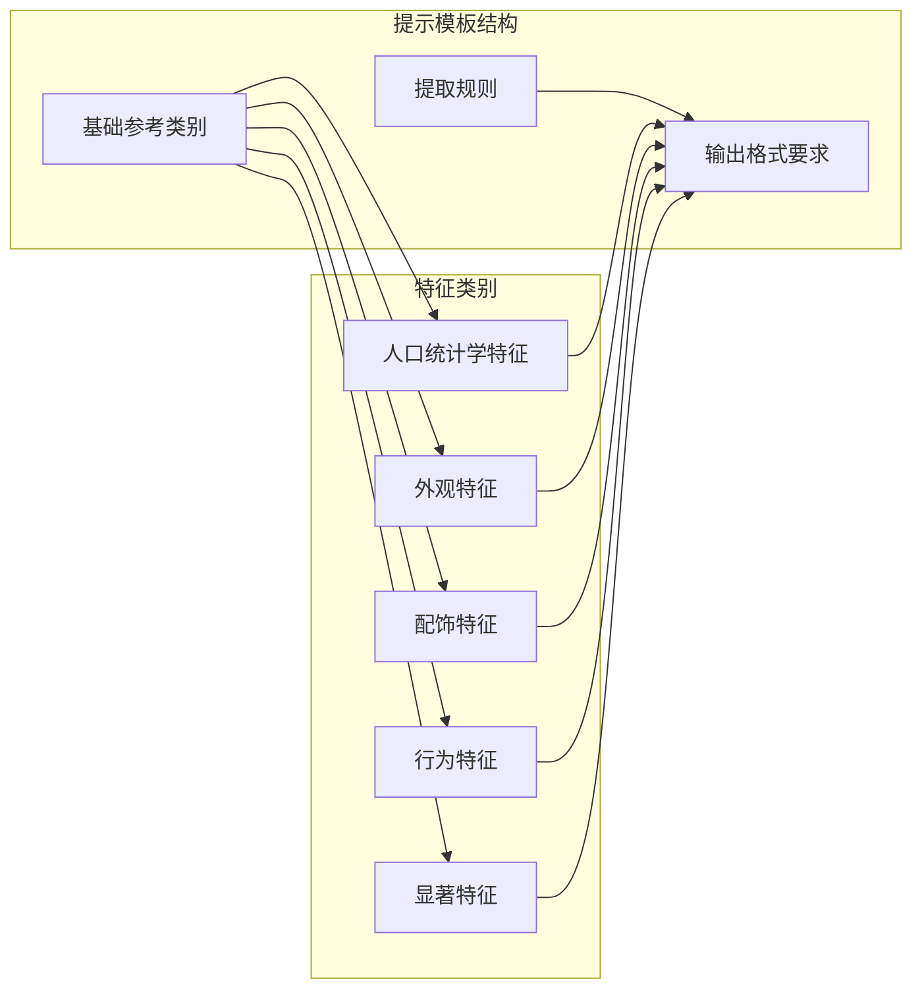

**图表来源**
- [feature_vlm.py:18-42](file://crossmedia_pid/core/feature_vlm.py#L18-L42)

#### JSON解析策略
系统实现了多层次的JSON解析容错机制：

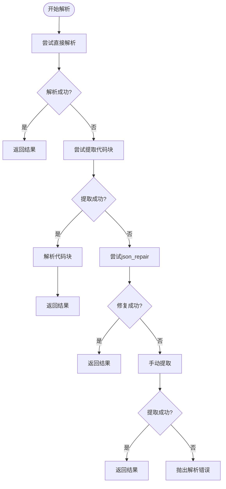

**图表来源**
- [feature_vlm.py:131-184](file://crossmedia_pid/core/feature_vlm.py#L131-L184)

#### 性能特性
- **延迟加载**：模型按需加载，减少启动时间
- **格式转换**：高效的图像格式转换和预处理
- **缓存机制**：避免重复的模型加载开销

**章节来源**
- [feature_vlm.py:52-101](file://crossmedia_pid/core/feature_vlm.py#L52-L101)
- [feature_vlm.py:131-184](file://crossmedia_pid/core/feature_vlm.py#L131-L184)
- [feature_vlm.py:210-291](file://crossmedia_pid/core/feature_vlm.py#L210-L291)

### 模块C：向量化器 (DynamicVectorizer)

#### 设计理念
向量化器采用混合向量表示策略，结合稠密语义向量和动态稀疏向量，实现语义理解和精确匹配的平衡。

#### 核心功能
- **稠密向量生成**：使用BGE模型生成语义嵌入
- **稀疏向量生成**：基于属性注册表创建动态稀疏向量
- **文本转换**：将结构化特征转换为可理解的文本描述
- **权重管理**：支持动态属性权重计算

#### 混合向量生成策略

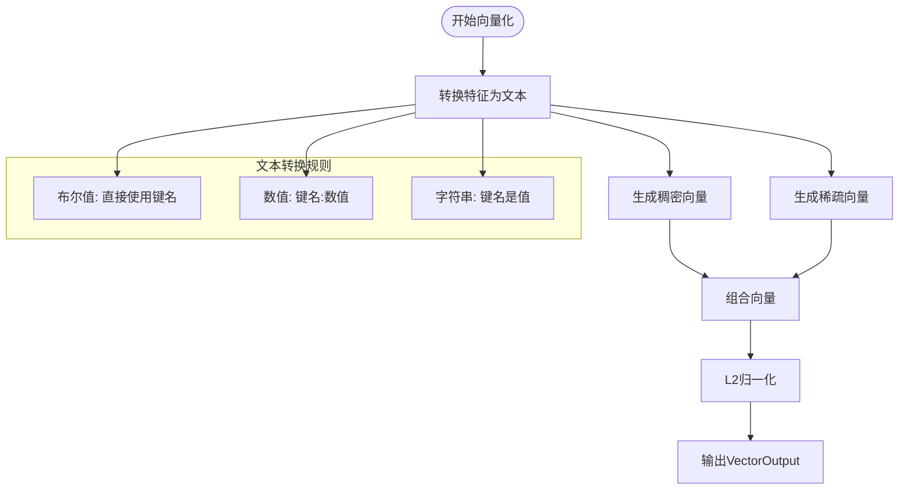

**图表来源**
- [vectorizer.py:205-226](file://crossmedia_pid/core/vectorizer.py#L205-L226)
- [vectorizer.py:227-258](file://crossmedia_pid/core/vectorizer.py#L227-L258)

#### 稠密向量生成
系统使用BAAI/bge-small-zh-v1.5模型生成中文语义嵌入：

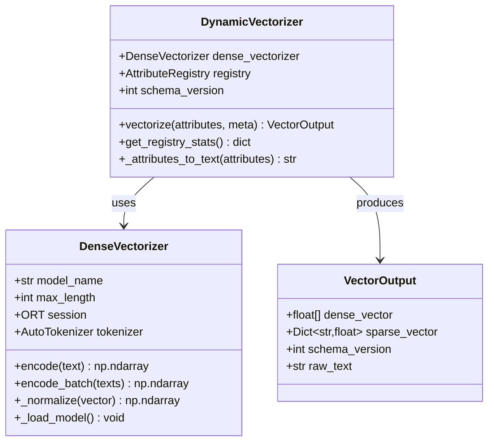

**图表来源**
- [vectorizer.py:28-172](file://crossmedia_pid/core/vectorizer.py#L28-L172)
- [vectorizer.py:174-263](file://crossmedia_pid/core/vectorizer.py#L174-L263)

#### 稀疏向量生成
基于属性注册表的动态稀疏向量生成：

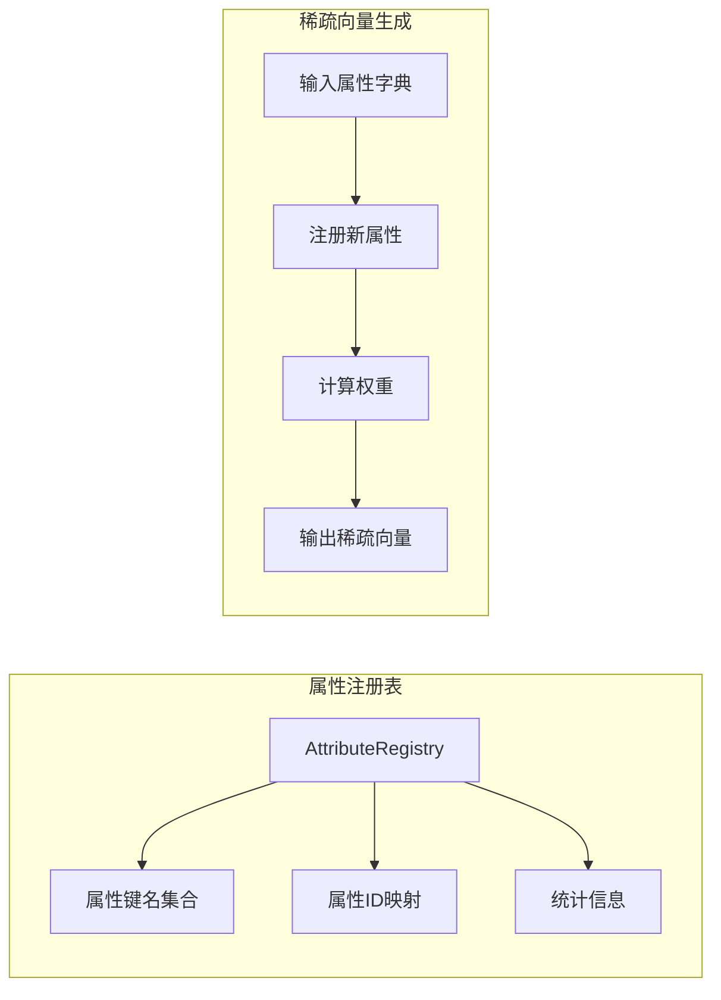

**图表来源**
- [registry.py:16-191](file://crossmedia_pid/utils/registry.py#L16-L191)
- [registry.py:233-268](file://crossmedia_pid/utils/registry.py#L233-L268)

#### 性能特性
- **ONNX优化**：支持ONNXRuntime加速，M1 Mac使用CoreML执行提供最佳性能
- **回退机制**：模型加载失败时自动切换到transformers实现
- **内存优化**：合理的模型缓存和资源管理

**章节来源**
- [vectorizer.py:28-172](file://crossmedia_pid/core/vectorizer.py#L28-L172)
- [vectorizer.py:174-263](file://crossmedia_pid/core/vectorizer.py#L174-L263)
- [registry.py:16-191](file://crossmedia_pid/utils/registry.py#L16-L191)

### 模块D：匹配器 (IdentityMatcher)

#### 设计理念
匹配器采用混合距离计算策略，结合稠密向量相似度、稀疏向量Jaccard相似度和可选的人脸特征，实现鲁棒的身份匹配决策。

#### 核心功能
- **多模态相似度计算**：综合多种相似度度量
- **权重平衡**：可配置的权重分配策略
- **身份决策**：基于阈值的新身份创建或现有身份合并
- **相似性搜索**：支持非侵入式的相似性检索

#### 混合匹配算法

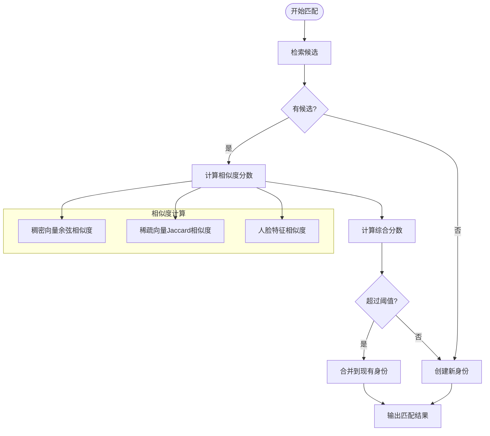

**图表来源**
- [matcher.py:140-253](file://crossmedia_pid/core/matcher.py#L140-L253)

#### 权重配置策略
系统支持灵活的权重配置，根据不同阶段的需求调整各模态的重要性：

| 模态 | Phase 1权重 | Phase 2权重 | 说明 |
|------|-------------|-------------|------|
| 稠密向量 | 0.65 | 0.45 | 语义特征的主要贡献者 |
| 稀疏向量 | 0.35 | 0.35 | 结构化特征的重要补充 |
| 人脸特征 | 0.0 | 0.20 | 未来版本启用，当前禁用 |

#### 相似度度量方法

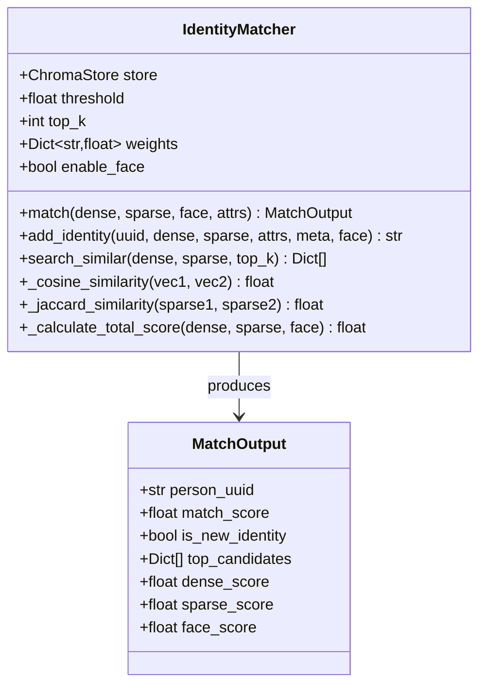

**图表来源**
- [matcher.py:30-351](file://crossmedia_pid/core/matcher.py#L30-L351)

#### 性能特性
- **向量数据库集成**：与ChromaDB深度集成，支持高效的相似性搜索
- **阈值控制**：可配置的匹配阈值确保决策的可靠性
- **候选管理**：支持Top-K候选检索和排序

**章节来源**
- [matcher.py:30-351](file://crossmedia_pid/core/matcher.py#L30-L351)

## 依赖关系分析

系统采用松耦合的模块化设计，通过明确定义的接口进行交互：

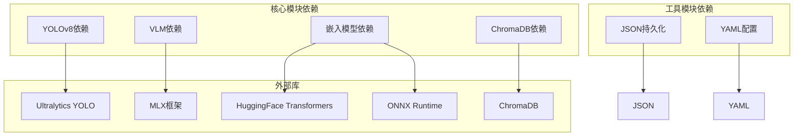

**图表来源**
- [requirements.txt:8-24](file://crossmedia_pid/requirements.txt#L8-L24)
- [extractor.py:14](file://crossmedia_pid/core/extractor.py#L14)
- [feature_vlm.py:86-94](file://crossmedia_pid/core/feature_vlm.py#L86-L94)
- [vectorizer.py:59-93](file://crossmedia_pid/core/vectorizer.py#L59-L93)
- [chroma_store.py:49-71](file://crossmedia_pid/db/chroma_store.py#L49-L71)

**章节来源**
- [requirements.txt:1-38](file://crossmedia_pid/requirements.txt#L1-L38)
- [main.py:28-32](file://crossmedia_pid/main.py#L28-L32)

## 性能考虑

### 硬件优化
- **M1/M2芯片优化**：充分利用Metal Performance Shaders和CoreML执行提供最佳性能
- **内存管理**：合理的模型缓存和资源释放策略
- **批处理优化**：支持批量处理以提高吞吐量

### 算法优化
- **质量过滤**：通过质量评分过滤低质量检测结果
- **智能采样**：视频处理时的帧采样策略减少计算开销
- **权重归一化**：自动权重归一化确保稳定性

### 存储优化
- **向量数据库**：ChromaDB提供高效的相似性搜索
- **持久化策略**：合理的数据持久化和索引策略
- **内存映射**：支持大规模数据集的高效处理

## 故障排除指南

### 常见问题诊断

#### 模型加载失败
**症状**：系统启动时报错，无法加载VLM或嵌入模型
**解决方案**：
1. 检查网络连接和模型下载权限
2. 验证ONNX模型文件完整性
3. 确认Python环境和依赖版本兼容性

#### 检测质量低
**症状**：检测置信度低或质量评分异常
**解决方案**：
1. 调整检测置信度阈值
2. 检查输入图像质量和光照条件
3. 验证YOLO模型权重文件完整性

#### 匹配效果不佳
**症状**：身份匹配准确率低或误匹配频繁
**解决方案**：
1. 调整匹配阈值和权重配置
2. 检查特征提取质量
3. 验证向量数据库索引状态

#### 内存不足
**症状**：处理大型数据集时内存溢出
**解决方案**：
1. 调整批处理大小和队列限制
2. 启用垃圾回收机制
3. 优化数据预处理流程

**章节来源**
- [extractor.py:86-104](file://crossmedia_pid/core/extractor.py#L86-L104)
- [feature_vlm.py:98-100](file://crossmedia_pid/core/feature_vlm.py#L98-L100)
- [vectorizer.py:86-93](file://crossmedia_pid/core/vectorizer.py#L86-L93)

## 结论

CrossMedia-PID系统通过四个精心设计的核心模块，实现了高效、可靠的跨媒体人物识别解决方案。每个模块都有明确的职责分工和优化策略，形成了一个完整的处理流水线。

系统的主要优势包括：
- **模块化设计**：清晰的职责分离便于维护和扩展
- **性能优化**：充分利用现代硬件和软件优化技术
- **鲁棒性**：多层容错机制确保系统稳定性
- **可扩展性**：支持新的模型和算法集成

该架构为未来的功能扩展奠定了坚实基础，包括人脸特征集成、多模态融合和实时处理等高级功能。

## 附录

### 配置参数参考

#### 模型配置
| 参数组 | 参数名 | 默认值 | 说明 |
|--------|--------|--------|------|
| yolo | model_path | yolov8n.pt | YOLO模型路径 |
| yolo | conf_threshold | 0.5 | 检测置信度阈值 |
| yolo | iou_threshold | 0.45 | NMS IoU阈值 |
| vlm | model_name | Qwen3-VL-235B-4bit | VLM模型名称 |
| vlm | max_tokens | 512 | 最大生成token数 |
| embedding | model_name | bge-small-zh-v1.5 | 嵌入模型名称 |
| embedding | max_length | 512 | 最大序列长度 |

#### 匹配配置
| 参数组 | 参数名 | 默认值 | 说明 |
|--------|--------|--------|------|
| matching | threshold | 0.72 | 匹配阈值 |
| matching | top_k | 5 | 候选数量 |
| matching | dense | 0.65 | 稠密向量权重 |
| matching | sparse | 0.35 | 稀疏向量权重 |
| registry | persist_path | ./attribute_registry.json | 注册表路径 |
| registry | min_frequency | 3 | 最小频率阈值 |

### 使用示例

#### 基本使用流程
```bash
# 处理单张图片
python main.py process input.jpg

# 批量处理
python main.py batch ./images/

# 以图搜图
python main.py search query.jpg

# 查看系统统计
python main.py stats
```

#### 高级配置
```yaml
# 自定义配置文件示例
models:
  yolo:
    conf_threshold: 0.6
    iou_threshold: 0.5
  vlm:
    temperature: 0.2
matching:
  threshold: 0.75
  weights:
    dense: 0.7
    sparse: 0.3
```