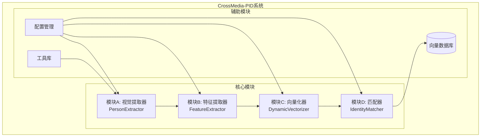
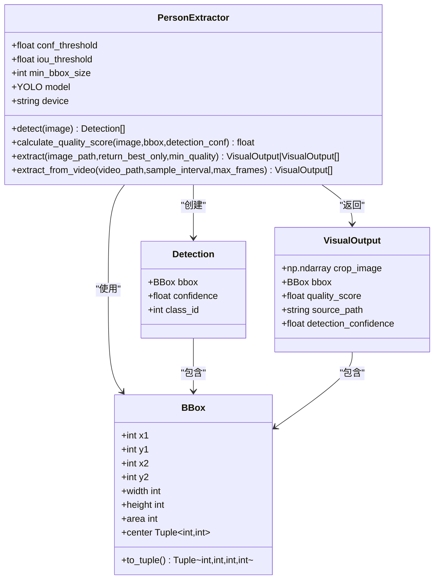
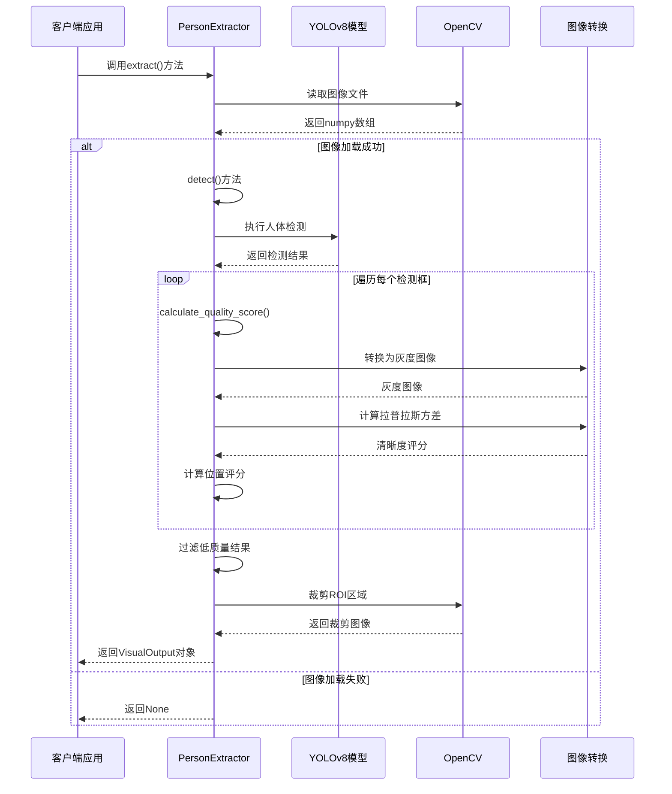
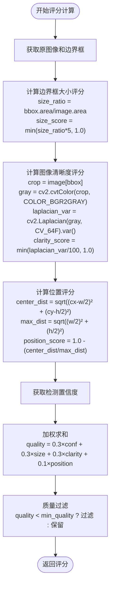
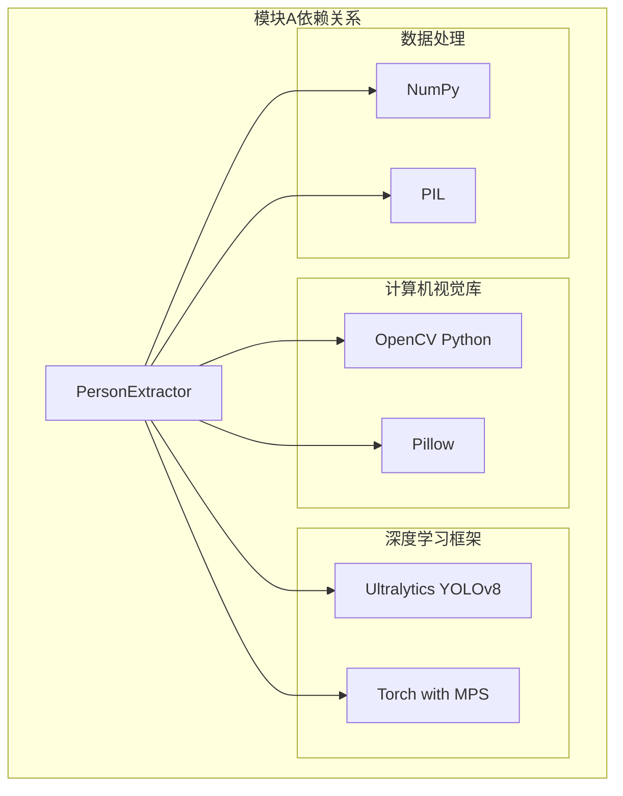

# 模块A：视觉提取器

<cite>
**本文档引用的文件**
- [extractor.py](file://crossmedia_pid/core/extractor.py)
- [config.yaml](file://crossmedia_pid/configs/config.yaml)
- [main.py](file://crossmedia_pid/main.py)
- [requirements.txt](file://crossmedia_pid/requirements.txt)
- [registry.py](file://crossmedia_pid/utils/registry.py)
</cite>

## 目录
1. [简介](#简介)
2. [项目结构](#项目结构)
3. [核心组件](#核心组件)
4. [架构概览](#架构概览)
5. [详细组件分析](#详细组件分析)
6. [依赖关系分析](#依赖关系分析)
7. [性能考虑](#性能考虑)
8. [故障排除指南](#故障排除指南)
9. [结论](#结论)

## 简介

模块A是CrossMedia-PID系统的核心视觉提取器，负责从图像和视频中检测和提取人体目标。该模块基于YOLOv8人体检测算法，实现了完整的预处理、推理和后处理流程，并集成了质量评分系统来评估检测结果的可靠性。

本模块的主要功能包括：
- YOLOv8人体检测算法的实现
- 检测结果的质量评分系统
- ROI（感兴趣区域）裁剪和提取
- 单帧图像和视频序列的处理
- 多种输出格式支持

## 项目结构

CrossMedia-PID项目采用模块化设计，模块A位于核心模块中，与其他三个模块协同工作形成完整的跨媒体人物识别系统。



**图表来源**
- [main.py:67-108](file://crossmedia_pid/main.py#L67-L108)
- [config.yaml:1-58](file://crossmedia_pid/configs/config.yaml#L1-L58)

**章节来源**
- [main.py:57-111](file://crossmedia_pid/main.py#L57-L111)
- [config.yaml:1-58](file://crossmedia_pid/configs/config.yaml#L1-L58)

## 核心组件

模块A的核心由PersonExtractor类及其相关数据结构组成，提供了完整的YOLOv8人体检测和质量评估功能。

### 主要数据结构

模块A定义了三个核心数据类来封装检测相关的数据：



**图表来源**
- [extractor.py:19-63](file://crossmedia_pid/core/extractor.py#L19-L63)
- [extractor.py:65-351](file://crossmedia_pid/core/extractor.py#L65-L351)

### YOLOv8模型集成

模块A使用Ultralytics YOLOv8框架进行人体检测，支持多种输入格式和设备加速。

**章节来源**
- [extractor.py:65-104](file://crossmedia_pid/core/extractor.py#L65-L104)
- [extractor.py:106-149](file://crossmedia_pid/core/extractor.py#L106-L149)

## 架构概览

模块A在整个CrossMedia-PID系统中扮演着关键的视觉前端角色，负责从原始媒体中提取高质量的人体图像。



**图表来源**
- [extractor.py:206-264](file://crossmedia_pid/core/extractor.py#L206-L264)
- [extractor.py:106-149](file://crossmedia_pid/core/extractor.py#L106-L149)

## 详细组件分析

### PersonExtractor类详解

PersonExtractor是模块A的核心类，提供了完整的YOLOv8人体检测和质量评估功能。

#### 初始化参数

| 参数名称 | 类型 | 默认值 | 描述 |
|---------|------|--------|------|
| model_path | str | "yolov8n.pt" | YOLO模型文件路径 |
| conf_threshold | float | 0.5 | 检测置信度阈值 |
| iou_threshold | float | 0.45 | 非极大值抑制IoU阈值 |
| min_bbox_size | int | 64 | 最小边界框尺寸（像素） |
| device | Optional[str] | None | 推理设备选择 |

#### 核心方法API

##### detect() 方法

**功能**：检测图像中的人体目标

**参数**：
- image: Union[np.ndarray, str, Path] - 输入图像，支持numpy数组或文件路径

**返回值**：List[Detection] - 检测到的人体目标列表

**实现细节**：
- 使用YOLOv8模型执行推理
- 仅检测person类别（class_id=0）
- 应用NMS非极大值抑制
- 过滤小于最小尺寸的边界框

**章节来源**
- [extractor.py:106-149](file://crossmedia_pid/core/extractor.py#L106-L149)

##### calculate_quality_score() 方法

**功能**：计算检测结果的质量评分

**评分系统权重**：
- 检测置信度权重：0.3
- 边界框大小评分权重：0.3  
- 图像清晰度评分权重：0.3
- 位置评分权重：0.1

**计算公式**：
```
quality_score = 0.3 × detection_conf + 
                0.3 × size_score + 
                0.3 × clarity_score + 
                0.1 × position_score
```

**详细计算过程**：

1. **检测置信度评分**：直接使用YOLO检测置信度
2. **边界框大小评分**：`size_score = min(bbox.area / image.area × 5, 1.0)`
3. **图像清晰度评分**：使用拉普拉斯算子计算方差，`clarity_score = min(variance / 100, 1.0)`
4. **位置评分**：基于边界框中心距离图像中心的距离计算

**章节来源**
- [extractor.py:151-204](file://crossmedia_pid/core/extractor.py#L151-L204)

##### extract() 方法

**功能**：从单张图像中提取人体

**参数**：
- image_path: Union[str, Path] - 图像文件路径
- return_best_only: bool = True - 是否只返回最佳结果
- min_quality: float = 0.3 - 最小质量阈值

**返回值**：
- Optional[VisualOutput] 或 List[VisualOutput] - 根据return_best_only参数返回单个或多个结果

**处理流程**：
1. 读取图像文件
2. 调用detect()方法获取检测结果
3. 对每个检测框计算质量评分
4. 过滤低于阈值的结果
5. 裁剪ROI区域
6. 按质量分数排序

**章节来源**
- [extractor.py:206-264](file://crossmedia_pid/core/extractor.py#L206-L264)

##### extract_from_video() 方法

**功能**：从视频中提取人体（最佳帧筛选）

**参数**：
- video_path: Union[str, Path] - 视频文件路径
- sample_interval: int = 5 - 帧采样间隔
- max_frames: Optional[int] = None - 最大处理帧数

**返回值**：List[VisualOutput] - 提取结果列表

**处理流程**：
1. 打开视频文件
2. 按采样间隔读取帧
3. 对每帧执行人体检测
4. 计算每个检测框的质量评分
5. 裁剪ROI区域
6. 按质量分数排序

**章节来源**
- [extractor.py:266-336](file://crossmedia_pid/core/extractor.py#L266-L336)

### 质量评分系统详解

模块A实现了四维质量评分系统，用于评估检测结果的可靠性。



**图表来源**
- [extractor.py:151-204](file://crossmedia_pid/core/extractor.py#L151-L204)

### 预处理和后处理逻辑

#### 预处理步骤

1. **图像加载**：支持多种格式（JPEG、PNG等）
2. **设备检测**：自动检测MPS（Metal Performance Shaders）可用性
3. **模型初始化**：加载YOLOv8模型文件

#### 后处理逻辑

1. **边界框过滤**：移除过小的检测框
2. **质量评分**：计算综合质量分数
3. **ROI裁剪**：根据边界框裁剪感兴趣区域
4. **结果排序**：按质量分数降序排列

**章节来源**
- [extractor.py:225-264](file://crossmedia_pid/core/extractor.py#L225-L264)

## 依赖关系分析

模块A的依赖关系相对简单，主要依赖于计算机视觉和深度学习库。



**图表来源**
- [requirements.txt:8-14](file://crossmedia_pid/requirements.txt#L8-L14)
- [extractor.py:11-14](file://crossmedia_pid/core/extractor.py#L11-L14)

### 外部依赖

| 依赖包 | 版本要求 | 用途 |
|--------|----------|------|
| ultralytics | >=8.0.0 | YOLOv8深度学习模型 |
| opencv-python | >=4.8.0 | 图像处理和视频读取 |
| numpy | >=1.24.0 | 数值计算和数组操作 |
| pillow | >=10.0.0 | 图像格式转换 |
| torch | - | 设备检测和MPS支持 |

**章节来源**
- [requirements.txt:1-38](file://crossmedia_pid/requirements.txt#L1-L38)

## 性能考虑

### 设备优化

模块A实现了智能设备选择机制：

1. **MPS优先级**：在M1/M2 Mac上优先使用Metal Performance Shaders
2. **CPU回退**：当MPS不可用时自动切换到CPU
3. **自动检测**：通过torch.backends.mps.is_available()判断设备可用性

### 性能优化建议

1. **批处理优化**：对于大量图像处理，考虑使用多进程并行
2. **内存管理**：及时释放不再使用的图像数据
3. **缓存策略**：对重复访问的模型文件使用缓存
4. **GPU利用**：在支持CUDA的环境中可考虑使用GPU版本

### 视频处理优化

1. **帧采样**：通过sample_interval参数控制处理频率
2. **最大帧数限制**：使用max_frames参数限制处理范围
3. **质量阈值调优**：根据应用场景调整min_quality参数

## 故障排除指南

### 常见问题及解决方案

#### 模型加载失败

**症状**：初始化PersonExtractor时报错

**可能原因**：
- 模型文件路径错误
- 模型文件损坏
- 权限不足

**解决方案**：
1. 验证模型文件路径是否正确
2. 检查模型文件完整性
3. 确认文件读取权限

#### 设备兼容性问题

**症状**：MPS设备无法使用

**可能原因**：
- 系统版本不支持MPS
- PyTorch版本不兼容

**解决方案**：
1. 检查系统版本和PyTorch版本
2. 自动回退到CPU模式
3. 更新相关依赖包

#### 检测结果质量差

**症状**：检测框过小或质量评分低

**可能原因**：
- 阈值设置不当
- 图像质量差
- 模型配置问题

**解决方案**：
1. 调整conf_threshold和min_bbox_size参数
2. 优化输入图像质量
3. 考虑使用更精确的模型

#### 内存不足

**症状**：处理大型图像或视频时内存溢出

**解决方案**：
1. 减少batch size
2. 降低图像分辨率
3. 增加系统内存或使用外部存储

**章节来源**
- [extractor.py:95-104](file://crossmedia_pid/core/extractor.py#L95-L104)
- [extractor.py:227-236](file://crossmedia_pid/core/extractor.py#L227-L236)

## 结论

模块A作为CrossMedia-PID系统的核心视觉提取器，成功实现了基于YOLOv8的人体检测功能。其设计具有以下特点：

1. **模块化设计**：清晰的类结构和方法分离
2. **质量导向**：完善的质量评分系统确保检测结果可靠性
3. **性能优化**：智能设备选择和多种优化策略
4. **易用性强**：简洁的API设计和灵活的配置选项

该模块为后续的特征提取、向量化和身份匹配提供了高质量的输入数据，是整个跨媒体人物识别系统的重要基础。通过合理的参数配置和性能优化，可以满足不同应用场景的需求。