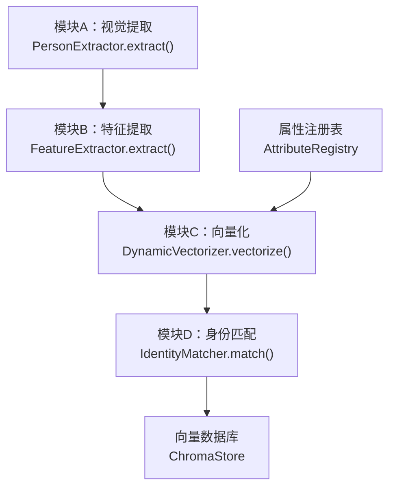
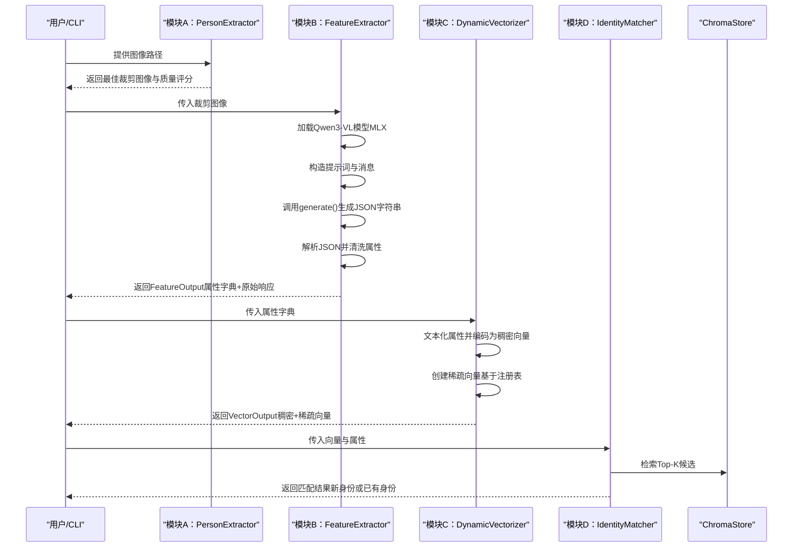
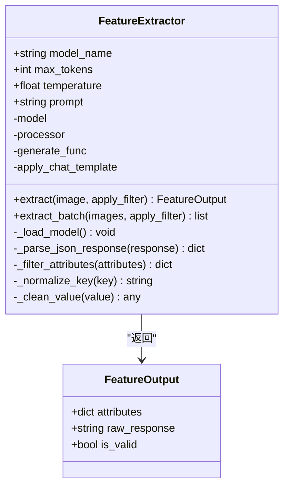
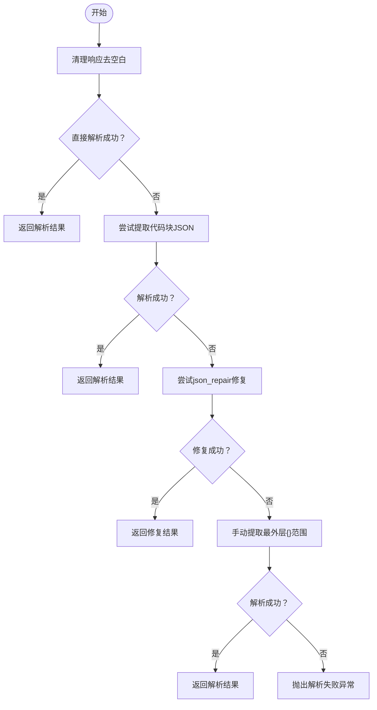
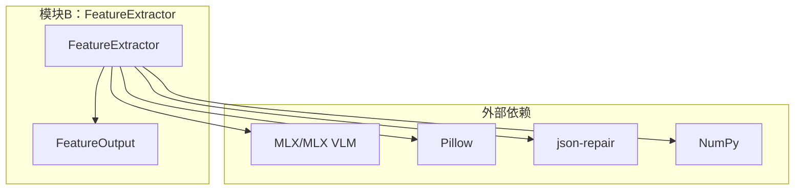

# 模块B：特征提取器

<cite>
**本文引用的文件**
- [feature_vlm.py](file://crossmedia_pid/core/feature_vlm.py)
- [extractor.py](file://crossmedia_pid/core/extractor.py)
- [vectorizer.py](file://crossmedia_pid/core/vectorizer.py)
- [matcher.py](file://crossmedia_pid/core/matcher.py)
- [chroma_store.py](file://crossmedia_pid/db/chroma_store.py)
- [registry.py](file://crossmedia_pid/utils/registry.py)
- [config.yaml](file://crossmedia_pid/configs/config.yaml)
- [main.py](file://crossmedia_pid/main.py)
- [requirements.txt](file://crossmedia_pid/requirements.txt)
</cite>

## 目录
1. [简介](#简介)
2. [项目结构](#项目结构)
3. [核心组件](#核心组件)
4. [架构总览](#架构总览)
5. [详细组件分析](#详细组件分析)
6. [依赖关系分析](#依赖关系分析)
7. [性能考量](#性能考量)
8. [故障排除指南](#故障排除指南)
9. [结论](#结论)
10. [附录](#附录)

## 简介
本文件面向CrossMedia-PID项目中的模块B（特征提取器），聚焦于Qwen3-VL多模态视觉语言模型的集成与特征提取流程，系统阐述以下内容：
- Qwen3-VL在MLX框架下的动态加载与推理机制
- 动态JSON解析与数据清洗策略（键名标准化、值清洗、特殊字符处理、数据修复）
- 开放域特征提取的工作原理（视觉编码器与语言编码器协同）
- FeatureExtractor类的完整API说明（extract_features、process_multimodal_input、clean_json_data等）
- 模型配置参数、输入格式要求、输出特征维度与性能调优建议
- 实际使用示例与常见问题排查

## 项目结构
模块B位于core/feature_vlm.py，负责从图像中提取人物特征并进行结构化输出；其上游由模块A（视觉提取）提供高质量裁剪图像，下游由模块C（向量化）将特征转为稠密与稀疏向量，最终交由模块D（身份匹配）完成检索与归并。



图表来源
- [extractor.py:206-264](file://crossmedia_pid/core/extractor.py#L206-L264)
- [feature_vlm.py:210-291](file://crossmedia_pid/core/feature_vlm.py#L210-L291)
- [vectorizer.py:227-258](file://crossmedia_pid/core/vectorizer.py#L227-L258)
- [matcher.py:140-252](file://crossmedia_pid/core/matcher.py#L140-L252)
- [chroma_store.py:73-123](file://crossmedia_pid/db/chroma_store.py#L73-L123)
- [registry.py:233-268](file://crossmedia_pid/utils/registry.py#L233-L268)

章节来源
- [main.py:112-200](file://crossmedia_pid/main.py#L112-L200)
- [config.yaml:11-19](file://crossmedia_pid/configs/config.yaml#L11-L19)

## 核心组件
- FeatureExtractor：基于Qwen3-VL的开放域特征提取器，负责将图像与提示词结合，生成结构化特征字典，并进行JSON解析与清洗。
- FeatureOutput：封装特征提取结果，包含清洗后的属性字典、原始响应与有效性标记。
- Prompt模板：内置人物特征提取提示，确保输出为合法JSON且键名为snake_case，值为中文描述。
- 数据清洗与解析策略：支持直接解析、代码块提取、json_repair修复与手动提取等多策略容错。

章节来源
- [feature_vlm.py:52-324](file://crossmedia_pid/core/feature_vlm.py#L52-L324)

## 架构总览
模块B在系统中的职责是“从高质量视觉输入中抽取开放域人物特征”，并将其转化为可用于后续向量化与匹配的结构化数据。整体流程如下：



图表来源
- [main.py:112-200](file://crossmedia_pid/main.py#L112-L200)
- [feature_vlm.py:210-291](file://crossmedia_pid/core/feature_vlm.py#L210-L291)
- [vectorizer.py:227-258](file://crossmedia_pid/core/vectorizer.py#L227-L258)
- [matcher.py:140-252](file://crossmedia_pid/core/matcher.py#L140-L252)
- [chroma_store.py:125-178](file://crossmedia_pid/db/chroma_store.py#L125-L178)

## 详细组件分析

### FeatureExtractor 类
- 职责：加载Qwen3-VL模型，接收图像与提示词，生成结构化特征字典，并进行JSON解析与清洗。
- 关键方法与行为：
  - extract(image, apply_filter): 从单张图像提取特征，返回FeatureOutput。
  - extract_batch(images, apply_filter): 批量提取特征。
  - _load_model(): 延迟加载MLX VLM模型与处理器。
  - _parse_json_response(response): 多策略JSON解析与修复。
  - _filter_attributes(attributes): 键名标准化与值清洗。
  - _normalize_key(key)、_clean_value(value): 数据清洗辅助。
- 输出类型：FeatureOutput（包含属性字典、原始响应、是否有效）。



图表来源
- [feature_vlm.py:52-324](file://crossmedia_pid/core/feature_vlm.py#L52-L324)

章节来源
- [feature_vlm.py:52-324](file://crossmedia_pid/core/feature_vlm.py#L52-L324)

### 动态JSON解析与数据清洗机制
- 直接解析：尝试直接解析整个响应为JSON。
- 代码块提取：从```json ... ```或``` ... ```中提取JSON。
- 修复策略：使用json_repair尝试修复常见JSON错误。
- 手动提取：定位最外层大括号范围并解析。
- 键名标准化：小写、空格替换为下划线、移除非字母数字与下划线字符。
- 值清洗：将“无”、“null”、“空字符串”等视为缺失值过滤掉。
- 过滤开关：可通过apply_filter控制是否应用清洗逻辑。



图表来源
- [feature_vlm.py](file://crossmedia_pid/core/feature_vlm.py#L131-L184)

章节来源
- [feature_vlm.py](file://crossmedia_pid/core/feature_vlm.py#L102-L208)

### 开放域特征提取工作原理
- 视觉编码器：将输入图像转换为RGB格式的PIL图像，供MLX VLM处理。
- 语言编码器：通过提示词模板构造消息，调用MLX VLM的generate接口生成自然语言描述的JSON。
- 协同机制：图像与文本提示共同驱动模型输出，确保特征结构化与一致性。
- 输出特征维度：FeatureOutput.attributes为动态字典，键为标准化后的英文标识，值为中文描述；最终向量化时会根据注册表映射为稀疏维度。

章节来源
- [feature_vlm.py](file://crossmedia_pid/core/feature_vlm.py#L210-L291)

### FeatureExtractor API 文档
- extract(image, apply_filter=True) -> FeatureOutput
  - 输入：图像（numpy数组，BGR格式），是否应用过滤。
  - 行为：加载模型、准备提示词、生成响应、解析JSON、清洗属性。
  - 输出：FeatureOutput对象，包含attributes、raw_response、is_valid。
- extract_batch(images, apply_filter=True) -> list
  - 输入：图像列表。
  - 行为：逐个调用extract。
  - 输出：FeatureOutput列表。
- _parse_json_response(response) -> dict
  - 输入：模型生成的字符串。
  - 行为：多策略解析与修复。
  - 输出：解析后的属性字典。
- _filter_attributes(attributes) -> dict
  - 输入：原始属性字典。
  - 行为：标准化键名、过滤“无”值。
  - 输出：清洗后的属性字典。
- _normalize_key(key) -> str
  - 输入：原始键名。
  - 行为：小写、空格替换、移除非字母数字与下划线。
  - 输出：标准化键名。
- _clean_value(value) -> any
  - 输入：原始值。
  - 行为：过滤“无”、“null”、“空字符串”等。
  - 输出：清洗后的值或None。

章节来源
- [feature_vlm.py](file://crossmedia_pid/core/feature_vlm.py#L210-L311)

### 模型配置参数与输入输出
- 模型配置（来自配置文件）：
  - vlm.model_name: 默认“mlx-community/Qwen3-VL-235B-4bit”
  - vlm.max_tokens: 默认512
  - vlm.temperature: 默认0.1
- 输入格式要求：
  - 图像：numpy数组，BGR格式；内部会转换为RGB并转为PIL图像。
  - 提示词：内置模板，确保输出为合法JSON。
- 输出特征维度：
  - attributes：动态字典，键为snake_case，值为中文描述。
  - raw_response：原始模型输出字符串（调试用途）。
  - is_valid：是否成功解析为JSON。

章节来源
- [config.yaml](file://crossmedia_pid/configs/config.yaml#L11-L19)
- [feature_vlm.py](file://crossmedia_pid/core/feature_vlm.py#L55-L74)
- [feature_vlm.py](file://crossmedia_pid/core/feature_vlm.py#L210-L291)

### 与下游模块的衔接
- 模块B输出的attributes将被模块C的DynamicVectorizer.vectorize()消费，生成：
  - 稠密向量：基于BGE模型的文本嵌入。
  - 稀疏向量：基于AttributeRegistry的维度映射。
- 模块D的IdentityMatcher.match()使用上述向量进行检索与身份决策，并将结果持久化至ChromaStore。

章节来源
- [vectorizer.py](file://crossmedia_pid/core/vectorizer.py#L227-L258)
- [matcher.py](file://crossmedia_pid/core/matcher.py#L140-L252)
- [chroma_store.py](file://crossmedia_pid/db/chroma_store.py#L73-L123)

## 依赖关系分析
- 模块B依赖：
  - MLX与MLX VLM：用于加载与推理Qwen3-VL模型。
  - Pillow：图像格式转换。
  - json-repair：JSON修复工具。
  - numpy：图像与向量处理。
- 与系统其他模块的关系：
  - 上游：模块A提供高质量裁剪图像。
  - 下游：模块C进行向量化，模块D进行匹配与持久化。



图表来源
- [feature_vlm.py:80-101](file://crossmedia_pid/core/feature_vlm.py#L80-L101)
- [requirements.txt:12-14](file://crossmedia_pid/requirements.txt#L12-L14)

章节来源
- [requirements.txt:1-38](file://crossmedia_pid/requirements.txt#L1-L38)

## 性能考量
- 模型加载策略：采用延迟加载，首次调用extract时才加载模型，减少启动开销。
- 设备选择：MLX在M1/M2上具备良好性能，建议在Apple Silicon设备上运行以获得最佳体验。
- 温度与token限制：temperature较低（如0.1）有助于稳定输出，max_tokens限制生成长度，避免过长响应影响解析。
- 批量处理：extract_batch按顺序处理，若需更高吞吐可在应用层引入并发队列（注意MLX的线程安全与内存占用）。
- JSON解析容错：多策略解析与修复可降低因模型输出不稳定导致的失败率。

章节来源
- [feature_vlm.py:80-101](file://crossmedia_pid/core/feature_vlm.py#L80-L101)
- [feature_vlm.py:292-311](file://crossmedia_pid/core/feature_vlm.py#L292-L311)
- [config.yaml:11-19](file://crossmedia_pid/configs/config.yaml#L11-L19)

## 故障排除指南
- 模型加载失败
  - 现象：日志报错“Failed to load VLM model”。
  - 排查：确认MLX与MLX VLM安装正确；检查模型名称是否可用；确保网络可达。
  - 参考：[feature_vlm.py:80-101](file://crossmedia_pid/core/feature_vlm.py#L80-L101)
- JSON解析失败
  - 现象：FeatureOutput.is_valid为False，raw_response为错误信息。
  - 排查：检查提示词模板是否被修改；确认模型输出符合JSON格式；启用json_repair依赖。
  - 参考：[feature_vlm.py:131-184](file://crossmedia_pid/core/feature_vlm.py#L131-L184)
- 图像输入格式问题
  - 现象：推理失败或输出为空。
  - 排查：确保输入为numpy数组且为BGR格式；内部会自动转换为RGB并转为PIL图像。
  - 参考：[feature_vlm.py:228-234](file://crossmedia_pid/core/feature_vlm.py#L228-L234)
- 性能瓶颈
  - 现象：推理耗时较长。
  - 排查：降低temperature与max_tokens；在Apple Silicon设备上运行；考虑批处理与并发队列。
  - 参考：[config.yaml:11-19](file://crossmedia_pid/configs/config.yaml#L11-L19)

章节来源
- [feature_vlm.py:80-101](file://crossmedia_pid/core/feature_vlm.py#L80-L101)
- [feature_vlm.py:131-184](file://crossmedia_pid/core/feature_vlm.py#L131-L184)
- [feature_vlm.py:228-234](file://crossmedia_pid/core/feature_vlm.py#L228-L234)
- [config.yaml:11-19](file://crossmedia_pid/configs/config.yaml#L11-L19)

## 结论
模块B通过Qwen3-VL实现了开放域人物特征提取，结合多策略JSON解析与数据清洗，能够稳定地将视觉输入转化为结构化特征字典。配合模块C的向量化与模块D的身份匹配，形成完整的跨媒体人物识别流水线。建议在Apple Silicon设备上部署以获得最佳性能，并根据业务需求调整温度、token上限与清洗策略。

## 附录

### 实际使用示例（CLI）
- 处理单张图片：python main.py process <image_path>
- 批量处理：python main.py batch <image_dir> --pattern "*.jpg"
- 以图搜图：python main.py search <image_path> --top-k 5
- 查看统计：python main.py stats

章节来源
- [main.py:256-380](file://crossmedia_pid/main.py#L256-L380)

### 配置文件要点
- vlm模型参数：model_name、max_tokens、temperature
- embedding模型参数：model_name、onnx_path、max_length
- 匹配阈值与权重：threshold、top_k、weights
- 注册表路径与最小频率：registry.persist_path、registry.min_frequency

章节来源
- [config.yaml:11-58](file://crossmedia_pid/configs/config.yaml#L11-L58)