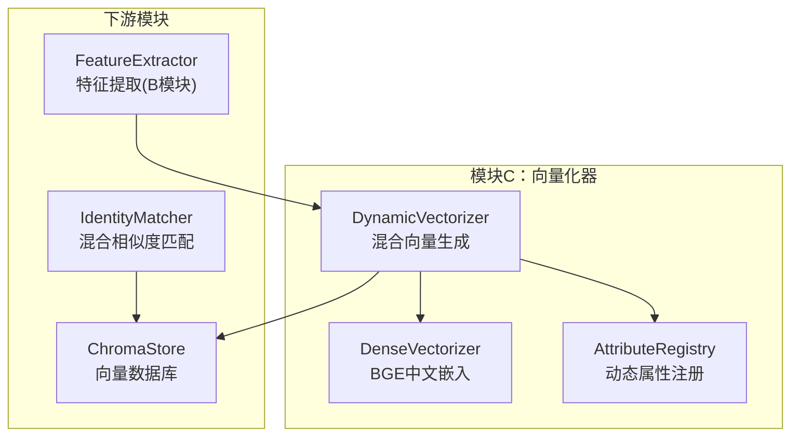
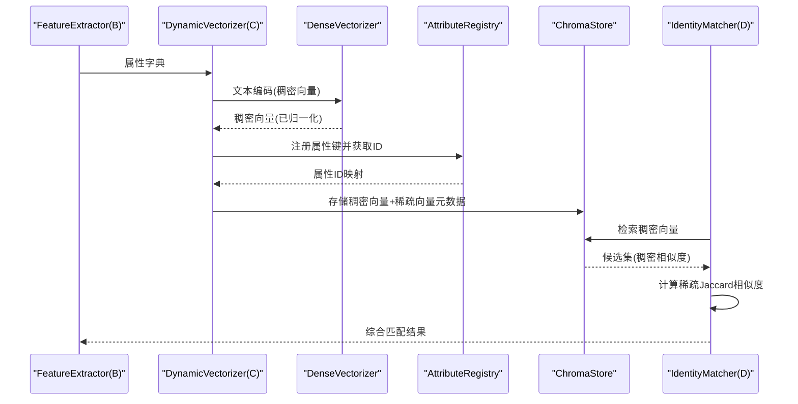
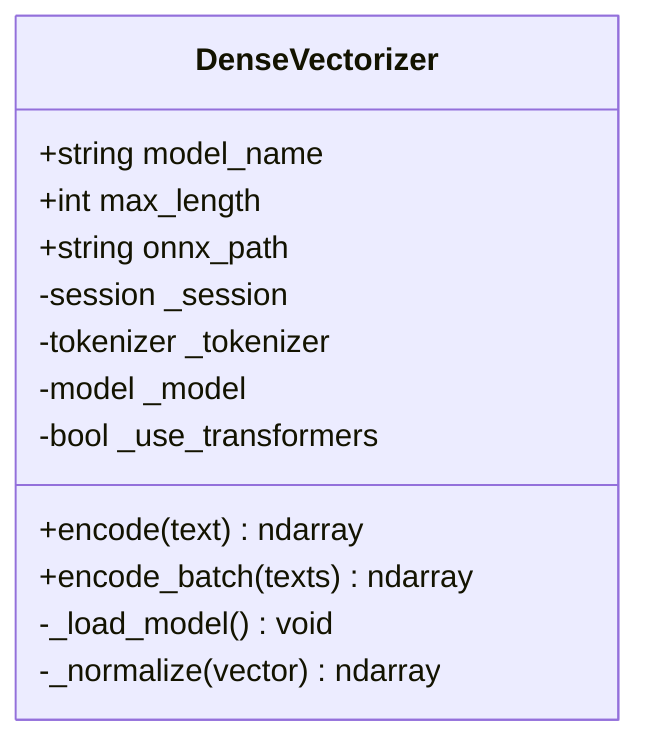
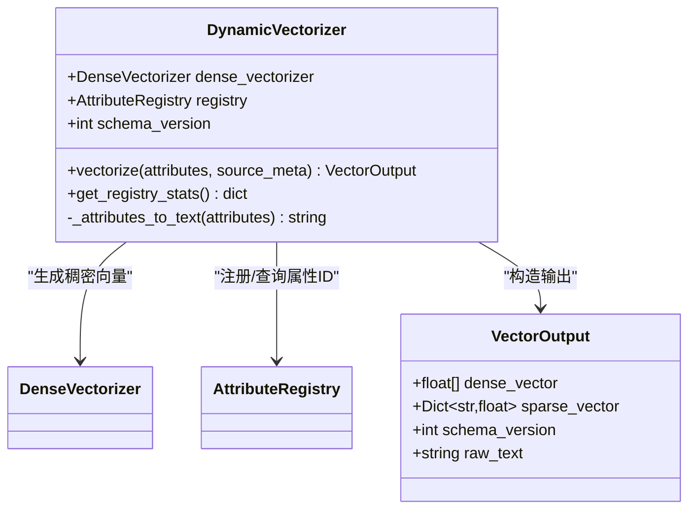
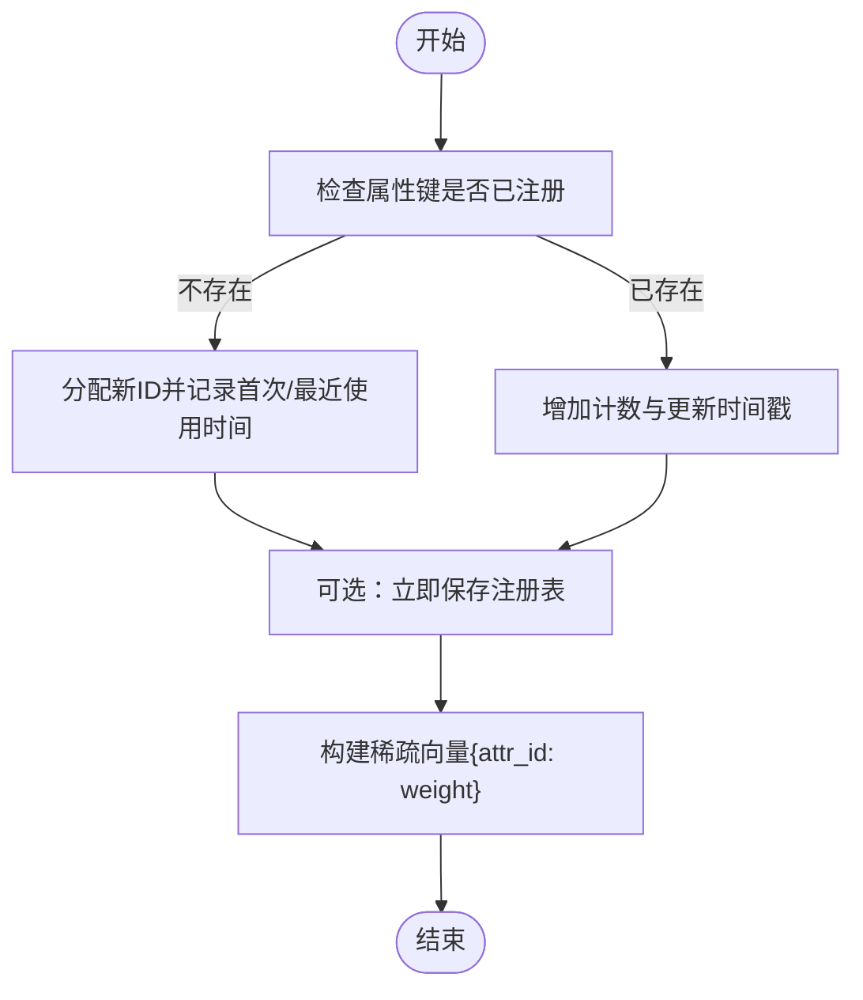
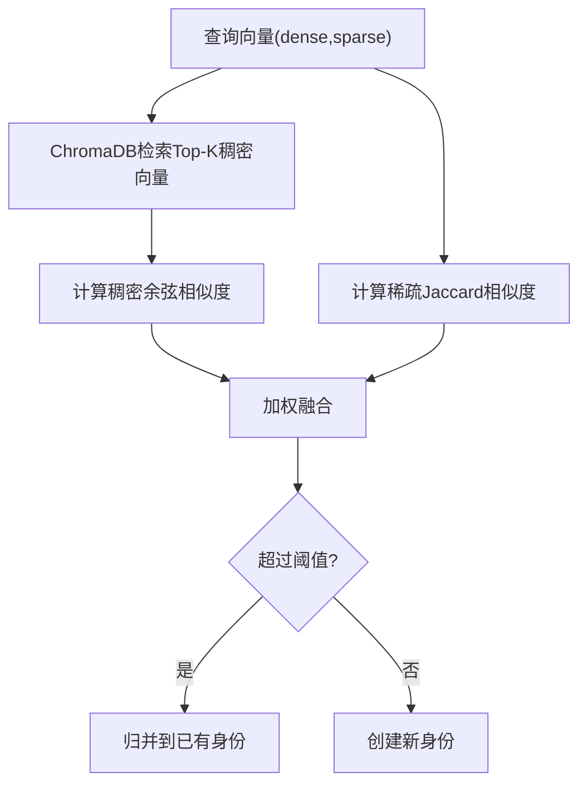
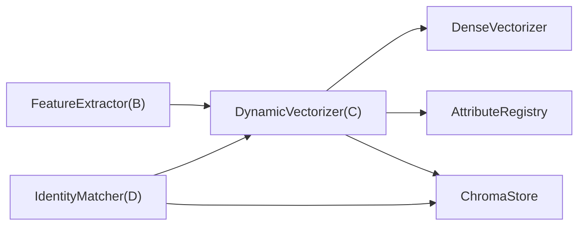

# 模块C：向量化器

<cite>
**本文引用的文件**
- [crossmedia_pid/core/vectorizer.py](file://crossmedia_pid/core/vectorizer.py)
- [crossmedia_pid/utils/registry.py](file://crossmedia_pid/utils/registry.py)
- [crossmedia_pid/configs/config.yaml](file://crossmedia_pid/configs/config.yaml)
- [crossmedia_pid/db/chroma_store.py](file://crossmedia_pid/db/chroma_store.py)
- [crossmedia_pid/core/matcher.py](file://crossmedia_pid/core/matcher.py)
- [crossmedia_pid/core/feature_vlm.py](file://crossmedia_pid/core/feature_vlm.py)
- [crossmedia_pid/main.py](file://crossmedia_pid/main.py)
- [crossmedia_pid/requirements.txt](file://crossmedia_pid/requirements.txt)
</cite>

## 目录
1. [简介](#简介)
2. [项目结构](#项目结构)
3. [核心组件](#核心组件)
4. [架构总览](#架构总览)
5. [详细组件分析](#详细组件分析)
6. [依赖关系分析](#依赖关系分析)
7. [性能考量](#性能考量)
8. [故障排查指南](#故障排查指南)
9. [结论](#结论)
10. [附录](#附录)

## 简介
本文件面向CrossMedia-PID的模块C（向量化器），系统性阐述以下内容：
- BGE中文嵌入模型的使用方式与混合向量生成策略
- 稠密语义向量与稀疏属性向量的融合机制：维度对齐、权重分配与归一化
- AttributeRegistry的动态属性管理：属性注册、维度扩展与向量构建
- Vectorizer类的完整API说明：create_dense_vector()、build_sparse_vector()、generate_mixed_vector()（注：实际实现中对应方法为DenseVectorizer.encode()、DynamicVectorizer.vectorize()与AttributeRegistry.create_sparse_vector()）
- 向量维度配置、相似度计算方法与性能优化技巧
- 实际应用场景示例与向量质量评估标准

## 项目结构
模块C位于core/vectorizer.py，配合utils/registry.py实现动态属性注册与稀疏向量构建；与db/chroma_store.py交互进行向量持久化；与core/matcher.py共同完成混合相似度计算与身份匹配；与core/feature_vlm.py协作从图像中提取结构化属性。

图表来源
- [crossmedia_pid/core/vectorizer.py:174-277](file://crossmedia_pid/core/vectorizer.py#L174-L277)
- [crossmedia_pid/utils/registry.py:16-269](file://crossmedia_pid/utils/registry.py#L16-L269)
- [crossmedia_pid/db/chroma_store.py:18-254](file://crossmedia_pid/db/chroma_store.py#L18-L254)
- [crossmedia_pid/core/matcher.py:30-351](file://crossmedia_pid/core/matcher.py#L30-L351)
- [crossmedia_pid/core/feature_vlm.py:52-325](file://crossmedia_pid/core/feature_vlm.py#L52-L325)

章节来源
- [crossmedia_pid/core/vectorizer.py:1-277](file://crossmedia_pid/core/vectorizer.py#L1-L277)
- [crossmedia_pid/utils/registry.py:1-269](file://crossmedia_pid/utils/registry.py#L1-L269)
- [crossmedia_pid/db/chroma_store.py:1-254](file://crossmedia_pid/db/chroma_store.py#L1-L254)
- [crossmedia_pid/core/matcher.py:1-351](file://crossmedia_pid/core/matcher.py#L1-L351)
- [crossmedia_pid/core/feature_vlm.py:1-325](file://crossmedia_pid/core/feature_vlm.py#L1-L325)

## 核心组件
- DenseVectorizer：基于BGE中文嵌入模型的稠密向量生成器，支持ONNX与Transformers两种后端，并提供L2归一化。
- DynamicVectorizer：将属性字典转换为文本，调用DenseVectorizer生成稠密向量，同时利用AttributeRegistry生成稀疏向量，最终输出VectorOutput。
- AttributeRegistry：动态属性注册表，维护属性键到ID的映射，支持持久化、并发安全、统计查询与最小频次验证。
- create_sparse_vector：从属性字典构建稀疏向量，按注册表ID映射并赋予权重。
- VectorOutput：统一输出结构，包含稠密向量、稀疏向量、模式版本与原始文本。

章节来源
- [crossmedia_pid/core/vectorizer.py:28-172](file://crossmedia_pid/core/vectorizer.py#L28-L172)
- [crossmedia_pid/core/vectorizer.py:174-277](file://crossmedia_pid/core/vectorizer.py#L174-L277)
- [crossmedia_pid/utils/registry.py:16-269](file://crossmedia_pid/utils/registry.py#L16-L269)

## 架构总览
模块C在整体流程中的作用：接收来自B模块（特征提取）的属性字典，生成稠密语义向量与稀疏属性向量，写入ChromaDB，并由D模块（匹配器）在检索时结合稠密余弦相似度与稀疏Jaccard相似度进行综合打分。

图表来源
- [crossmedia_pid/core/feature_vlm.py:210-290](file://crossmedia_pid/core/feature_vlm.py#L210-L290)
- [crossmedia_pid/core/vectorizer.py:227-258](file://crossmedia_pid/core/vectorizer.py#L227-L258)
- [crossmedia_pid/utils/registry.py:233-268](file://crossmedia_pid/utils/registry.py#L233-L268)
- [crossmedia_pid/db/chroma_store.py:73-123](file://crossmedia_pid/db/chroma_store.py#L73-L123)
- [crossmedia_pid/core/matcher.py:140-252](file://crossmedia_pid/core/matcher.py#L140-L252)

## 详细组件分析

### DenseVectorizer：BGE中文嵌入模型
- 模型加载策略
  - 优先尝试ONNXRuntime（M1优化：CoreMLExecutionProvider/CPUExecutionProvider），若失败则回退到Transformers后端。
  - 支持自定义ONNX路径或从HuggingFace加载模型。
- 文本编码
  - 使用AutoTokenizer进行分词，支持padding/truncation与max_length限制。
  - ONNX路径：将input_ids与attention_mask作为输入，得到向量后进行L2归一化。
  - Transformers路径：使用last_hidden_state[:, 0]作为句向量，再L2归一化。
- 批量编码
  - encode_batch遍历文本列表，逐个encode并堆叠为(N,D)矩阵。

图表来源
- [crossmedia_pid/core/vectorizer.py:28-172](file://crossmedia_pid/core/vectorizer.py#L28-L172)

章节来源
- [crossmedia_pid/core/vectorizer.py:28-172](file://crossmedia_pid/core/vectorizer.py#L28-L172)

### DynamicVectorizer：混合向量生成
- 属性转文本
  - 将属性字典转换为自然语言描述文本，用于稠密向量生成。
  - 支持布尔、数值与字符串类型的值，跳过None与“无”。
- 稠密向量
  - 调用DenseVectorizer.encode生成向量并归一化。
- 稀疏向量
  - 调用create_sparse_vector，基于AttributeRegistry注册属性键并映射为ID，赋予权重。
- 输出
  - 返回VectorOutput，包含稠密向量、稀疏向量、schema版本与原始文本。

图表来源
- [crossmedia_pid/core/vectorizer.py:174-277](file://crossmedia_pid/core/vectorizer.py#L174-L277)

章节来源
- [crossmedia_pid/core/vectorizer.py:174-277](file://crossmedia_pid/core/vectorizer.py#L174-L277)

### AttributeRegistry：动态属性管理
- 注册与映射
  - register(attr_key)：若键已存在则更新计数与时间戳；否则分配新ID并持久化。
  - get_id/get_key：双向查询。
- 统计与过滤
  - get_statistics：返回总属性数、已验证属性数与下一个可用ID。
  - get_verified_keys(min_frequency)：返回出现频次≥阈值的键。
- 持久化与并发
  - _load/_save：JSON文件持久化，含锁保证并发安全。
  - reset(confirm)：危险操作，需显式确认。
- create_sparse_vector
  - 遍历属性字典，调用register获取ID并构建稀疏向量{attr_id: weight}。

图表来源
- [crossmedia_pid/utils/registry.py:82-115](file://crossmedia_pid/utils/registry.py#L82-L115)
- [crossmedia_pid/utils/registry.py:233-268](file://crossmedia_pid/utils/registry.py#L233-L268)

章节来源
- [crossmedia_pid/utils/registry.py:16-269](file://crossmedia_pid/utils/registry.py#L16-L269)

### Vectorizer类API详解
注意：实际实现中未提供名为create_dense_vector()、build_sparse_vector()、generate_mixed_vector()的方法，以下为基于现有实现的等价API说明与使用路径。

- DenseVectorizer.encode(text) -> ndarray
  - 输入：文本字符串
  - 输出：L2归一化的稠密向量
  - 适用场景：从属性文本生成语义向量
- DenseVectorizer.encode_batch(texts) -> ndarray
  - 输入：文本列表
  - 输出：(N,D)稠密向量矩阵
- DynamicVectorizer.vectorize(attributes, source_meta=None) -> VectorOutput
  - 输入：属性字典；可选源元信息
  - 输出：包含稠密向量、稀疏向量、schema版本与原始文本的结构化对象
- AttributeRegistry.register(attr_key, auto_save=True) -> int
  - 输入：属性键名
  - 输出：属性ID
- create_sparse_vector(attributes, registry=None, weight=1.0) -> dict
  - 输入：属性字典；可选注册表；默认权重
  - 输出：稀疏向量{attr_id: weight}

章节来源
- [crossmedia_pid/core/vectorizer.py:102-172](file://crossmedia_pid/core/vectorizer.py#L102-L172)
- [crossmedia_pid/core/vectorizer.py:227-258](file://crossmedia_pid/core/vectorizer.py#L227-L258)
- [crossmedia_pid/utils/registry.py:82-115](file://crossmedia_pid/utils/registry.py#L82-L115)
- [crossmedia_pid/utils/registry.py:233-268](file://crossmedia_pid/utils/registry.py#L233-L268)

### 向量维度与配置
- 稠密向量维度
  - BGE中文嵌入模型的维度取决于具体模型名称，默认使用“BAAI/bge-small-zh-v1.5”，其维度通常为768。
  - 可通过配置文件中的embedding模型名与max_length参数控制。
- 稀疏向量维度
  - 由AttributeRegistry动态扩展，每个新增属性键映射为一个独立维度（ID）。
  - 稀疏向量维度与稠密向量维度不同，二者不直接对齐，需在匹配阶段采用混合相似度策略。
- 配置入口
  - configs/config.yaml中embedding段落定义模型名、ONNX路径与max_length。

章节来源
- [crossmedia_pid/configs/config.yaml:16-19](file://crossmedia_pid/configs/config.yaml#L16-L19)
- [crossmedia_pid/core/vectorizer.py:31-46](file://crossmedia_pid/core/vectorizer.py#L31-L46)

### 相似度计算与匹配
- 稠密向量相似度
  - 使用余弦相似度，ChromaDB返回的cosine距离为1−similarity，因此在D模块中转换为相似度。
- 稀疏向量相似度
  - 使用加权Jaccard相似度：intersection_weight / union_weight，其中权重为两个向量在共有/总属性上的最小/最大值之和。
- 综合分数
  - total_score = w_d × dense + w_s × sparse + w_f × face
  - 权重来自配置，且会进行归一化处理，确保总和接近1.0。

图表来源
- [crossmedia_pid/db/chroma_store.py:125-178](file://crossmedia_pid/db/chroma_store.py#L125-L178)
- [crossmedia_pid/core/matcher.py:71-138](file://crossmedia_pid/core/matcher.py#L71-L138)
- [crossmedia_pid/core/matcher.py:140-252](file://crossmedia_pid/core/matcher.py#L140-L252)

章节来源
- [crossmedia_pid/db/chroma_store.py:125-178](file://crossmedia_pid/db/chroma_store.py#L125-L178)
- [crossmedia_pid/core/matcher.py:71-138](file://crossmedia_pid/core/matcher.py#L71-L138)
- [crossmedia_pid/core/matcher.py:140-252](file://crossmedia_pid/core/matcher.py#L140-L252)

## 依赖关系分析
- 模块C依赖
  - utils/registry.py：提供动态属性注册与稀疏向量构建
  - db/chroma_store.py：提供向量持久化与检索
  - core/matcher.py：提供混合相似度计算与身份决策
  - core/feature_vlm.py：提供属性字典（上游）
- 外部依赖
  - onnxruntime/tokenizers：BGE模型推理
  - chromadb：向量数据库
  - numpy/PIL/ultralytics等：通用计算与计算机视觉

图表来源
- [crossmedia_pid/core/vectorizer.py:174-277](file://crossmedia_pid/core/vectorizer.py#L174-L277)
- [crossmedia_pid/utils/registry.py:16-269](file://crossmedia_pid/utils/registry.py#L16-L269)
- [crossmedia_pid/db/chroma_store.py:18-254](file://crossmedia_pid/db/chroma_store.py#L18-L254)
- [crossmedia_pid/core/matcher.py:30-351](file://crossmedia_pid/core/matcher.py#L30-L351)
- [crossmedia_pid/core/feature_vlm.py:52-325](file://crossmedia_pid/core/feature_vlm.py#L52-L325)

章节来源
- [crossmedia_pid/requirements.txt:1-38](file://crossmedia_pid/requirements.txt#L1-L38)
- [crossmedia_pid/core/vectorizer.py:1-20](file://crossmedia_pid/core/vectorizer.py#L1-L20)
- [crossmedia_pid/utils/registry.py:1-14](file://crossmedia_pid/utils/registry.py#L1-L14)

## 性能考量
- 模型加载与后端选择
  - 优先使用ONNXRuntime（M1 CoreML/CPU Provider），若不可用则回退Transformers，避免额外转换开销。
- 归一化与相似度
  - 稠密向量在生成时即L2归一化，减少后续相似度计算成本。
  - 稀疏向量采用Jaccard相似度，复杂度与非零元素数量相关，建议控制属性数量。
- 批量处理
  - DenseVectorizer.encode_batch支持批量编码，提升吞吐。
- 数据库检索
  - ChromaDB使用hnsw索引与cosine距离，Top-K检索可控制候选规模。
- 权重与阈值
  - 在配置中合理设置w_d、w_s、阈值与Top-K，平衡召回与精度。

[本节为通用性能建议，无需特定文件引用]

## 故障排查指南
- 模型加载失败
  - 现象：DenseVectorizer._load_model抛出异常并回退到Transformers
  - 处理：检查模型名/ONNX路径是否存在；确认网络与权限
- ONNXProvider不可用
  - 现象：CoreMLExecutionProvider不可用时自动降级至CPUExecutionProvider
  - 处理：确认系统环境与onnxruntime版本
- 稀疏向量为空
  - 现象：create_sparse_vector返回空字典
  - 处理：检查属性值是否为None或“无”；确认AttributeRegistry已正确注册
- 相似度异常
  - 现象：稠密相似度为0或NaN
  - 处理：确认向量已L2归一化；检查ChromaDB距离函数与阈值设置
- 配置问题
  - 现象：向量化器/匹配器行为不符合预期
  - 处理：核对configs/config.yaml中的embedding、registry、matching段落

章节来源
- [crossmedia_pid/core/vectorizer.py:53-94](file://crossmedia_pid/core/vectorizer.py#L53-L94)
- [crossmedia_pid/utils/registry.py:67-80](file://crossmedia_pid/utils/registry.py#L67-L80)
- [crossmedia_pid/db/chroma_store.py:159-160](file://crossmedia_pid/db/chroma_store.py#L159-L160)
- [crossmedia_pid/configs/config.yaml:16-40](file://crossmedia_pid/configs/config.yaml#L16-L40)

## 结论
模块C通过DenseVectorizer与AttributeRegistry实现了“语义稠密向量 + 动态稀疏属性向量”的混合策略，既保留了BGE中文嵌入的语义表达能力，又借助稀疏向量的可解释性与动态扩展能力，提升了跨媒体人物识别的鲁棒性与可维护性。结合ChromaDB与IdentityMatcher的混合相似度计算，形成了一套完整的向量化、存储与匹配流水线。

[本节为总结性内容，无需特定文件引用]

## 附录

### 实际应用场景示例
- 单图处理流程
  - A模块：人体检测与最佳帧筛选
  - B模块：VLM提取结构化属性
  - C模块：向量化（稠密+稀疏）
  - D模块：身份匹配与入库
- 以图搜图
  - 重复步骤1-3，然后调用D模块的search_similar进行检索

章节来源
- [crossmedia_pid/main.py:112-200](file://crossmedia_pid/main.py#L112-L200)
- [crossmedia_pid/main.py:202-226](file://crossmedia_pid/main.py#L202-L226)

### 向量质量评估标准
- 稠密向量
  - L2归一化一致性：确保向量模长为1
  - 语义一致性：同义/近义文本应具有较高相似度
- 稀疏向量
  - 属性覆盖率：高频属性应稳定映射到ID
  - 稀疏性：尽量保持高维低密度
- 混合匹配
  - Top-K候选分布：应集中于目标身份
  - 阈值敏感性：在不同阈值下稳定性良好

[本节为通用评估建议，无需特定文件引用]