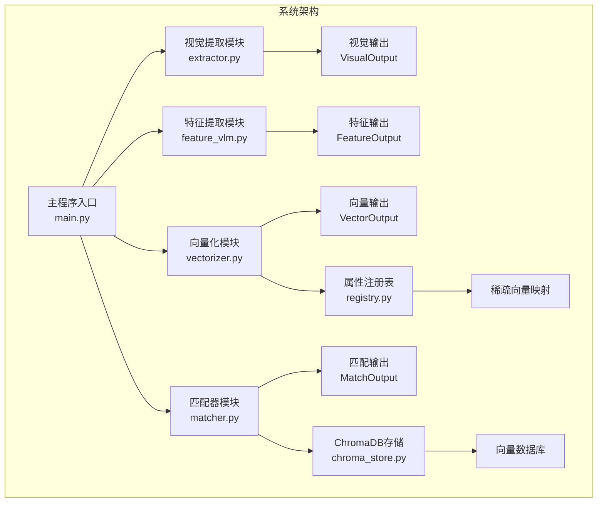
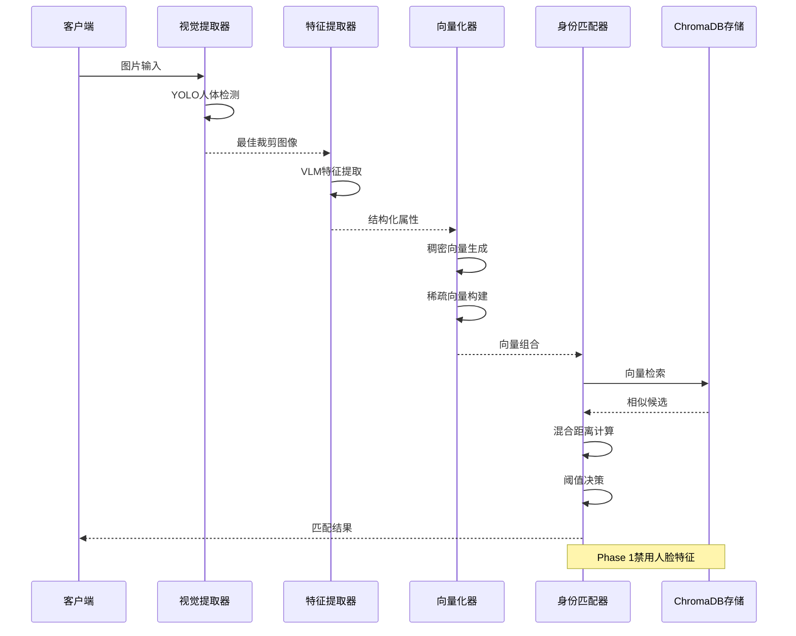
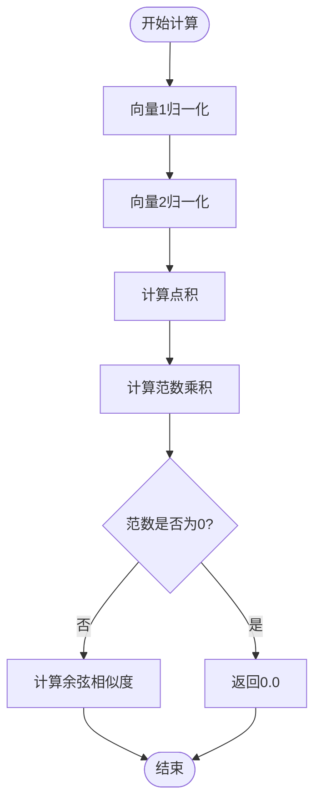
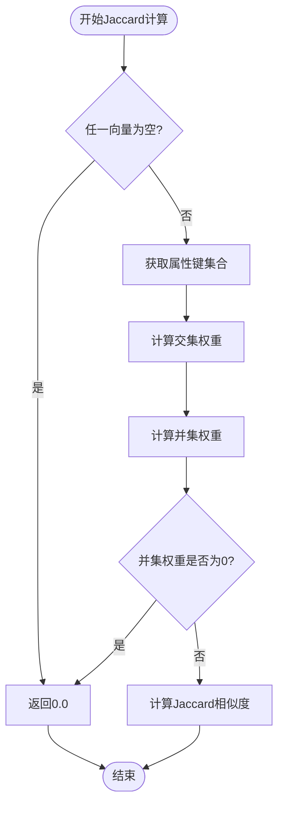
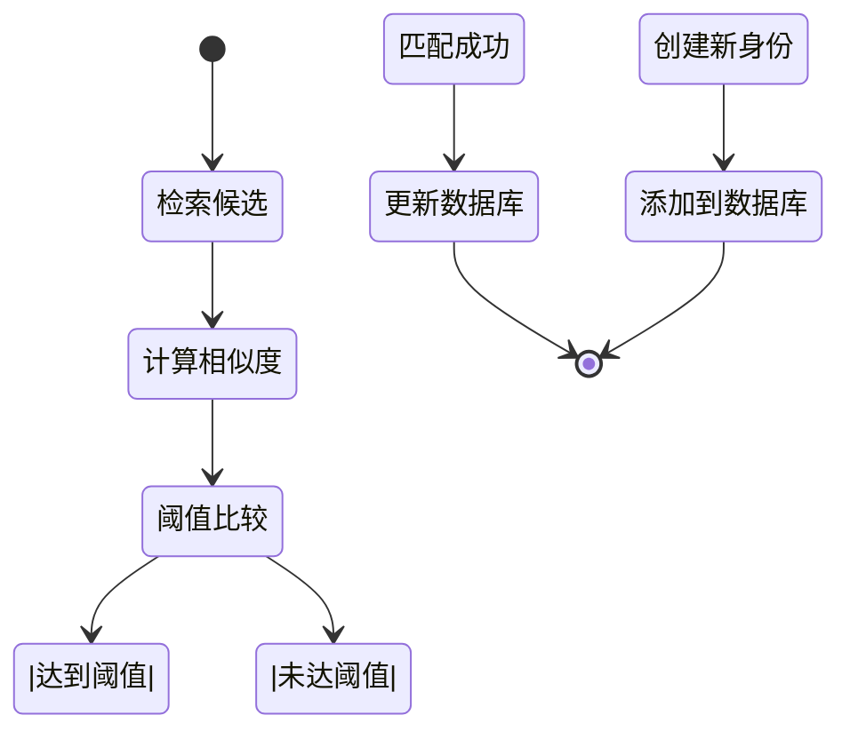
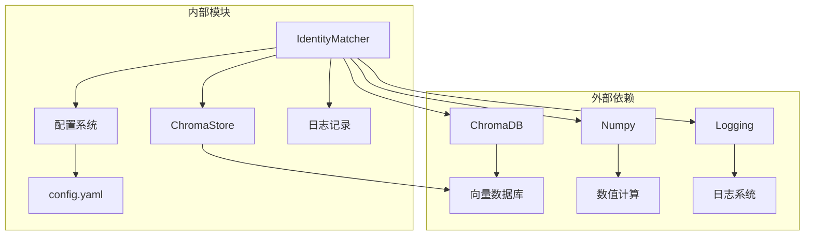

# 模块D：匹配器

<cite>
**本文档引用的文件**
- [matcher.py](file://crossmedia_pid/core/matcher.py)
- [chroma_store.py](file://crossmedia_pid/db/chroma_store.py)
- [config.yaml](file://crossmedia_pid/configs/config.yaml)
- [main.py](file://crossmedia_pid/main.py)
- [registry.py](file://crossmedia_pid/utils/registry.py)
- [vectorizer.py](file://crossmedia_pid/core/vectorizer.py)
- [feature_vlm.py](file://crossmedia_pid/core/feature_vlm.py)
- [requirements.txt](file://crossmedia_pid/requirements.txt)
</cite>

## 目录
1. [简介](#简介)
2. [项目结构](#项目结构)
3. [核心组件](#核心组件)
4. [架构概览](#架构概览)
5. [详细组件分析](#详细组件分析)
6. [依赖关系分析](#依赖关系分析)
7. [性能考虑](#性能考虑)
8. [故障排除指南](#故障排除指南)
9. [结论](#结论)
10. [附录](#附录)

## 简介

模块D是CrossMedia-PID系统中的身份匹配器，负责执行混合距离计算算法，结合余弦相似度和Jaccard距离来实现精确的身份识别。该模块采用多模态特征融合策略，通过加权组合稠密向量相似度、稀疏属性相似度和可选的人脸特征相似度，实现鲁棒的身份匹配功能。

在CrossMedia-PID的Phase 1中，匹配器专注于基础的身份识别功能，禁用了人脸特征匹配，主要依赖于语义向量和属性向量的组合匹配。系统提供了灵活的阈值配置、权重调节和异常处理机制，确保在各种场景下的稳定性和准确性。

## 项目结构

CrossMedia-PID系统采用模块化设计，每个功能模块都有明确的职责分工：



**图表来源**
- [main.py:57-111](file://crossmedia_pid/main.py#L57-L111)
- [matcher.py:30-351](file://crossmedia_pid/core/matcher.py#L30-L351)

**章节来源**
- [main.py:57-111](file://crossmedia_pid/main.py#L57-L111)
- [matcher.py:30-351](file://crossmedia_pid/core/matcher.py#L30-L351)

## 核心组件

### IdentityMatcher类

IdentityMatcher是模块D的核心类，负责执行完整的身份匹配流程。该类实现了混合距离计算、身份决策和身份创建的完整逻辑。

**主要特性：**
- 混合距离计算：结合余弦相似度和Jaccard距离
- 动态权重分配：支持可配置的权重组合
- 阈值决策：基于相似度阈值进行身份匹配
- 异常处理：完善的错误处理和日志记录

**章节来源**
- [matcher.py:30-351](file://crossmedia_pid/core/matcher.py#L30-L351)

### MatchOutput数据类

MatchOutput类封装了匹配器的输出结果，提供了标准化的数据结构来表示匹配结果的各种指标。

**关键字段：**
- `person_uuid`: 匹配到的身份UUID
- `match_score`: 综合匹配分数
- `is_new_identity`: 是否创建了新身份
- `top_candidates`: 前K个候选者的详细信息
- `dense_score`: 稠密向量相似度
- `sparse_score`: 稀疏向量相似度
- `face_score`: 人脸特征相似度（可选）

**章节来源**
- [matcher.py:18-28](file://crossmedia_pid/core/matcher.py#L18-L28)

## 架构概览

模块D在整个CrossMedia-PID系统中扮演着关键的决策角色，连接着上游的特征提取模块和下游的数据存储模块。



**图表来源**
- [main.py:112-201](file://crossmedia_pid/main.py#L112-L201)
- [matcher.py:140-253](file://crossmedia_pid/core/matcher.py#L140-L253)

**章节来源**
- [main.py:112-201](file://crossmedia_pid/main.py#L112-L201)
- [matcher.py:140-253](file://crossmedia_pid/core/matcher.py#L140-L253)

## 详细组件分析

### 混合距离计算算法

模块D实现了创新的混合距离计算策略，结合了不同类型的相似度度量来提高匹配精度。

#### 余弦相似度计算

余弦相似度用于衡量稠密向量之间的角度相似性，通过计算向量的点积与范数乘积的比值来确定相似度。



**图表来源**
- [matcher.py:71-82](file://crossmedia_pid/core/matcher.py#L71-L82)

#### Jaccard相似度计算

Jaccard相似度专门用于稀疏向量的属性匹配，通过计算交集权重与并集权重的比值来衡量属性相似性。



**图表来源**
- [matcher.py:84-119](file://crossmedia_pid/core/matcher.py#L84-L119)

#### 综合匹配分数计算

综合匹配分数通过加权组合三种相似度指标来得到最终的匹配结果。

**权重分配策略：**
- 稠密向量权重：0.65（语义相似度）
- 稀疏向量权重：0.35（属性相似度）
- 人脸特征权重：0.0（Phase 1禁用）

**章节来源**
- [matcher.py:121-138](file://crossmedia_pid/core/matcher.py#L121-L138)

### 身份决策和创建流程

身份匹配器实现了完整的身份决策机制，包括新身份创建、现有身份更新和身份合并策略。



**图表来源**
- [matcher.py:140-253](file://crossmedia_pid/core/matcher.py#L140-L253)

#### 新身份注册流程

当没有候选者达到匹配阈值时，系统会创建新的身份标识符并将其添加到数据库中。

**流程特点：**
- 自动生成唯一UUID标识符
- 初始化匹配分数为0.0
- 记录详细的日志信息
- 返回标准化的匹配输出

#### 现有身份更新机制

当找到高相似度的候选者时，系统会更新现有身份的信息，而不是创建新的身份。

**更新策略：**
- 选择最高相似度的候选者
- 维持原有的身份UUID
- 更新相关的元数据信息
- 记录匹配历史

**章节来源**
- [matcher.py:140-253](file://crossmedia_pid/core/matcher.py#L140-L253)

### 相似度阈值设置和权重分配

模块D提供了灵活的阈值和权重配置机制，支持根据不同的应用场景进行优化。

#### 阈值配置

系统默认阈值设置为0.72，这是一个经过实验验证的平衡点，能够在准确率和召回率之间取得良好平衡。

**阈值调优指南：**
- 高阈值（>0.8）：提高匹配准确性，但可能漏检
- 低阈值（<0.7）：提高召回率，但可能产生误匹配
- 建议范围：0.65-0.85

#### 权重分配策略

权重分配直接影响匹配结果的侧重点，系统提供了针对不同场景的预设配置。

**默认权重配置：**
- 稠密向量：0.65（语义相似度占主导）
- 稀疏向量：0.35（属性相似度辅助）
- 人脸特征：0.0（Phase 1禁用）

**权重调优建议：**
- 语义相似度重要：增加稠密向量权重
- 属性相似度重要：增加稀疏向量权重
- 多模态融合：启用人脸特征匹配

**章节来源**
- [matcher.py:33-70](file://crossmedia_pid/core/matcher.py#L33-L70)
- [config.yaml:33-41](file://crossmedia_pid/configs/config.yaml#L33-L41)

### API文档

#### IdentityMatcher类

IdentityMatcher类提供了完整的身份匹配功能接口，支持多种使用场景。

##### 构造函数

```python
def __init__(
    self,
    store: ChromaStore,
    threshold: float = 0.72,
    top_k: int = 5,
    weights: Optional[Dict[str, float]] = None,
    enable_face: bool = False
):
```

**参数说明：**
- `store`: ChromaDB存储实例
- `threshold`: 匹配阈值，默认0.72
- `top_k`: 检索候选数量，默认5
- `weights`: 权重配置字典
- `enable_face`: 是否启用人脸特征匹配

##### compute_similarity()方法

```python
def compute_similarity(
    self,
    dense_vector: List[float],
    sparse_vector: Dict[str, float],
    face_embedding: Optional[List[float]] = None
) -> float:
```

**功能描述：** 计算给定向量的综合相似度分数

**参数说明：**
- `dense_vector`: 稠密向量
- `sparse_vector`: 稀疏向量
- `face_embedding`: 人脸特征向量（可选）

**返回值：** 综合相似度分数（0-1）

##### decide_identity()方法

```python
def decide_identity(
    self,
    dense_vector: List[float],
    sparse_vector: Dict[str, float],
    face_embedding: Optional[List[float]] = None
) -> MatchOutput:
```

**功能描述：** 执行身份决策，返回匹配结果

**参数说明：**
- `dense_vector`: 稠密向量
- `sparse_vector`: 稀疏向量
- `face_embedding`: 人脸特征向量（可选）

**返回值：** MatchOutput对象，包含完整的匹配信息

##### merge_identities()方法

```python
def merge_identities(
    self,
    person_uuid: str,
    dense_vector: List[float],
    sparse_vector: Dict[str, float],
    attributes: Dict,
    source_meta: Optional[Dict] = None,
    face_embedding: Optional[List[float]] = None
) -> str:
```

**功能描述：** 将新条目合并到现有身份中

**参数说明：**
- `person_uuid`: 目标身份UUID
- `dense_vector`: 稠密向量
- `sparse_vector`: 稀疏向量
- `attributes`: 属性字典
- `source_meta`: 源数据元信息
- `face_embedding`: 人脸特征向量（可选）

**返回值：** 新文档ID

##### add_identity()方法

```python
def add_identity(
    self,
    person_uuid: str,
    dense_vector: List[float],
    sparse_vector: Dict[str, float],
    attributes: Dict,
    source_meta: Optional[Dict] = None,
    face_embedding: Optional[List[float]] = None
) -> str:
```

**功能描述：** 添加新身份到数据库

**参数说明：**
- `person_uuid`: 身份UUID
- `dense_vector`: 稠密向量
- `sparse_vector`: 稀疏向量
- `attributes`: 属性字典
- `source_meta`: 源数据元信息
- `face_embedding`: 人脸特征向量（可选）

**返回值：** 文档ID

##### search_similar()方法

```python
def search_similar(
    self,
    dense_vector: List[float],
    sparse_vector: Dict[str, float],
    top_k: int = 5
) -> List[Dict]:
```

**功能描述：** 搜索相似身份（不创建新身份）

**参数说明：**
- `dense_vector`: 稠密向量
- `sparse_vector`: 稀疏向量
- `top_k`: 返回数量

**返回值：** 相似身份列表

**章节来源**
- [matcher.py:30-351](file://crossmedia_pid/core/matcher.py#L30-L351)

## 依赖关系分析

模块D的依赖关系相对简洁，主要依赖于ChromaDB向量存储和配置系统。



**图表来源**
- [matcher.py:13-15](file://crossmedia_pid/core/matcher.py#L13-L15)
- [config.yaml:1-58](file://crossmedia_pid/configs/config.yaml#L1-58)

**章节来源**
- [matcher.py:13-15](file://crossmedia_pid/core/matcher.py#L13-L15)
- [config.yaml:1-58](file://crossmedia_pid/configs/config.yaml#L1-58)

## 性能考虑

模块D在设计时充分考虑了性能优化，采用了多种策略来提升系统的响应速度和资源利用率。

### 向量检索优化

系统使用ChromaDB作为向量存储，支持高效的相似度搜索。通过合理的索引策略和查询优化，能够在大规模数据集上保持良好的查询性能。

### 内存管理

- **延迟加载**：模型和组件采用延迟加载策略，减少启动时间
- **缓存机制**：频繁访问的组件会被缓存，避免重复初始化
- **内存限制**：支持内存使用限制，防止内存泄漏

### 并发处理

系统支持多线程和异步处理，能够有效利用多核CPU资源。对于I/O密集型操作，采用异步编程模式提升整体性能。

### 性能调优参数

**核心调优参数：**
- `top_k`: 控制候选数量，影响召回率和性能
- `threshold`: 控制匹配严格程度，影响准确率
- `weights`: 调整不同相似度指标的权重

**优化建议：**
- 在保证准确率的前提下，适当降低top_k值
- 根据数据特征调整阈值设置
- 通过A/B测试确定最优权重配置

## 故障排除指南

### 常见问题和解决方案

#### 向量维度不匹配

**问题描述：** 稠密向量维度与数据库中的向量维度不一致

**解决方案：**
- 检查向量化器的模型配置
- 确认使用的嵌入模型一致
- 重新训练或重建向量数据库

#### 相似度计算异常

**问题描述：** 相似度计算返回NaN或异常值

**解决方案：**
- 检查输入向量是否为零向量
- 验证向量归一化过程
- 检查数值精度问题

#### 数据库连接失败

**问题描述：** ChromaDB连接异常或查询超时

**解决方案：**
- 检查数据库文件权限
- 验证磁盘空间充足
- 重启数据库服务

#### 性能问题

**问题描述：** 匹配速度过慢或内存占用过高

**解决方案：**
- 调整top_k参数
- 优化阈值设置
- 检查硬件资源使用情况

**章节来源**
- [matcher.py:6, 15:6-15](file://crossmedia_pid/core/matcher.py#L6-L15)

## 结论

模块D作为CrossMedia-PID系统的核心匹配组件，通过创新的混合距离计算算法和智能的身份决策机制，实现了高精度的人物身份识别。系统的设计充分考虑了实用性、可扩展性和性能优化，在保证准确率的同时提供了良好的用户体验。

通过灵活的阈值配置、权重调节和异常处理机制，模块D能够适应不同的应用场景和数据特征。随着系统的发展，模块D将继续演进，支持更多高级功能和更复杂的匹配策略。

## 附录

### 实际匹配场景示例

#### 场景1：监控视频分析
- **目标**：识别监控画面中出现的可疑人员
- **配置**：较低阈值（0.65），较高top_k（10）
- **策略**：优先召回，后续人工确认

#### 场景2：社交媒体内容审核
- **目标**：识别潜在违规用户
- **配置**：较高阈值（0.8），较低top_k（3）
- **策略**：严格控制误报率

#### 场景3：历史档案检索
- **目标**：从大量历史照片中查找特定人物
- **配置**：适中阈值（0.72），中等top_k（5）
- **策略**：平衡准确率和召回率

### 阈值调优指南

**调优步骤：**
1. **基线测试**：使用默认配置进行基准测试
2. **A/B测试**：对比不同阈值设置的效果
3. **ROC曲线分析**：绘制ROC曲线确定最优阈值
4. **业务验证**：结合业务需求验证效果

**评估指标：**
- **准确率**：正确匹配的比例
- **召回率**：实际存在的身份被正确识别的比例
- **F1分数**：准确率和召回率的调和平均
- **误报率**：错误匹配的比例

### 匹配结果验证方法

#### 人工验证
- **随机抽样**：从匹配结果中随机抽取样本进行人工验证
- **专家评审**：邀请领域专家对关键案例进行评审
- **一致性检查**：检查多次匹配的一致性

#### 自动验证
- **交叉验证**：使用留出法或K折交叉验证
- **统计检验**：使用t检验或Mann-Whitney U检验
- **性能监控**：持续监控关键性能指标的变化

**章节来源**
- [requirements.txt:1-38](file://crossmedia_pid/requirements.txt#L1-L38)