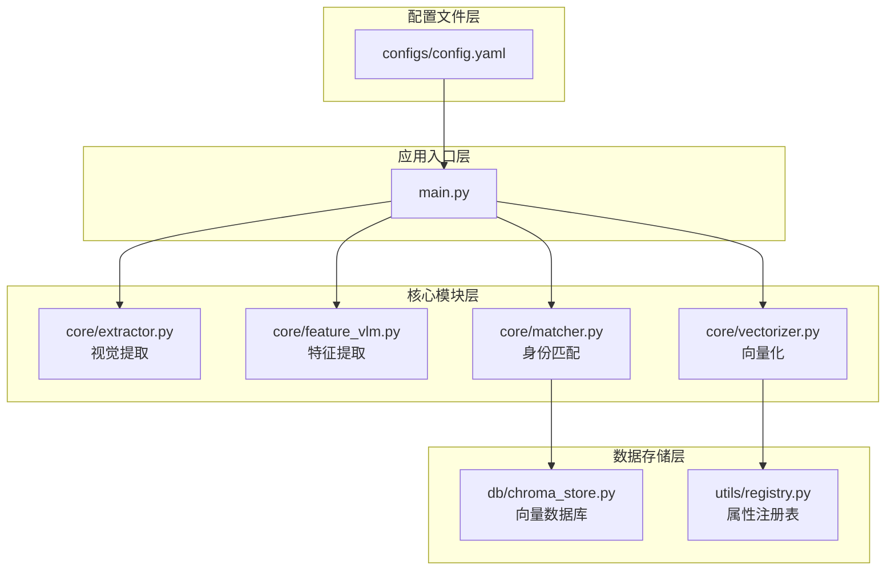
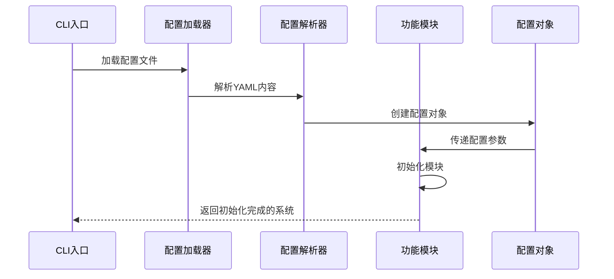
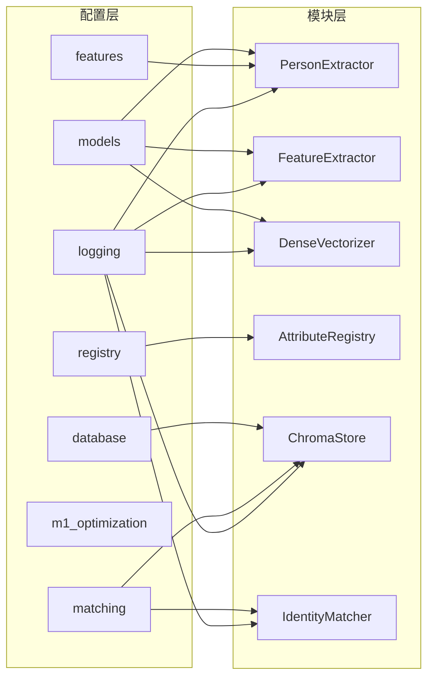

# 配置管理

<cite>
**本文引用的文件**
- [config.yaml](file://configs/config.yaml)
- [main.py](file://main.py)
- [extractor.py](file://core/extractor.py)
- [feature_vlm.py](file://core/feature_vlm.py)
- [vectorizer.py](file://core/vectorizer.py)
- [matcher.py](file://core/matcher.py)
- [chroma_store.py](file://db/chroma_store.py)
- [registry.py](file://utils/registry.py)
</cite>

## 目录
1. [简介](#简介)
2. [项目结构](#项目结构)
3. [核心组件](#核心组件)
4. [架构概览](#架构概览)
5. [详细组件分析](#详细组件分析)
6. [依赖分析](#依赖分析)
7. [性能考虑](#性能考虑)
8. [故障排除指南](#故障排除指南)
9. [结论](#结论)
10. [附录](#附录)

## 简介

CrossMedia-PID是一个跨媒体人物识别系统，采用模块化架构设计。配置管理系统是该系统的核心组成部分，负责统一管理各个功能模块的参数设置。本文档提供了完整的配置管理指南，涵盖配置文件结构、参数说明、默认值、推荐配置方案以及最佳实践。

## 项目结构

CrossMedia-PID采用分层架构，配置管理贯穿整个系统：



**图表来源**
- [config.yaml:1-58](file://configs/config.yaml#L1-L58)
- [main.py:48-110](file://main.py#L48-L110)

**章节来源**
- [config.yaml:1-58](file://configs/config.yaml#L1-L58)
- [main.py:1-384](file://main.py#L1-L384)

## 核心组件

配置管理系统由以下核心组件构成：

### 配置文件加载器
- **功能**: 负责从YAML文件加载配置
- **路径**: [main.py:48-54](file://main.py#L48-L54)
- **特性**: 支持自定义配置文件路径，提供默认回退机制

### 模块化配置解析
- **功能**: 将配置参数传递给各个功能模块
- **实现**: 在主控制器中逐个初始化各模块
- **特点**: 支持部分配置覆盖，提供合理的默认值

**章节来源**
- [main.py:48-110](file://main.py#L48-L110)

## 架构概览

配置管理在系统中的作用流程：



**图表来源**
- [main.py:48-110](file://main.py#L48-L110)
- [config.yaml:1-58](file://configs/config.yaml#L1-L58)

## 详细组件分析

### 模型配置 (models)

模型配置分为三个主要类别：

#### YOLO人体检测模型
| 参数名 | 类型 | 默认值 | 说明 |
|--------|------|--------|------|
| model_path | 字符串 | yolov8n.pt | YOLO模型路径 |
| conf_threshold | 浮点数 | 0.5 | 检测置信度阈值 |
| iou_threshold | 浮点数 | 0.45 | NMS IoU阈值 |
| classes | 列表 | [0] | 检测类别（仅人） |

#### VLM特征提取模型
| 参数名 | 类型 | 默认值 | 说明 |
|--------|------|--------|------|
| model_name | 字符串 | mlx-community/Qwen3-VL-235B-4bit | VLM模型名称 |
| max_tokens | 整数 | 512 | 最大生成token数 |
| temperature | 浮点数 | 0.1 | 采样温度 |

#### 嵌入向量模型
| 参数名 | 类型 | 默认值 | 说明 |
|--------|------|--------|------|
| model_name | 字符串 | BAAI/bge-small-zh-v1.5 | 嵌入模型名称 |
| onnx_path | 字符串/空 | null | ONNX模型路径 |
| max_length | 整数 | 512 | 最大序列长度 |

**章节来源**
- [config.yaml:4-19](file://configs/config.yaml#L4-L19)
- [extractor.py:68-104](file://core/extractor.py#L68-L104)
- [feature_vlm.py:55-79](file://core/feature_vlm.py#L55-L79)
- [vectorizer.py:31-52](file://core/vectorizer.py#L31-L52)

### 数据库设置 (database)

向量数据库配置直接影响系统的存储能力和查询性能：

| 参数名 | 类型 | 默认值 | 说明 |
|--------|------|--------|------|
| persist_directory | 字符串 | ./chroma_db | 持久化目录 |
| collection_name | 字符串 | person_embeddings | 集合名称 |
| distance_fn | 字符串 | cosine | 距离函数类型 |

**章节来源**
- [config.yaml:22-26](file://configs/config.yaml#L22-L26)
- [chroma_store.py:21-37](file://db/chroma_store.py#L21-L37)

### 特征提取设置 (features)

特征提取阶段的关键参数：

| 参数名 | 类型 | 默认值 | 说明 |
|--------|------|--------|------|
| min_quality_score | 浮点数 | 0.3 | 最小质量评分 |
| min_bbox_size | 整数 | 64 | 最小边界框尺寸（像素） |

**章节来源**
- [config.yaml:29-31](file://configs/config.yaml#L29-L31)
- [extractor.py:151-204](file://core/extractor.py#L151-L204)

### 匹配算法参数 (matching)

身份匹配的核心阈值和权重配置：

| 参数组 | 参数名 | 类型 | 默认值 | 说明 |
|--------|--------|------|--------|------|
| 基础参数 | threshold | 浮点数 | 0.72 | 匹配阈值 |
| 基础参数 | top_k | 整数 | 5 | 候选数量 |
| 权重参数 | dense | 浮点数 | 0.65 | 稠密向量权重 |
| 权重参数 | sparse | 浮点数 | 0.35 | 稀疏向量权重 |
| 权重参数 | face | 浮点数 | 0.0 | 人脸特征权重（Phase 1禁用） |

**章节来源**
- [config.yaml:34-40](file://configs/config.yaml#L34-L40)
- [matcher.py:33-70](file://core/matcher.py#L33-L70)

### 属性注册表配置 (registry)

动态属性注册表管理：

| 参数名 | 类型 | 默认值 | 说明 |
|--------|------|--------|------|
| persist_path | 字符串 | ./attribute_registry.json | 持久化路径 |
| min_frequency | 整数 | 3 | 最小频率阈值 |

**章节来源**
- [config.yaml:43-45](file://configs/config.yaml#L43-L45)
- [registry.py:24-39](file://utils/registry.py#L24-L39)

### M1 Mac优化配置 (m1_optimization)

针对Apple Silicon的性能优化：

| 参数名 | 类型 | 默认值 | 说明 |
|--------|------|--------|------|
| max_queue_size | 整数 | 5 | 最大队列大小 |
| enable_metal | 布尔值 | true | 启用Metal加速 |
| memory_limit_gb | 整数 | 12 | 内存限制（GB） |
| gc_interval | 整数 | 10 | 垃圾回收间隔 |

**章节来源**
- [config.yaml:48-52](file://configs/config.yaml#L48-L52)
- [extractor.py:95-104](file://core/extractor.py#L95-L104)

### 日志配置 (logging)

系统日志设置：

| 参数名 | 类型 | 默认值 | 说明 |
|--------|------|--------|------|
| level | 字符串 | INFO | 日志级别 |
| format | 字符串 | 时间戳格式 | 日志格式 |

**章节来源**
- [config.yaml:55-57](file://configs/config.yaml#L55-L57)
- [main.py:37-45](file://main.py#L37-L45)

## 依赖分析

配置参数在系统中的依赖关系：



**图表来源**
- [main.py:68-108](file://main.py#L68-L108)
- [config.yaml:1-58](file://configs/config.yaml#L1-L58)

**章节来源**
- [main.py:68-108](file://main.py#L68-L108)

## 性能考虑

### 配置对性能的影响

1. **模型参数影响**
   - `max_tokens`: 影响VLM推理时间，建议根据硬件能力调整
   - `max_length`: 嵌入模型序列长度，影响内存使用
   - `conf_threshold`和`iou_threshold`: 影响检测精度和速度平衡

2. **数据库性能**
   - `distance_fn`: 不同距离函数影响查询性能
   - `top_k`: 候选数量直接影响查询复杂度

3. **内存优化**
   - `memory_limit_gb`: 控制M1优化内存使用
   - `max_queue_size`: 并发处理队列大小

### 调优策略

1. **高精度场景**
   ```yaml
   models:
     vlm:
       max_tokens: 1024
       temperature: 0.0
   matching:
     threshold: 0.75
     top_k: 10
   ```

2. **实时性场景**
   ```yaml
   models:
     vlm:
       max_tokens: 256
       temperature: 0.3
   matching:
     threshold: 0.65
     top_k: 3
   ```

3. **内存受限场景**
   ```yaml
   m1_optimization:
     memory_limit_gb: 8
     max_queue_size: 3
   ```

## 故障排除指南

### 常见配置问题

1. **模型加载失败**
   - 检查`model_path`和`model_name`是否正确
   - 确认网络连接正常（首次下载模型时）

2. **数据库连接问题**
   - 验证`persist_directory`权限
   - 检查磁盘空间充足

3. **内存不足**
   - 调整`memory_limit_gb`
   - 减少`max_queue_size`

### 配置验证方法

1. **语法验证**
   ```bash
   python -c "import yaml; print(yaml.safe_load(open('configs/config.yaml')))"
   ```

2. **模块测试**
   ```python
   from core.extractor import PersonExtractor
   extractor = PersonExtractor()  # 使用默认配置
   ```

**章节来源**
- [main.py:48-54](file://main.py#L48-L54)
- [chroma_store.py:43-71](file://db/chroma_store.py#L43-L71)

## 结论

CrossMedia-PID的配置管理系统提供了灵活而强大的参数控制机制。通过合理的配置优化，可以在准确性、性能和资源使用之间找到最佳平衡点。建议用户根据具体应用场景选择合适的配置方案，并定期评估和调整参数以获得最优效果。

## 附录

### 配置模板

#### 基础配置模板
```yaml
models:
  yolo:
    model_path: "yolov8n.pt"
    conf_threshold: 0.5
    iou_threshold: 0.45
  vlm:
    model_name: "mlx-community/Qwen3-VL-235B-4bit"
    max_tokens: 512
    temperature: 0.1
  embedding:
    model_name: "BAAI/bge-small-zh-v1.5"
    max_length: 512

database:
  chroma:
    persist_directory: "./chroma_db"
    collection_name: "person_embeddings"
    distance_fn: "cosine"

features:
  min_quality_score: 0.3
  min_bbox_size: 64

matching:
  threshold: 0.72
  top_k: 5
  weights:
    dense: 0.65
    sparse: 0.35
    face: 0.0

registry:
  persist_path: "./attribute_registry.json"
  min_frequency: 3

m1_optimization:
  max_queue_size: 5
  enable_metal: true
  memory_limit_gb: 12
  gc_interval: 10

logging:
  level: "INFO"
  format: "%(asctime)s - %(name)s - %(levelname)s - %(message)s"
```

### 最佳实践建议

1. **生产环境配置**
   - 使用GPU加速的模型部署
   - 合理设置阈值以平衡误检率和漏检率
   - 定期备份数据库和注册表

2. **开发环境配置**
   - 使用较小的模型进行快速迭代
   - 开启详细的日志记录
   - 设置较低的并发限制

3. **监控和维护**
   - 定期检查数据库性能指标
   - 监控内存使用情况
   - 跟踪匹配准确率变化