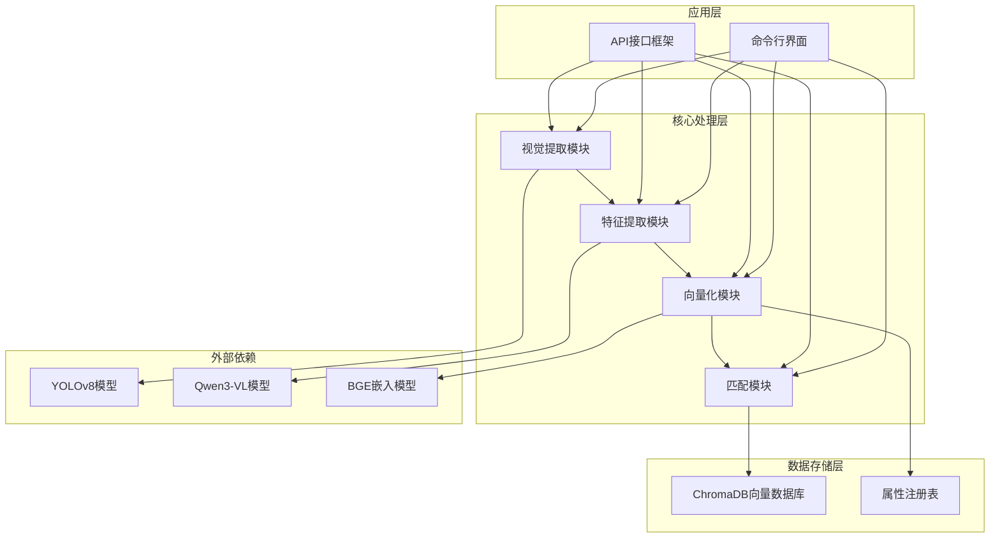
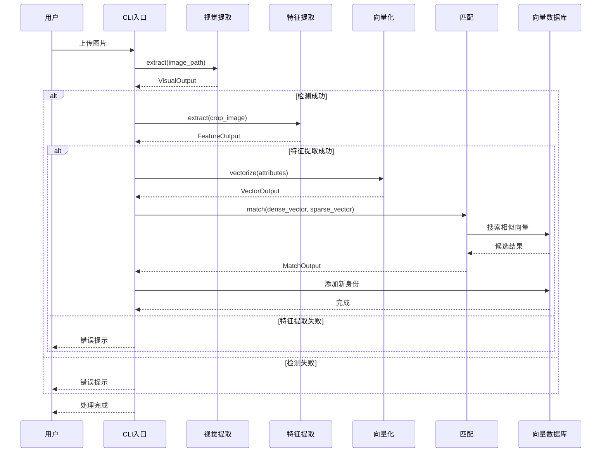
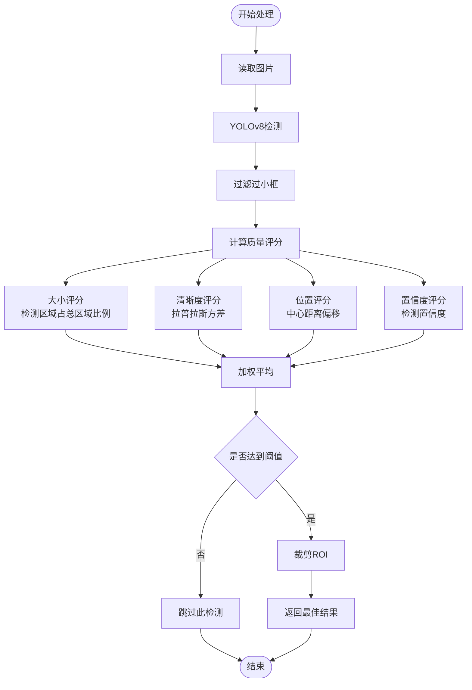
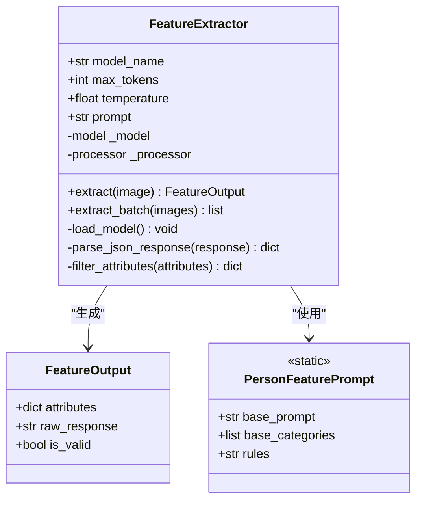
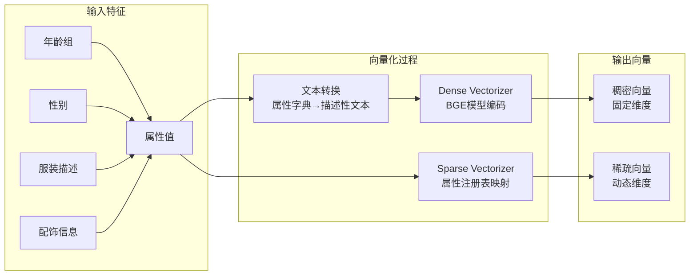
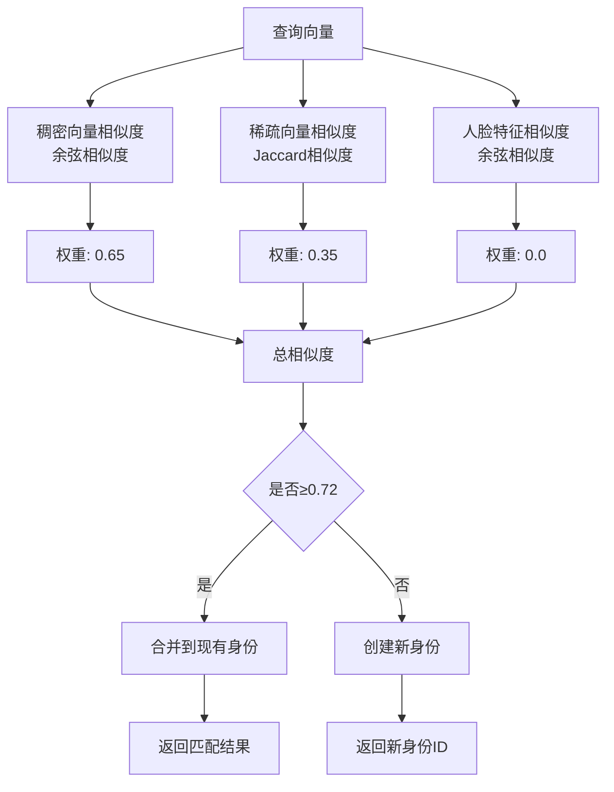
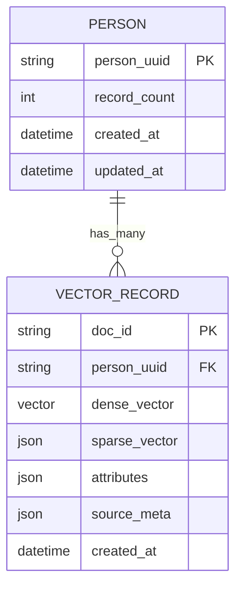

# CrossMedia-PID跨媒体人物识别系统项目概述

<cite>
**本文档引用的文件**
- [main.py](file://main.py)
- [config.yaml](file://configs/config.yaml)
- [extractor.py](file://core/extractor.py)
- [feature_vlm.py](file://core/feature_vlm.py)
- [vectorizer.py](file://core/vectorizer.py)
- [matcher.py](file://core/matcher.py)
- [chroma_store.py](file://db/chroma_store.py)
- [registry.py](file://utils/registry.py)
- [routes.py](file://api/routes.py)
- [requirements.txt](file://requirements.txt)
- [setup.py](file://setup.py)
</cite>

## 目录
1. [简介](#简介)
2. [项目结构](#项目结构)
3. [核心组件](#核心组件)
4. [架构概览](#架构概览)
5. [详细组件分析](#详细组件分析)
6. [依赖关系分析](#依赖关系分析)
7. [性能考虑](#性能考虑)
8. [故障排除指南](#故障排除指南)
9. [结论](#结论)

## 简介

CrossMedia-PID跨媒体人物识别系统是一个基于多模态视觉语言模型（VLM）和计算机视觉技术的先进人物识别平台。该系统旨在解决跨媒体环境下的复杂人物识别挑战，通过结合深度学习、计算机视觉和向量数据库技术，实现高精度、高效率的人物身份识别和匹配。

### 系统核心目标

- **跨媒体识别**：能够在不同媒体格式（图片、视频）中准确识别和跟踪人物
- **多模态融合**：结合视觉检测、特征提取和语义理解技术
- **实时处理**：支持单张图片处理、批量处理和实时搜索功能
- **可扩展架构**：模块化设计，便于功能扩展和性能优化

### 技术特色

- **四阶段处理流程**：视觉提取 → 特征提取 → 向量化 → 匹配
- **混合向量表示**：结合稠密语义向量和稀疏属性向量
- **智能阈值管理**：动态权重分配和相似度计算
- **M1 Mac优化**：针对Apple Silicon进行性能优化

## 项目结构

系统采用模块化的分层架构设计，将复杂的识别任务分解为四个独立的功能模块：

**图表来源**
- [main.py:57-111](file://main.py#L57-L111)
- [extractor.py:65-104](file://core/extractor.py#L65-L104)
- [feature_vlm.py:52-101](file://core/feature_vlm.py#L52-L101)
- [vectorizer.py:174-204](file://core/vectorizer.py#L174-L204)
- [matcher.py:30-70](file://core/matcher.py#L30-L70)

**章节来源**
- [main.py:24-34](file://main.py#L24-L34)
- [config.yaml:1-58](file://configs/config.yaml#L1-L58)

## 核心组件

### 四个核心模块详解

系统实现了经典的四阶段处理流水线，每个阶段都有明确的职责和输出格式：

#### 模块A：视觉提取（PersonExtractor）
负责人体检测、质量评估和ROI裁剪，为后续处理提供高质量的人体图像。

#### 模块B：特征提取（FeatureExtractor）
使用多模态视觉语言模型动态提取人物特征，生成结构化的属性字典。

#### 模块C：向量化（DynamicVectorizer）
将非结构化特征转换为机器可理解的向量表示，支持稠密和稀疏两种向量类型。

#### 模块D：匹配（IdentityMatcher）
执行身份匹配和决策，管理人物身份的创建和合并。

**章节来源**
- [extractor.py:65-264](file://core/extractor.py#L65-L264)
- [feature_vlm.py:52-290](file://core/feature_vlm.py#L52-L290)
- [vectorizer.py:174-258](file://core/vectorizer.py#L174-L258)
- [matcher.py:30-252](file://core/matcher.py#L30-L252)

## 架构概览

系统采用流水线式架构，四个核心模块通过标准化的数据接口进行协作：

**图表来源**
- [main.py:112-200](file://main.py#L112-L200)
- [extractor.py:206-264](file://core/extractor.py#L206-L264)
- [feature_vlm.py:210-290](file://core/feature_vlm.py#L210-L290)
- [vectorizer.py:227-258](file://core/vectorizer.py#L227-L258)
- [matcher.py:140-252](file://core/matcher.py#L140-L252)

## 详细组件分析

### 视觉提取模块（模块A）

视觉提取模块是整个系统的基础，负责从复杂背景中精确定位人体并进行质量评估：

#### 核心功能
- **人体检测**：使用YOLOv8模型进行实时人体检测
- **质量评估**：综合考虑检测置信度、边界框大小、图像清晰度和位置因素
- **ROI裁剪**：提取最佳的人体区域供后续处理

#### 质量评分算法

**图表来源**
- [extractor.py:151-204](file://core/extractor.py#L151-L204)
- [extractor.py:206-264](file://core/extractor.py#L206-L264)

#### 关键参数配置
- **检测阈值**：0.5（conf_threshold）
- **NMS阈值**：0.45（iou_threshold）
- **最小框尺寸**：64像素（min_bbox_size）
- **质量阈值**：0.3（min_quality_score）

**章节来源**
- [extractor.py:65-264](file://core/extractor.py#L65-L264)
- [config.yaml:5-10](file://configs/config.yaml#L5-L10)
- [config.yaml:29-32](file://configs/config.yaml#L29-L32)

### 特征提取模块（模块B）

特征提取模块使用先进的多模态视觉语言模型进行开放式人物特征提取：

#### VLM特征提取流程

**图表来源**
- [feature_vlm.py:52-290](file://core/feature_vlm.py#L52-L290)
- [feature_vlm.py:44-50](file://core/feature_vlm.py#L44-L50)

#### JSON解析策略

特征提取模块实现了多层次的JSON解析容错机制：

1. **直接解析**：尝试直接解析整个响应
2. **代码块提取**：从Markdown代码块中提取JSON
3. **修复解析**：使用json_repair库修复常见JSON错误
4. **手动提取**：通过正则表达式手动提取JSON片段

#### 关键配置参数
- **模型名称**：mlx-community/Qwen3-VL-235B-4bit
- **最大token数**：512
- **温度参数**：0.1（控制创造性）
- **基础类别**：15个预定义人物特征类别

**章节来源**
- [feature_vlm.py:52-290](file://core/feature_vlm.py#L52-L290)
- [config.yaml:11-15](file://configs/config.yaml#L11-L15)

### 向量化模块（模块C）

向量化模块将非结构化特征转换为机器学习友好的向量表示：

#### 混合向量表示

**图表来源**
- [vectorizer.py:174-258](file://core/vectorizer.py#L174-L258)
- [vectorizer.py:28-172](file://core/vectorizer.py#L28-L172)

#### 稠密向量生成

稠密向量生成器使用BAAI/bge-small-zh-v1.5模型，支持多种后端：

1. **ONNX Runtime**：高性能推理（推荐）
2. **Transformers**：兼容性保证（回退方案）
3. **CoreML**：M1 Mac优化

#### 稀疏向量生成

稀疏向量通过属性注册表实现动态维度映射：

- **动态扩展**：新属性自动分配ID
- **频率验证**：通过最小频率阈值确保可靠性
- **持久化存储**：注册表信息保存到JSON文件

**章节来源**
- [vectorizer.py:174-258](file://core/vectorizer.py#L174-L258)
- [config.yaml:16-20](file://configs/config.yaml#L16-L20)
- [registry.py:16-208](file://utils/registry.py#L16-L208)

### 匹配模块（模块D）

匹配模块执行最终的身份决策，结合多种相似度度量：

#### 混合相似度计算

**图表来源**
- [matcher.py:121-138](file://core/matcher.py#L121-L138)
- [matcher.py:140-252](file://core/matcher.py#L140-L252)

#### 身份决策策略

匹配模块采用"先检索后决策"的策略：

1. **候选检索**：基于稠密向量在ChromaDB中检索Top-K候选
2. **相似度计算**：计算混合相似度（稠密+稀疏+人脸）
3. **阈值判断**：比较综合分数与阈值
4. **身份创建**：低于阈值时创建新身份UUID

**章节来源**
- [matcher.py:30-252](file://core/matcher.py#L30-L252)
- [config.yaml:34-41](file://configs/config.yaml#L34-L41)

### 数据存储层

#### ChromaDB向量数据库

系统使用ChromaDB作为向量存储解决方案：

**图表来源**
- [chroma_store.py:73-123](file://db/chroma_store.py#L73-L123)
- [chroma_store.py:180-209](file://db/chroma_store.py#L180-L209)

#### 属性注册表

属性注册表提供动态的属性ID映射和统计功能：

- **自动注册**：新属性自动分配唯一ID
- **频率统计**：跟踪属性出现频率
- **持久化存储**：支持断电恢复
- **线程安全**：并发访问保护

**章节来源**
- [chroma_store.py:18-254](file://db/chroma_store.py#L18-L254)
- [registry.py:16-269](file://utils/registry.py#L16-L269)

## 依赖关系分析

系统采用松耦合的设计，通过标准化的数据接口实现模块间的通信：

```mermaid
graph TB
subgraph "核心依赖"
NUMPY[numpy>=1.24.0]
PILL[pillow>=10.0.0]
YAML[pyyaml>=6.0]
CLICK[click>=8.1.0]
end
subgraph "计算机视觉"
ULTRALYTICS[ultralytics>=8.0.0]
OPENCV[opencv-python>=4.8.0]
end
subgraph "MLX生态"
MLX[mlx>=0.15.0]
MLX_VLM[mlx-vlm>=0.1.0]
end
subgraph "向量数据库"
CHROMADB[chromadb>=0.4.0]
end
subgraph "嵌入模型"
ONNXRUNTIME[onnxruntime>=1.16.0]
TOKENIZERS[tokenizers>=0.14.0]
end
subgraph "工具库"
RICH[rich>=13.0.0]
JSON_REPAIR[json-repair>=0.10.0]
end
main.py --> NUMPY
main.py --> PILL
main.py --> YAML
main.py --> CLICK
extractor.py --> ULTRALYTICS
extractor.py --> OPENCV
feature_vlm.py --> MLX
feature_vlm.py --> MLX_VLM
vectorizer.py --> ONNXRUNTIME
vectorizer.py --> TOKENIZERS
chroma_store.py --> CHROMADB
main.py --> RICH
feature_vlm.py --> JSON_REPAIR
```

**图表来源**
- [requirements.txt:1-38](file://requirements.txt#L1-L38)
- [setup.py:8-27](file://setup.py#L8-L27)

**章节来源**
- [requirements.txt:1-38](file://requirements.txt#L1-L38)
- [setup.py:1-35](file://setup.py#L1-L35)

## 性能考虑

### M1 Mac优化策略

系统针对Apple Silicon进行了专门优化：

- **MPS加速**：YOLO模型自动使用Metal Performance Shaders
- **CoreML集成**：ONNX模型通过CoreML执行
- **内存管理**：动态队列大小和垃圾回收优化
- **多线程处理**：合理的并发控制避免资源争用

### 模型选择策略

- **轻量级部署**：使用Qwen3-VL-235B-4bit进行推理
- **快速响应**：BGE-small-zh-v1.5提供快速嵌入生成
- **内存友好**：ONNX Runtime减少内存占用

### 批处理优化

- **进度可视化**：Rich库提供实时进度反馈
- **错误隔离**：单张图片失败不影响整体流程
- **资源复用**：模型加载后重复使用避免重复开销

## 故障排除指南

### 常见问题诊断

#### 模型加载失败
**症状**：系统启动时报错，无法加载VLM或YOLO模型
**解决方案**：
1. 检查网络连接，确保能够访问模型仓库
2. 验证MLX和ONNX Runtime安装完整性
3. 清理缓存后重新安装依赖

#### 内存不足
**症状**：处理大型图片时内存溢出
**解决方案**：
1. 调整max_queue_size参数
2. 降低batch处理大小
3. 使用更小的模型变体

#### 性能问题
**症状**：处理速度慢于预期
**解决方案**：
1. 确认MPS设备可用性
2. 检查ONNX模型是否正确加载
3. 调整max_length参数优化性能

### 日志分析

系统提供详细的日志输出，可通过`--verbose`参数启用调试模式：

- **INFO级别**：正常流程信息
- **WARNING级别**：潜在问题警告
- **ERROR级别**：严重错误信息

**章节来源**
- [main.py:37-46](file://main.py#L37-L46)
- [config.yaml:55-58](file://configs/config.yaml#L55-L58)

## 结论

CrossMedia-PID跨媒体人物识别系统代表了现代多模态识别技术的先进实践。通过精心设计的四阶段处理流程和模块化架构，系统实现了高精度、高效率的人物识别能力。

### 主要优势

1. **技术先进性**：采用最新的多模态视觉语言模型和向量数据库技术
2. **架构合理性**：清晰的模块划分和标准化接口设计
3. **性能优化**：针对M1 Mac的深度优化和资源管理
4. **可扩展性**：为后续Phase 2的Web服务和更多功能预留了完善框架

### 应用前景

该系统为跨媒体人物识别提供了完整的解决方案，适用于以下场景：
- 社交媒体内容监控
- 娱乐产业人物管理
- 安全监控系统集成
- 数字资产管理

通过持续的技术迭代和功能扩展，CrossMedia-PID有望成为跨媒体人物识别领域的标杆解决方案。